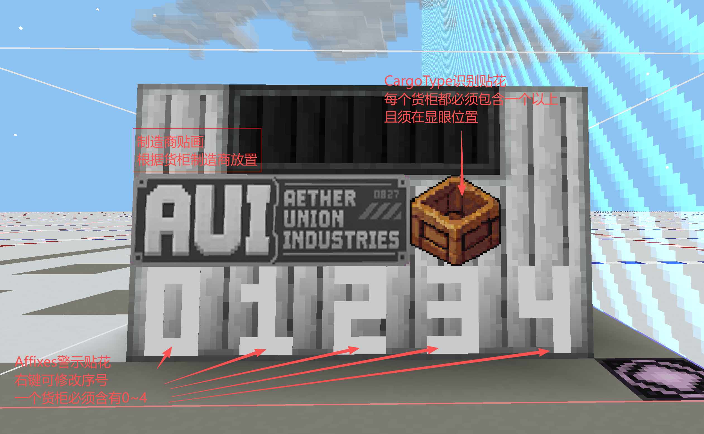
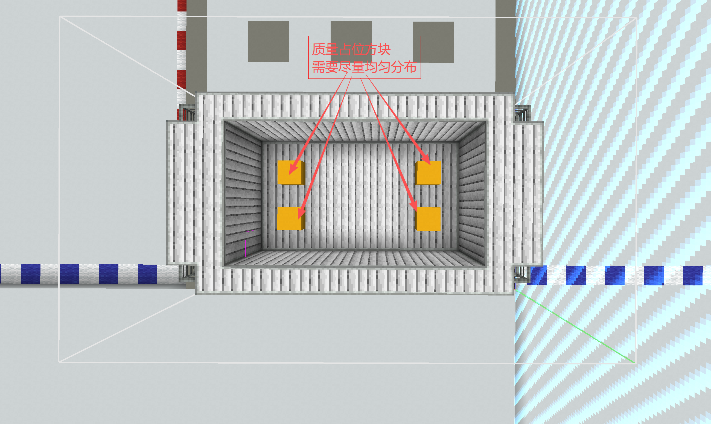

# 货柜结构制作规范

> 已实现：结构／物理基础能力；本页其余“必须”为内容制作要求，不代表加载器全部强制检查。待验收：全部下列实机检查及[实体贴花问题](../../00_重构状态与验收清单.md)。


本文规定货柜结构模板的最低制作要求。所有正式货柜在保存为 `.nbt` 前都应完成本页检查。

实现原理和模板路径参见[货柜结构模板](../01核心系统/03_货柜结构模板.md)，内容设计参见[货柜设计模板](04_货柜设计模板.md)。

## 一、强制要求

### 1. CargoClass 占位贴花

每个货柜结构必须包含至少一个 CargoClass 占位贴花。

- 空柜生成时分类占位贴花解析为 none；装载预览按具体 CargoGood 的 CargoClass 解析。实体装卸后的刷新尚待接通，见状态清单 R1。
- 占位贴花应放在玩家容易观察的位置。
- 放置多个占位贴花时，应确认各个朝向均能正确显示。
- 不要直接把固定 CargoClass 图标保存进通用货柜模板。

### 2. Affix 警示贴花槽位

每个货柜结构必须包含五个 Affix 警示贴花占位槽，对应编号 `0`～`4`。

- 槽位按 Load 中最终货物运输词条顺序显示；空柜没有货物词条。
- 运行数据最多 5 个运输词条；超限定义会校验失败，不依赖显示截断纠错。
- 五个槽位应保持固定、清晰且不互相遮挡的排列。
- 即使某个设计当前没有五个词条，也必须保留全部五个槽位，以便同一结构适配不同 CargoClass。


### 3. 质量占位方块

每个货柜结构必须包含一个或更多质量占位方块。

- 系统会根据目标质量和结构实际质量计算需要补充的质量。
- 存在多个质量占位方块时，补充质量会在它们之间平分；出现小数时按实现规则向上取整。
- 质量占位方块应尽量分布在结构内部或受保护位置，不应影响外观和运输接口。
- 不要使用旧压载占位块代替质量占位方块。
- 如果模板没有质量占位方块，货柜仍可生成，但只能使用结构实际质量，无法达到更高的目标质量。


### 4. 货柜等级与尺寸

下表为内容制作的规格尺寸约定，不是数据加载器自动识别规格或推导容量的公式。模板外接包围盒体积计算：

```text
体积 = X × Y × Z
```

| 等级 | 允许的外接包围盒体积 |
|---|---:|
| S | 0～128 |
| M | 129～256 |
| L | 257～512 |
| X | 513～1024 |
| XL | 1025 以上 |
| SP | 特别订单，不参与常规体积与尺寸递进；按订单单独确定 |

不要通过在模板边缘保留无意义方块或空白来人为改变等级。尺寸还应与货柜的视觉比例、货物单位和运输难度相符。SP 结构必须登记在对应制造商的“特别订单系列”文档中，不得作为常规系列的附加尺寸。

### 5. 可运输性

货柜结构必须在设计阶段考虑实际运输方式。

- 明确使用 LC、LM、SD 或 SM 中的哪一种接口。
- 为对接器、绑扎点、吊装点或承载面预留足够空间。
- 检查结构重心、底面和外轮廓，避免正常运输时明显失衡。
- 货柜不应只能依靠临时方块或破坏结构才能装卸。
- 外露装饰不得妨碍载具、锁定器、绳索或周边货柜。
- 大型规格应验证转弯、停靠、装卸和成组摆放所需空间。

### 6. 可用方块范围

货柜结构只能使用：

- Minecraft 原版方块；
- CargoVerse 本模组方块；
- CargoVerse 声明为必须依赖的模组所提供的方块。

不得使用可选模组、整合包临时模组、开发工具模组或其他非必须依赖提供的方块。否则缺少对应模组时可能导致模板无法加载、方块丢失或存档损坏。

### 7. 禁止实体与方块实体内容

货柜结构不应包含实体，也应尽量避免 BlockEntity 方块。

禁止保存：

- 生物、盔甲架、展示实体、掉落物、载具等实体；
- 物品展示框、画等附着实体；
- 模板中意外捕获的玩家、船、矿车或模组实体；
- 实体乘客关系、实体 UUID 或其他实体 NBT；
- 装有物品或流体的容器；
- 保存了运行状态、所有者、网络地址或外部 UUID 的方块实体。

导出结构时必须关闭“包含实体”或使用等效设置。

若外观必须依赖某种 BlockEntity 方块，应先确认它不会持续 Tick、不会保存敏感运行状态，并经过专门测试。

### 8. 质量控制

货柜主体应尽量使用低质量方块，让质量占位系统有足够空间补足目标质量。

- 结构实际质量是目标质量无法突破的下限。
- 如果模板实际质量高于数据定义计算出的目标质量，最终仍会使用结构实际质量。
- 避免大量使用高密度装饰块、隐藏压载块或质量异常的模组方块。
- 调整结构材料后应重新实测结构质量，不能沿用旧结果。

### 9. 避免可交互方块

货柜结构应尽量避免可互动、可储存或会主动更新的方块，以减少漏洞和额外开销。

尽量不要使用：

- 箱子、桶、储罐和其他容器；
- 门、活板门、按钮、拉杆等可切换状态方块；
- 工作站、菜单方块和机器；
- 红石元件、命令方块、结构方块和拼图方块；
- 会随机 Tick、生长、融化或扩散的方块；
- 火、传送门、流体源和持续产生粒子的复杂方块；
- 具有持续服务端 Tick 或网络同步行为的模组方块。

货柜实例虽然具有编辑保护，但模板本身仍应采用最小攻击面设计，不能只依赖事件拦截保证安全。

## 二、推荐规范

### 1. 原点与底面

- 货柜生成原点是模板底面中心点。
- 模板底面应平整，并明确实际承载面。
- 不要在底面以下保存无关方块。
- 保存前清理模板边界，避免无意义空气范围扩大外接包围盒。

### 2. 贴花布局

- 贴花应紧贴安装表面，避免与主体严重穿插或悬空。
- 为 CargoClass 与五个 Affix 槽位预留稳定位置，不要让其他装饰遮挡。
- 检查四个水平方向下的贴花朝向。
- 普通贴花缩放后不得超出预期表面或侵入运输接口。

### 3. 结构稳定性

- 避免依赖邻居更新才能保持状态的方块。
- 避免只靠易碎装饰连接主体的视觉结构。
- 不要保存正在运动、正在组装或尚未稳定的模组结构状态。
- 不要在模板中保留结构方块、测试标记和临时辅助方块。

### 4. 性能

- 优先使用静态普通方块。
- 控制透明、动态渲染和复杂模型方块的数量。
- 避免持续发光、发声、产生粒子或进行环境扫描的方块。
- 相同视觉效果优先通过方块状态、静态模型和贴花实现。

### 5. 命名

- 结构文件名使用小写英文、数字和下划线。
- 模板 ID 应与货柜定义中的 `template` 完全一致。
- 推荐按制造商、系列、接口和规格组织路径。

示例：

```text
cargoverse:cargo/aui/aui_atlas_sd_s
```

## 三、保存前检查

### 必备内容

- [ ] 包含至少一个 CargoClass 占位贴花
- [ ] 包含编号 `0`～`4` 的五个 Affix 占位贴花
- [ ] 包含至少一个质量占位方块
- [ ] 货柜等级与外接包围盒体积一致
- [ ] 运输接口、底面和装卸空间明确

### 内容安全

- [ ] 只使用原版、本模组和必须依赖模组的方块
- [ ] 未保存任何实体
- [ ] 未保存容器内容、流体或敏感方块实体数据
- [ ] 没有结构方块、拼图方块或临时制作方块残留
- [ ] 没有不必要的可交互、随机 Tick 或持续 Tick 方块

### 物理与表现

- [ ] 模板实际质量低于或符合目标质量范围
- [ ] 质量占位方块不会破坏外观和运输结构
- [ ] 贴花位置、朝向和缩放正确
- [ ] 四个水平方向放置时外观正常
- [ ] 模板底面中心与预期生成原点一致

### 游戏内验证

- [ ] 可以由大型货柜制造台正常生成
- [ ] 可以通过 `/cargoverse summon` 生成
- [ ] 预览的 CargoClass／Affix 替换正确，并单独检查实体装卸刷新（待验收 R1）
- [ ] 实际质量与 GUI、HUD 显示一致
- [ ] 存档重载后质量、碰撞和位置保持正确
- [ ] 普通玩家无法编辑、交互或向货柜放置流体
- [ ] 货柜能够按预定方式装载、固定、移动和卸载

[返回货柜系统](../README.md)
