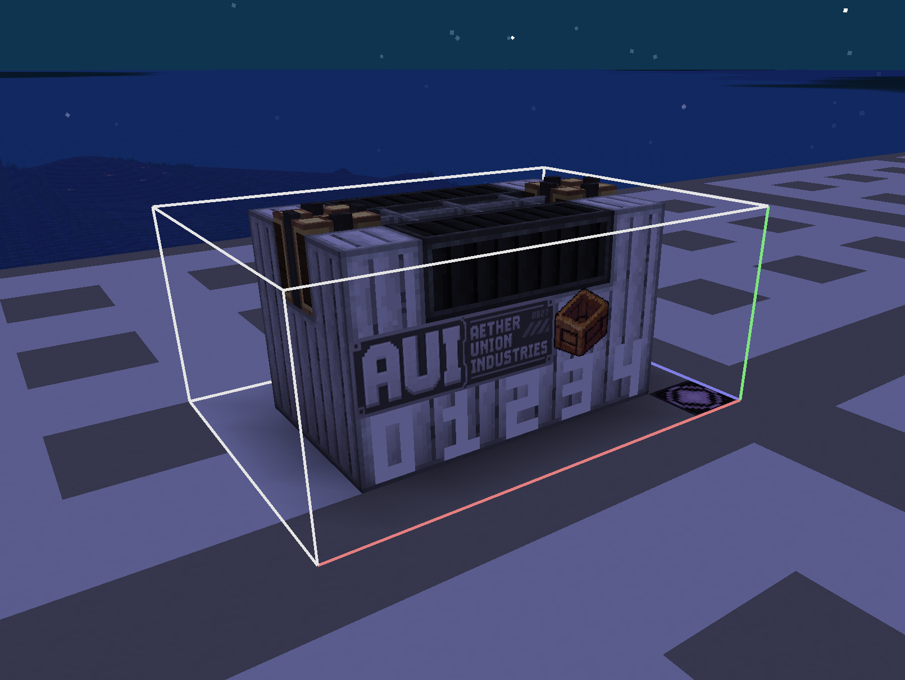
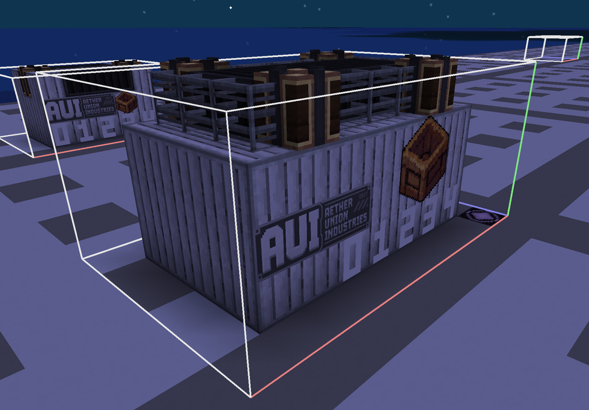
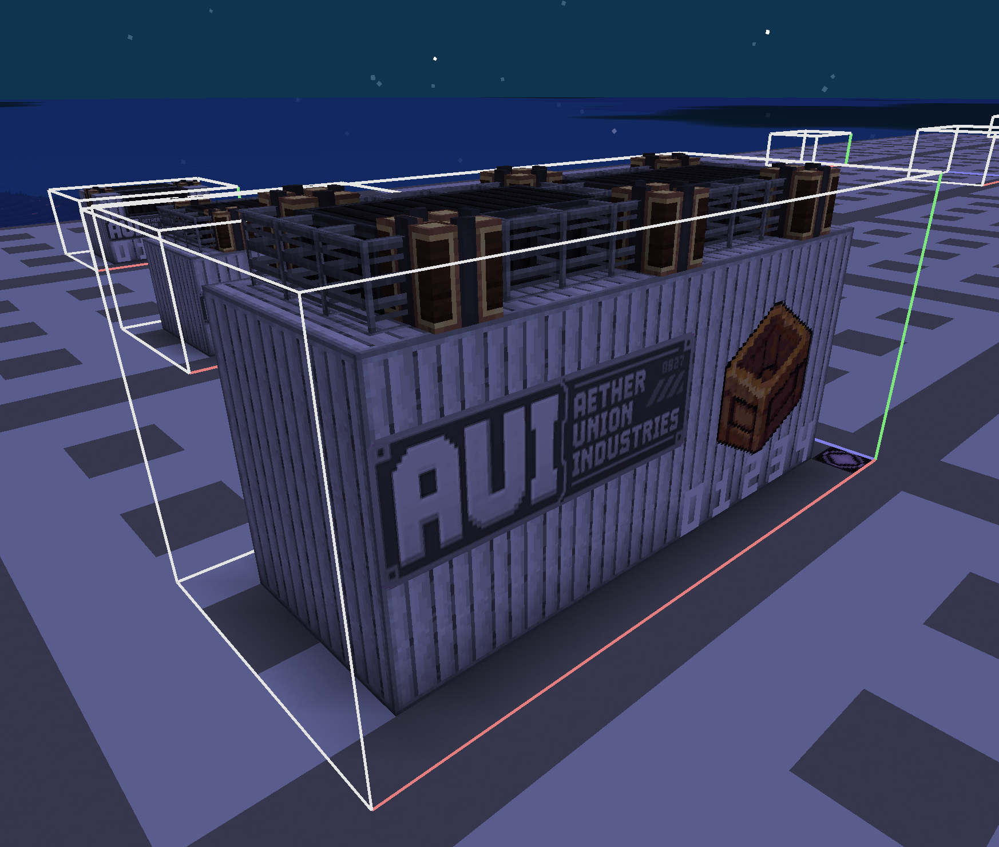
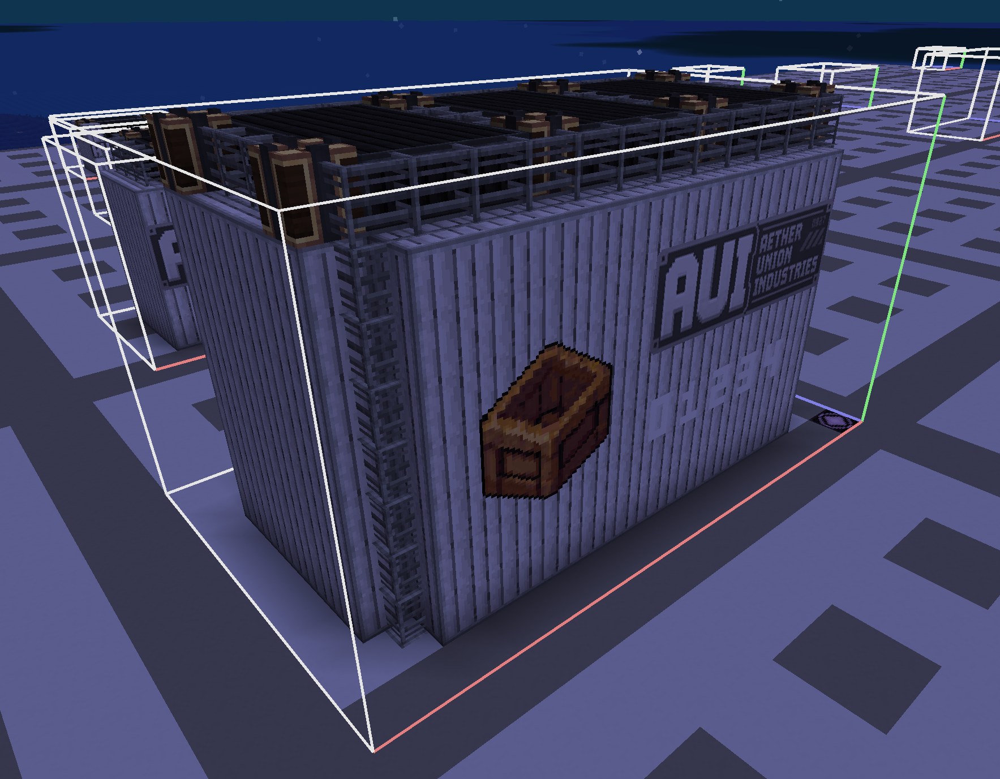

# 货柜设计模板

| 产品系列     | 规格      | 接口  | 定位     | 特点             |
| -------- | ------- | --- | ------ | -------------- |
| Atlas 系列 | S/M/L/X | SD  | 通用标准货柜 | 最普及；最低成本；最高兼容性 |

## 适用货物

| CargoType           | 中文名称    | 是否可用 | 适用规格    |  词条或限制   |
| ------------------- | ------- | :--: | ------- | :------: |
| `agriculture`       | 农业产品    |  √   | S/M/L/X |    限时    |
| `livestock`         | 活体生物    |  ×   |         |          |
| `ore`               | 矿石资源    |  √   | S/M/L/X |    无     |
| `wood`              | 木材      |  √   | S/M/L/X |    无     |
| `stone`             | 石材      |  √   | S/M/L/X |    无     |
| `fuel_resource`     | 能源原料    |  √   | S/M/L/X |   易燃物    |
| `textile`           | 纺织与轻工业品 |  √   | S/M/L/X |    无     |
| `security`          | 安防与武装设备 |  √   | S/M/L/X |    无     |
| `component`         | 工业零件    |  √   | S/M/L/X |   易碎品    |
| `machinery`         | 机械设备    |  ×   |         |          |
| `electronics`       | 电子设备    |  √   | S/M/L/X |    防潮    |
| `chemical`          | 化工材料    |  ×   |         |          |
| `construction`      | 建筑材料    |  √   | S/M/L/X |    无     |
| `structural_module` | 大型结构组件  |  ×   |         |          |
| `supplies`          | 生活补给    |  √   | S/M/L/X |    无     |
| `medical`           | 医疗物资    |  √   | S/M/L/X | 限时\冷链运输  |
| `luxury`            | 贵重消费品   |  √   | S/M/L/X | 易碎品\请勿倒置 |
| `research_sample`   | 科研样本    |  ×   |         |          |
| `data`              | 数据资源    |  ×   |         |          |
| `experimental`      | 实验品     |  ×   |         |          |

---
## AUI-Atlas-SD-S
#### AUI Atlas 标准货柜 S 型
> 天穹联合工业 Atlas 系列最小规格标准货柜，专为小型飞艇、短距离运输以及快速补给任务设计。采用统一标准接口，可快速接入各类运输平台，是个人运输与小型贸易网络中最常见的货柜型号。

**制造商：** Aether Union Industries  
**系列：** Atlas Series  
**接口：** SD 标准对接接口

### 货柜预览截图：

### 货柜基础参数
>以下为货柜定义的通用基础数值。

| 代码                  | 名称           | 参数                                                                                                                                                                                                |
| ------------------- | ------------ | ------------------------------------------------------------------------------------------------------------------------------------------------------------------------------------------------- |
| `template`          | 货柜结构ID       | `cargoverse:aui_atlas_sd_s`                                                                                                                                                                       |
| `display_name`      | 显示名称         | `AUI Atlas 标准货柜 S 型`                                                                                                                                                                              |
| `cargo_description` | 货柜描述         | `§lAUI Atlas 标准货柜 S 型\n§r§7天穹联合工业[Atlas]系列最小规格标准货柜，专为小型飞艇、短距离运输以及快速补给任务设计。采用统一标准接口，可快速接入各类运输平台，是个人运输与小型贸易网络中最常见的货柜型号。\n§r§l制造商：Aether Union Industries  \n§r§l系列：Atlas Series \n§r§l接口：SD 标准对接接口` |
| `currency_id`       | 交易物品ID       | cargoverse:enderite                                                                                                                                                                               |
| `max_owned`         | 每个玩家的同时最大持有量 | 10                                                                                                                                                                                                |
| `cargo_level`       | 货柜等级         | `S`                                                                                                                                                                                               |
| `max_integrity`     | 最大完整性        | 100                                                                                                                                                                                               |

### 结构信息

| 项目       | 内容    |
| -------- | ----- |
| 模板尺寸     | 7×3×5 |
| 体积       | 105   |
| 质量占位方块数量 | 1     |
| 结构基本质量   | 【待填写】 |

### CargoType 参数
> 以下为`cargo_type`中的不同货物类型的参数。
> 修正倍率不填写时默认为 `1.0`；`weight` 越高越容易被抽取。

表内质量、价格和经验表示策划目标最终值；实际 JSON 只填写 `weight`、可选的四项微调倍率与 `affixes`，再由统一货物类型常量和货柜等级倍率反算或生成最终值。

| `cargo_type` (货物类型) | `weight` (权重) | `mass_modifier` (最终质量修正) | `price_modifier` (价格修正) | `license_modifier` (运输许可经验修正) | `prosperity_modifier` (繁荣度经验修正) | `affixes` (词条)            |
| ---------------------- | :--------------: | :-------------------------: | :------------------------: | :------------------------------: | :--------------------------------: | ---------------------------- |
| `agriculture`          |        2         |             1.0             |            1.0             |               1.0                |                1.0                 | `time_limit`                 |
| `ore`                  |        3         |             1.0             |            1.0             |               1.0                |                1.0                 | 无                            |
| `wood`                 |        3         |             1.0             |            1.0             |               1.0                |                1.0                 | 无                            |
| `stone`                |        3         |             1.0             |            1.0             |               1.0                |                1.0                 | 无                            |
| `fuel_resource`        |        1         |             1.0             |            1.0             |               1.0                |                1.0                 | `flammable`                  |
| `textile`              |        3         |             1.0             |            1.0             |               1.0                |                1.0                 | 无                            |
| `security`             |        1         |             1.0             |            1.0             |               1.0                |                1.0                 | 无                            |
| `component`            |        2         |             1.0             |            1.0             |               1.0                |                1.0                 | `fragile`                    |
| `electronics`          |        2         |             1.0             |            1.0             |               1.0                |                1.0                 | `moisture_proof`             |
| `construction`         |        2         |             1.0             |            1.0             |               1.0                |                1.0                 | 无                            |
| `supplies`             |        3         |             1.0             |            1.0             |               1.0                |                1.0                 | 无                            |
| `medical`              |        1         |             1.0             |            1.0             |               1.0                |                1.0                 | `time_limit` `cold_chain` |
| `luxury`               |        1         |             1.0             |            1.0             |               1.0                |                1.0                 | `keep_upright` `fragile`  |

---
## AUI-Atlas-SD-M

#### AUI Atlas 标准货柜 M 型

> Atlas 系列的主力型号，也是天穹联合工业销量最高的标准货柜。M 型货柜在容量、重量和通用性之间取得平衡，被广泛应用于商业运输、资源贸易以及工业补给任务。

**制造商：** Aether Union Industries  
**系列：** Atlas Series  
**接口：** SD 标准对接接口

### 货柜预览截图：

##### 货柜模板基础参数
>以下为货柜定义的通用基础数值。

| 代码                  | 名称           | 参数                                                                                                                                                                                    |
| ------------------- | ------------ | ------------------------------------------------------------------------------------------------------------------------------------------------------------------------------------- |
| `template`          | 货柜结构ID       | `cargoverse:aui_atlas_sd_m                                                                                                                                                            |
| `display_name`      | 显示名称         | `AUI Atlas 标准货柜 M 型`                                                                                                                                                                  |
| `cargo_description` | 货柜描述         | `§lAUI Atlas 标准货柜 M 型\n§r§7[Atlas]系列的主力型号，也是天穹联合工业销量最高的标准货柜。M型货柜在容量、重量和通用性之间取得平衡，被广泛应用于商业运输、资源贸易以及工业补给任务。\n§r§l制造商：Aether Union Industries  \n§r§l系列：Atlas Series \n§r§l接口：SD 标准对接接口` |
| `currency_id`       | 交易物品ID       | cargoverse:enderite                                                                                                                                                                   |
| `max_owned`         | 每个玩家的同时最大持有量 | 10                                                                                                                                                                                    |
| `cargo_level`       | 货柜等级         | `M`                                                                                                                                                                                   |
| `max_integrity`     | 最大完整性        | 100                                                                                                                                                                                   |

### 结构信息

| 项目       | 内容    |
| -------- | ----- |
| 模板尺寸     | 9×4×6 |
| 体积       | 216   |
| 质量占位方块数量 | 2     |
| 结构基本质量   | 【待填写】 |

##### 货柜类型参数
> 以下为`cargo_type`中的不同货物类型的参数。

表内质量、价格和经验表示策划目标最终值；实际 JSON 只填写 `weight`、可选的四项微调倍率与 `affixes`，再由统一货物类型常量和货柜等级倍率反算或生成最终值。

| `cargo_type`(货物类型) | `weight`(权重) | `mass`(最终物理质量) | `license_experience`(航运许可经验) | `trade_point_experience`(贸易点繁荣度经验) | `affixes`(词条) |
| ------------------ | ------------ | -------------------- | ---------------------------- | ---------------------------------- | ------------- |
| `agriculture`      |              |                      |                              |                                    |               |
| `textile`          |              |                      |                              |                                    |               |
| `security`         |              |                      |                              |                                    |               |
| `component`        |              |                      |                              |                                    |               |
| `electronics`      |              |                      |                              |                                    |               |
| `supplies`         |              |                      |                              |                                    |               |
| `medical`          |              |                      |                              |                                    |               |
| `luxury`           |              |                      |                              |                                    |               |
| `research_sample`  |              |                      |                              |                                    |               |

---
## AUI-Atlas-SD-L
#### AUI Atlas 标准货柜 L 型

> 面向大型运输飞艇设计的标准化货柜。L 型 Atlas 在保持标准接口兼容性的同时扩大了载货空间，是矿产运输、工业原料供应以及区域贸易网络中的核心运输单元。

**制造商：** Aether Union Industries  
**系列：** Atlas Series  
**接口：** SD 标准对接接口

### 货柜预览截图：

##### 货柜模板基础参数
>以下为货柜定义的通用基础数值。

| 代码                  | 名称           | 参数                                                                                                                                                                                  |
| ------------------- | ------------ | ----------------------------------------------------------------------------------------------------------------------------------------------------------------------------------- |
| `template`          | 货柜结构ID       | `cargoverse:aui_atlas_slm                                                                                                                                                           |
| `display_name`      | 显示名称         | `AUI Atlas 标准货柜 L 型`                                                                                                                                                                |
| `cargo_description` | 货柜描述         | `§lAUI Atlas 标准货柜 L 型\n§r§7面向大型运输飞艇设计的标准化货柜。L型[Atlas]在保持标准接口兼容性的同时扩大了载货空间，是矿产运输、工业原料供应以及区域贸易网络中的核心运输单元。\n§r§l制造商：Aether Union Industries  \n§r§l系列：Atlas Series \n§r§l接口：SD 标准对接接口` |
| `currency_id`       | 交易物品ID       | cargoverse:enderite                                                                                                                                                                 |
| `max_owned`         | 每个玩家的同时最大持有量 | 5                                                                                                                                                                                   |
| `cargo_level`       | 货柜等级         | `L`                                                                                                                                                                                 |
| `max_integrity`     | 最大完整性        | 100                                                                                                                                                                                 |

### 结构信息

| 项目       | 内容     |
| -------- | ------ |
| 模板尺寸     | 13×6×7 |
| 体积       | 546    |
| 质量占位方块数量 | 4      |
| 结构基本质量   | 【待填写】  |

##### 货柜类型参数
> 以下为`cargo_type`中的不同货物类型的参数。

表内质量、价格和经验表示策划目标最终值；实际 JSON 只填写 `weight`、可选的四项微调倍率与 `affixes`，再由统一货物类型常量和货柜等级倍率反算或生成最终值。

| `cargo_type`(货物类型) | `weight`(权重) | `mass`(最终物理质量) | `license_experience`(航运许可经验) | `trade_point_experience`(贸易点繁荣度经验) | `affixes`(词条) |
| ------------------ | ------------ | -------------------- | ---------------------------- | ---------------------------------- | ------------- |
| `agriculture`      |              |                      |                              |                                    |               |
| `textile`          |              |                      |                              |                                    |               |
| `security`         |              |                      |                              |                                    |               |
| `component`        |              |                      |                              |                                    |               |
| `electronics`      |              |                      |                              |                                    |               |
| `supplies`         |              |                      |                              |                                    |               |
| `medical`          |              |                      |                              |                                    |               |
| `luxury`           |              |                      |                              |                                    |               |
| `research_sample`  |              |                      |                              |                                    |               |

---
## AUI-Atlas-SD-X
#### AUI Atlas 重型标准货柜 X 型

> Atlas 系列最大规模标准化型号之一，为满足大型工业运输需求而设计。X 型货柜采用强化框架结构，可用于大型工程材料、工业设备以及区域级物资调配，是现代天空工业体系的重要组成部分。

**制造商：** Aether Union Industries  
**系列：** Atlas Series  
**接口：** SD 标准对接接口

### 货柜预览截图：

##### 货柜模板基础参数
>以下为货柜定义的通用基础数值。

| 代码                  | 名称           | 参数                                                                                                                                                                                                |
| ------------------- | ------------ | ------------------------------------------------------------------------------------------------------------------------------------------------------------------------------------------------- |
| `template`          | 货柜结构ID       | `cargoverse:aui_atlas_sxm                                                                                                                                                                         |
| `display_name`      | 显示名称         | `AUI Atlas 标准货柜 X 型`                                                                                                                                                                              |
| `cargo_description` | 货柜描述         | `§lAUI Atlas 标准货柜 X 型\n§r§7[Atlas]系列最大规模标准化型号之一，为满足大型工业运输需求而设计。X型货柜采用强化框架结构，可用于大型工程材料、工业设备以及区域级物资调配，是现代天空工业体系的重要组成部分。\n§r§l制造商：Aether Union Industries  \n§r§l系列：Atlas Series \n§r§l接口：SD 标准对接接口` |
| `currency_id`       | 交易物品ID       | cargoverse:enderite                                                                                                                                                                               |
| `max_owned`         | 每个玩家的同时最大持有量 | 1                                                                                                                                                                                                 |
| `cargo_level`       | 货柜等级         | `X`                                                                                                                                                                                               |
| `max_integrity`     | 最大完整性        | 100                                                                                                                                                                                               |

### 结构信息

| 项目       | 内容     |
| -------- | ------ |
| 模板尺寸     | 15×8×9 |
| 体积       | 1080   |
| 质量占位方块数量 | 4      |
| 结构基本质量   | 【待填写】  |

##### 货柜类型参数
> 以下为`cargo_type`中的不同货物类型的参数。

表内质量、价格和经验表示策划目标最终值；实际 JSON 只填写 `weight`、可选的四项微调倍率与 `affixes`，再由统一货物类型常量和货柜等级倍率反算或生成最终值。

| `cargo_type`(货物类型) | `weight`(权重) | `mass`(最终物理质量) | `license_experience`(航运许可经验) | `trade_point_experience`(贸易点繁荣度经验) | `affixes`(词条) |
| ------------------ | ------------ | -------------------- | ---------------------------- | ---------------------------------- | ------------- |
| `agriculture`      |              |                      |                              |                                    |               |
| `textile`          |              |                      |                              |                                    |               |
| `security`         |              |                      |                              |                                    |               |
| `component`        |              |                      |                              |                                    |               |
| `electronics`      |              |                      |                              |                                    |               |
| `supplies`         |              |                      |                              |                                    |               |
| `medical`          |              |                      |                              |                                    |               |
| `luxury`           |              |                      |                              |                                    |               |
| `research_sample`  |              |                      |                              |                                    |               |
