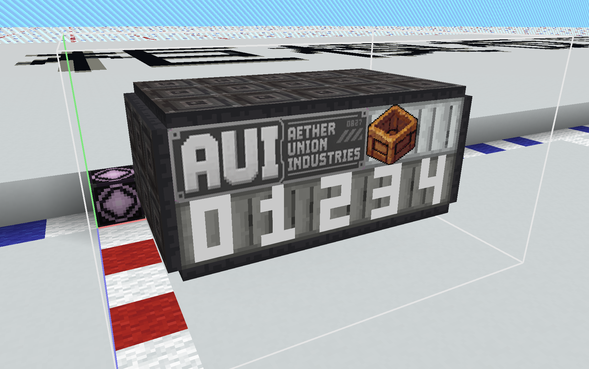
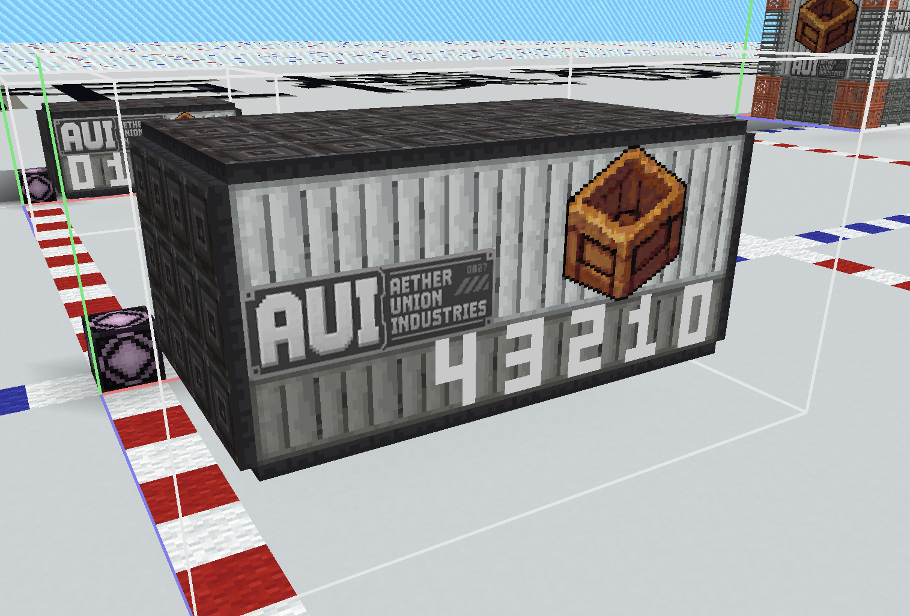
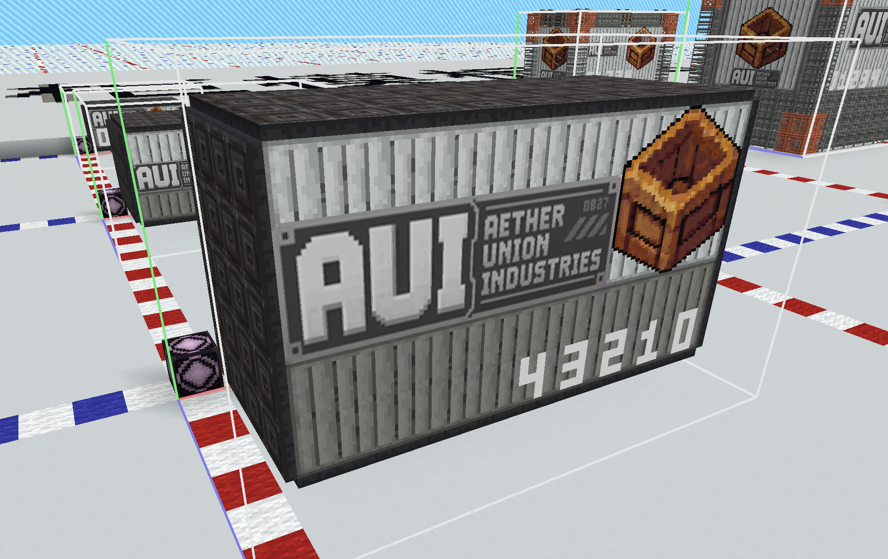

# 货柜设计模板

> 预留（内容设计）／待验收：保留世界观、命名、美术及历史平衡目标；已迁入数据包的型号以实际 cargo_containers 为准。下文旧整柜字段、类型表和数值不作为现行 JSON 契约，不能直接复制。
> 现行字段见[容器定义](<../../01核心系统/02_货柜定义系统.md>)与[货物定义](<../../01核心系统/05_货物类型.md>)；用[新设计模板](<../04_货柜设计模板.md>)继续制作。接口文字仅为展示／结构约定，不是容器数据字段。

| 产品系列     | 规格    | 接口  | 定位     | 特点                  |
| -------- | ----- | --- | ------ | ------------------- |
| Hermes系列 | S/M/L | MC  | 快速物流货柜 | 快速装卸；更低的初始完整度；更轻的重量 |

## 适用货物

> “CargoType 默认词条 ID”来自 `cargo_value_constants/default.json` 的 `cargo_type_affixes`，不在货柜定义中重复声明。
> `最终词条 = CargoType 默认词条 - 本规格 blocked_affixes`；`blocked_affixes` 是货柜根节点字段，对该规格的所有 CargoType 统一生效。

| CargoType | 中文名称 | 是否可用 | 适用规格 | CargoType 默认词条 ID | 简易描述 |
| --- | --- | :---: | --- | --- | --- |
| `agriculture` | 农业产品 | √ | S/M/L | `time_limit` | 轻量化结构适合快速周转，可运输谷物、蔬果和其他农产品。 |
| `livestock` | 活体生物 | × | — | `height_limit` |  |
| `ore` | 矿石资源 | √ | S/M/L | 无 | 轻量化结构适合快速周转，可运输原矿和精炼矿料。 |
| `wood` | 木材 | √ | S/M/L | 无 | 轻量化结构适合快速周转，可运输原木、板材和木构件。 |
| `stone` | 石材 | √ | S/M/L | 无 | 轻量化结构适合快速周转，可运输石料和砖材。 |
| `fuel_resource` | 能源原料 | × | — | `flammable` `radioactive` `cold_proof` |  |
| `textile` | 纺织与轻工业品 | √ | S/M/L | 无 | 轻量化结构适合快速周转，可运输布匹和轻工业制品。 |
| `security` | 安防与武装设备 | √ | S/M/L | 无 | 轻量化结构适合快速周转，可运输武器、装甲和安防设备。 |
| `component` | 工业零件 | √ | S/M/L | `fragile` | 轻量化结构适合快速周转，可运输机械零件和工业组件。 |
| `machinery` | 机械设备 | × | S/M/L | `keep_upright` `fragile` |  |
| `electronics` | 电子设备 | √ | S/M/L | `moisture_proof` `fragile` | 轻量化结构适合快速周转，可运输传感器、控制器和计算设备。 |
| `chemical` | 化工材料 | × | — | `radioactive` |  |
| `construction` | 建筑材料 | × | S/M/L | 无 |  |
| `structural_module` | 大型结构组件 | × | — | 无 |  |
| `supplies` | 生活补给 | √ | S/M/L | 无 | 轻量化结构适合快速周转，可运输食品、工具和日常补给。 |
| `medical` | 医疗物资 | √ | S/M/L | `time_limit` `cold_chain` `light_sensitive` | 轻量化结构适合快速周转，可运输药品、医疗器械和急救物资。 |
| `luxury` | 贵重消费品 | √ | S/M/L | `keep_upright` `fragile` | 轻量化结构适合快速周转，可运输珠宝、艺术品和贵重商品。 |
| `research_sample` | 科研样本 | √ | S/M/L | `time_limit` `fragile` `keep_upright` `light_sensitive` | 轻量化结构适合快速周转，可运输生物、地质和遗迹样本。 |
| `data` | 数据资源 | × | — | `cold_proof` `fragile` `moisture_proof` |  |
| `experimental` | 实验品 | × | — | 无 |  |

---
## AUI-Hermes-MC-S

### AUI Hermes 轻量化货柜 S 型

>天穹联合工业[Hermes]系列最小规格快速物流货柜，专为个人飞艇、短途运输以及紧急补给任务设计。采用轻量化结构与标准对接接口，可快速装卸并适配小型运输平台，是初级贸易与快速配送中最常见的物流货柜型号。

**制造商：** Aether Union Industries
**系列：** Hermes
**接口：** MC 磁力约束

### 货柜预览截图：

### 货柜基础参数

| 参数                  | 名称           | 内容                                                                                                                                                                                                       |
| ------------------- | ------------ | -------------------------------------------------------------------------------------------------------------------------------------------------------------------------------------------------------- |
| `template`          | 货柜结构ID       | `cargoverse:cargo/aui/hermes/aui_hermes_mc_s`                                                                                                                                                            |
| `display_name`      | 显示名称         | `AUI Hermes 轻量化货柜 S 型`                                                                                                                                                                                   |
| `cargo_description` | 货柜描述         | `§lAUI Hermes 快速货运箱 S 型\n§r§7天穹联合工业[Hermes]系列最小规格轻型货运箱，专为个人飞艇、短途运输以及紧急补给任务设计。采用轻量化结构与快速装卸接口，可在有限空间内实现高效货物周转，是小型运输艇与私人贸易网络中的常用型号。\n§r§l制造商：Aether Union Industries\n§r§l系列：Hermes Series\n§r§l接口：MC 磁力约束` |
| `currency_id`       | 交易物品ID       | `cargoverse:enderite`                                                                                                                                                                                    |
| `max_owned`         | 每个玩家的同时最大持有量 | 10                                                                                                                                                                                                       |
| `cargo_level`       | 货柜等级         | `S`                                                                                                                                                                                                      |
| `max_integrity`     | 最大完整性        | 70                                                                                                                                                                                                       |
| `blocked_affixes`   | 屏蔽词条         | 无                                                                                                                                                                                                        |
| `base_affixes`      | 货柜基础词条       | 无                                                                                                                                                                                                        |

### 结构信息

| 项目       | 内容    |
| -------- | ----- |
| 模板尺寸 | 7 × 4 × 5 |
| 体积 | 140 |
| 质量占位方块数量 | 2 |
| 结构基本质量   | 0 |

### CargoType 参数

> 修正倍率不填写时默认为 `1.0`；`weight` 越高越容易被抽取。
> 表内质量、货物单位、价格和经验表示策划目标最终值；实际货柜 JSON 只填写 `weight` 与可选的五项微调倍率。初始词条统一在 `cargo_type_affixes` 中维护，货柜能力通过根节点 `blocked_affixes` 表达。

| `cargo_type` (货物类型) | `weight` (权重) | `mass_modifier` (最终质量修正) | `price_modifier` (价格修正) | `cargo_units_modifier` (货物单位修正) | `license_modifier` (运输许可经验修正) | `prosperity_modifier` (繁荣度经验修正) |
| ---------------------- | :--------------: | :-------------------------: | :------------------------: | :--------------------------------: | :------------------------------: | :--------------------------------: |
| `agriculture`          |        4         | 0.65 |            1.0             |                0.6                 |               0.6                |                0.8                 |
| `ore`                  |        1         | 0.65 |            1.0             |                0.6                 |               0.6                |                0.8                 |
| `wood`                 |        1         | 0.65 |            1.0             |                0.6                 |               0.6                |                0.8                 |
| `stone`                |        1         | 0.65 |            1.0             |                0.6                 |               0.6                |                0.8                 |
| `textile`              |        2         | 0.65 |            1.0             |                0.6                 |               0.6                |                0.8                 |
| `security`             |        1         | 0.65 |            1.0             |                0.6                 |               0.6                |                0.8                 |
| `component`            |        2         | 0.65 |            1.0             |                0.6                 |               0.6                |                0.8                 |
| `electronics`          |        2         | 0.65 |            1.0             |                1.0                 |               0.6                |                0.8                 |
| `supplies`             |        4         | 0.65 |            1.0             |                1.0                 |               0.6                |                0.8                 |
| `medical`              |        4         | 0.65 |            1.5             |                1.0                 |               1.5                |                0.8                 |
| `luxury`               |        1         | 0.65 |            1.0             |                1.0                 |               1.0                |                0.8                 |
| `research_sample`      |        1         | 0.65 |            1.5             |                1.0                 |               1.5                |                0.8                 |

---

## AUI-Hermes-MC-M

### AUI Hermes 轻量化货柜 M 型

>天穹联合工业[Hermes]系列标准规格轻型货运箱，针对中型运输飞艇与区域物流任务优化设计。在保持较低重量的同时提供稳定的装载容量，支持快速部署与高频次运输，是商业物流航线中最常见的中型货柜型号。

**制造商：** 【Manufacturer】  
**系列：** 【Series】  
**接口：** MC 磁力约束

### 货柜预览截图：

### 货柜基础参数

| 参数                  | 名称           | 内容                                                                                                                                                                                                      |
| ------------------- | ------------ | ------------------------------------------------------------------------------------------------------------------------------------------------------------------------------------------------------- |
| `template`          | 货柜结构ID       | `cargoverse:cargo/aui/hermes/aui_hermes_mc_m`                                                                                                                                                           |
| `display_name`      | 显示名称         | `AUI Hermes 轻量化货柜 M 型`                                                                                                                                                                                  |
| `cargo_description` | 货柜描述         | `§lAUI Hermes 快速货运箱 M 型\n§r§7天穹联合工业[Hermes]系列标准规格轻型货运箱，针对中型运输飞艇与区域物流任务优化设计。在保持较低重量的同时提供稳定的装载容量，支持快速部署与高频次运输，是商业物流航线中最常见的中型货柜型号。\n§r§l制造商：Aether Union Industries\n§r§l系列：Hermes Series\n§r§l接口：MC 磁力约束` |
| `currency_id`       | 交易物品ID       | `cargoverse:enderite`                                                                                                                                                                                   |
| `max_owned`         | 每个玩家的同时最大持有量 | 10                                                                                                                                                                                                      |
| `cargo_level`       | 货柜等级         | `M`                                                                                                                                                                                                     |
| `max_integrity`     | 最大完整性        | 70                                                                                                                                                                                                      |
| `blocked_affixes`   | 屏蔽词条         | 无                                                                                                                                                                                                       |
| `base_affixes`      | 货柜基础词条       | 无                                                                                                                                                                                                       |

### 结构信息

| 项目       | 内容    |
| -------- | ----- |
| 模板尺寸 | 9 × 5 × 6 |
| 体积 | 270 |
| 质量占位方块数量 | 4 |
| 结构基本质量   | 0 |

### CargoType 参数

> 修正倍率不填写时默认为 `1.0`；`weight` 越高越容易被抽取。
> 表内质量、货物单位、价格和经验表示策划目标最终值；实际货柜 JSON 只填写 `weight` 与可选的五项微调倍率。初始词条统一在 `cargo_type_affixes` 中维护，货柜能力通过根节点 `blocked_affixes` 表达。

| `cargo_type` (货物类型) | `weight` (权重) | `mass_modifier` (最终质量修正) | `price_modifier` (价格修正) | `cargo_units_modifier` (货物单位修正) | `license_modifier` (运输许可经验修正) | `prosperity_modifier` (繁荣度经验修正) |
| ---------------------- | :--------------: | :-------------------------: | :------------------------: | :--------------------------------: | :------------------------------: | :--------------------------------: |
| `agriculture`          |        4         | 0.65 |            1.0             |                0.6                 |               0.6                |                0.8                 |
| `ore`                  |        1         | 0.65 |            1.0             |                0.6                 |               0.6                |                0.8                 |
| `wood`                 |        1         | 0.65 |            1.0             |                0.6                 |               0.6                |                0.8                 |
| `stone`                |        1         | 0.65 |            1.0             |                0.6                 |               0.6                |                0.8                 |
| `textile`              |        2         | 0.65 |            1.0             |                0.6                 |               0.6                |                0.8                 |
| `security`             |        1         | 0.65 |            1.0             |                0.6                 |               0.6                |                0.8                 |
| `component`            |        2         | 0.65 |            1.0             |                0.6                 |               0.6                |                0.8                 |
| `electronics`          |        2         | 0.65 |            1.0             |                1.0                 |               0.6                |                0.8                 |
| `supplies`             |        4         | 0.65 |            1.0             |                1.0                 |               0.6                |                0.8                 |
| `medical`              |        4         | 0.65 |            1.5             |                1.0                 |               1.5                |                0.8                 |
| `luxury`               |        1         | 0.65 |            1.0             |                1.0                 |               1.0                |                0.8                 |
| `research_sample`      |        1         | 0.65 |            1.5             |                1.0                 |               1.5                |                0.8                 |

---

## AUI-Hermes-MC-L

### AUI Hermes 轻量化货柜 L 型

>天穹联合工业[Hermes]系列标准规格轻型货运箱，针对中型运输飞艇与区域物流任务优化设计。在保持较低重量的同时提供稳定的装载容量，支持快速部署与高频次运输，是商业物流航线中最常见的中型货柜型号。

**制造商：** 【Manufacturer】  
**系列：** 【Series】  
**接口：** MC 磁力约束

### 货柜预览截图：

### 货柜基础参数

| 参数                  | 名称           | 内容                                                                                                                                                                                                      |
| ------------------- | ------------ | ------------------------------------------------------------------------------------------------------------------------------------------------------------------------------------------------------- |
| `template`          | 货柜结构ID       | `cargoverse:cargo/aui/hermes/aui_hermes_mc_l`                                                                                                                                                           |
| `display_name`      | 显示名称         | `AUI Hermes 轻量化货柜 L 型`                                                                                                                                                                                  |
| `cargo_description` | 货柜描述         | `§lAUI Hermes 快速货运箱 L 型\n§r§7天穹联合工业[Hermes]系列标准规格轻型货运箱，针对中型运输飞艇与区域物流任务优化设计。在保持较低重量的同时提供稳定的装载容量，支持快速部署与高频次运输，是商业物流航线中最常见的中型货柜型号。\n§r§l制造商：Aether Union Industries\n§r§l系列：Hermes Series\n§r§l接口：MC 磁力约束` |
| `currency_id`       | 交易物品ID       | `cargoverse:enderite`                                                                                                                                                                                   |
| `max_owned`         | 每个玩家的同时最大持有量 | 7                                                                                                                                                                                                       |
| `cargo_level`       | 货柜等级         | `L`                                                                                                                                                                                                     |
| `max_integrity`     | 最大完整性        | 70                                                                                                                                                                                                      |
| `blocked_affixes`   | 屏蔽词条         | 无                                                                                                                                                                                                       |
| `base_affixes`      | 货柜基础词条       | 无                                                                                                                                                                                                       |

### 结构信息

| 项目       | 内容     |
| -------- | ------ |
| 模板尺寸 | 11 × 7 × 6 |
| 体积 | 462 |
| 质量占位方块数量 | 4 |
| 结构基本质量   | 0 |

### CargoType 参数

> 修正倍率不填写时默认为 `1.0`；`weight` 越高越容易被抽取。
> 表内质量、货物单位、价格和经验表示策划目标最终值；实际货柜 JSON 只填写 `weight` 与可选的五项微调倍率。初始词条统一在 `cargo_type_affixes` 中维护，货柜能力通过根节点 `blocked_affixes` 表达。

| `cargo_type` (货物类型) | `weight` (权重) | `mass_modifier` (最终质量修正) | `price_modifier` (价格修正) | `cargo_units_modifier` (货物单位修正) | `license_modifier` (运输许可经验修正) | `prosperity_modifier` (繁荣度经验修正) |
| ---------------------- | :--------------: | :-------------------------: | :------------------------: | :--------------------------------: | :------------------------------: | :--------------------------------: |
| `agriculture`          |        4         | 0.65 |            1.0             |                0.6                 |               0.6                |                0.8                 |
| `ore`                  |        1         | 0.65 |            1.0             |                0.6                 |               0.6                |                0.8                 |
| `wood`                 |        1         | 0.65 |            1.0             |                0.6                 |               0.6                |                0.8                 |
| `stone`                |        1         | 0.65 |            1.0             |                0.6                 |               0.6                |                0.8                 |
| `textile`              |        2         | 0.65 |            1.0             |                0.6                 |               0.6                |                0.8                 |
| `security`             |        1         | 0.65 |            1.0             |                0.6                 |               0.6                |                0.8                 |
| `component`            |        2         | 0.65 |            1.0             |                0.6                 |               0.6                |                0.8                 |
| `electronics`          |        2         | 0.65 |            1.0             |                1.0                 |               0.6                |                0.8                 |
| `supplies`             |        4         | 0.65 |            1.0             |                1.0                 |               0.6                |                0.8                 |
| `medical`              |        4         | 0.65 |            1.5             |                1.0                 |               1.5                |                0.8                 |
| `luxury`               |        1         | 0.65 |            1.0             |                1.0                 |               1.0                |                0.8                 |
| `research_sample`      |        1         | 0.65 |            1.5             |                1.0                 |               1.5                |                0.8                 |

---

> 继续增加 L、X、XL 或 SP 规格时，复制上方任意一个规格章节并修改 `cargo_level`。

[返回货柜内容设计](README.md)
