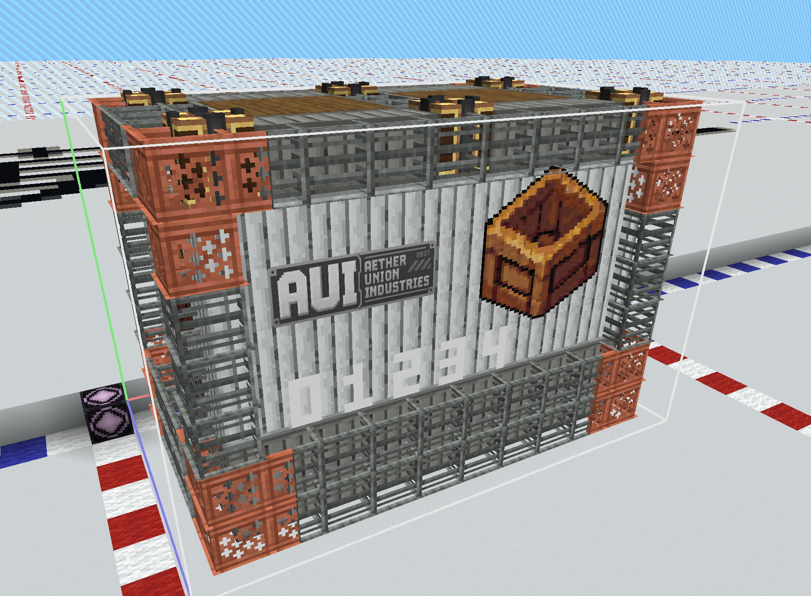
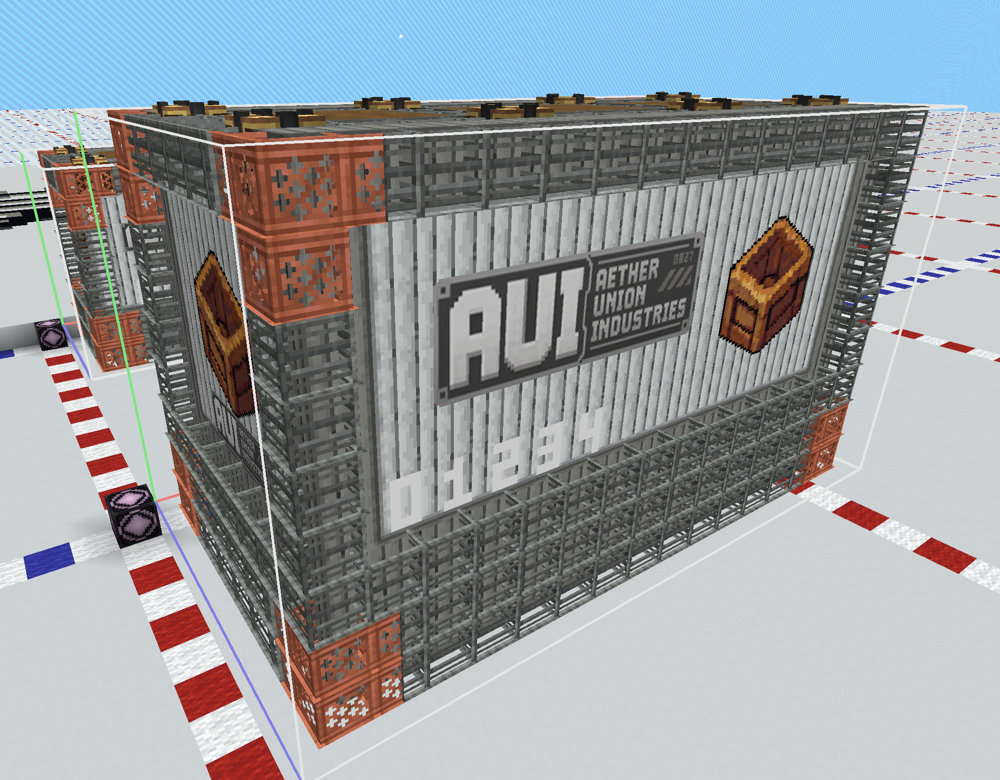
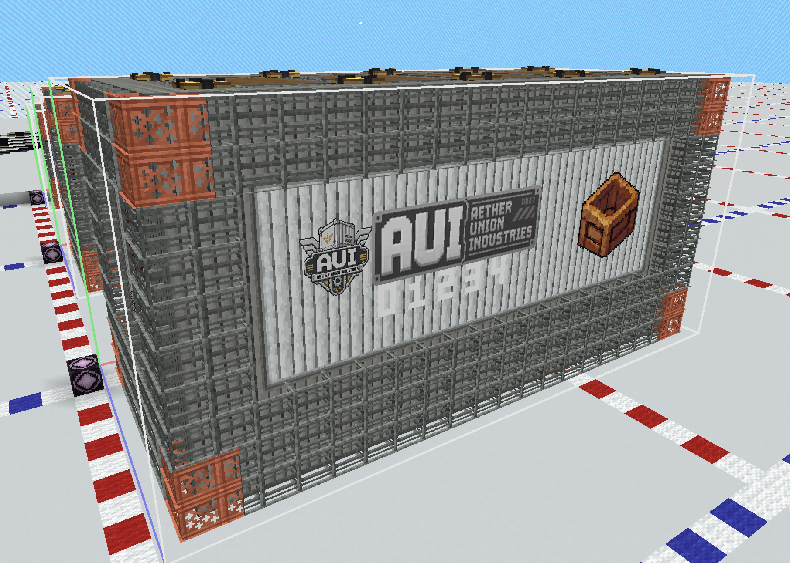

# 货柜设计模板

| 产品系列    | 规格    | 接口  | 定位     | 特点                    |
| ------- | ----- | --- | ------ | --------------------- |
| Titan系列 | S/M/L | HD  | 重型工业运输 | 高承载；加强结构；通常更重运输的货物也更多 |

## 适用货物

> “CargoType 默认词条 ID”来自 `cargo_value_constants/default.json` 的 `cargo_type_affixes`，不在货柜定义中重复声明。
> `最终词条 = CargoType 默认词条 - 本规格 blocked_affixes`；`blocked_affixes` 是货柜根节点字段，对该规格的所有 CargoType 统一生效。

| CargoType | 中文名称 | 是否可用 | 适用规格 | CargoType 默认词条 ID | 简易描述 |
| --- | --- | :---: | --- | --- | --- |
| `agriculture`       | 农业产品    |  ×   | —     | `time_limit` |                               |
| `livestock`         | 活体生物    |  ×   | —     | `height_limit` |                               |
| `ore`               | 矿石资源    |  √   | S/M/L | 无 | 强化承载框架适合重型运输，可运输原矿和精炼矿料。      |
| `wood`              | 木材      |  √   | S/M/L | 无 | 强化承载框架适合重型运输，可运输原木、板材和木构件。    |
| `stone`             | 石材      |  √   | S/M/L | 无 | 强化承载框架适合重型运输，可运输石料和砖材。        |
| `fuel_resource`     | 能源原料    |  √   | S/M/L | `flammable` `radioactive` `cold_proof` | 强化承载框架适合重型运输，可运输燃料和能源材料。      |
| `textile`           | 纺织与轻工业品 |  √   | S/M/L | 无 | 强化承载框架适合重型运输，可运输布匹和轻工业制品。     |
| `security`          | 安防与武装设备 |  √   | S/M/L | 无 | 强化承载框架适合重型运输，可运输武器、装甲和安防设备。   |
| `component`         | 工业零件    |  √   | S/M/L | `fragile` | 强化承载框架适合重型运输，可运输机械零件和工业组件。    |
| `machinery`         | 机械设备    |  √   | S/M/L | `keep_upright` `fragile` | 强化承载框架适合重型运输，可运输机床和工程机械。      |
| `electronics`       | 电子设备    |  √   | S/M/L | `moisture_proof` `fragile` | 强化承载框架适合重型运输，可运输传感器、控制器和计算设备。 |
| `chemical`          | 化工材料    |  ×   | —     | `radioactive` |                               |
| `construction`      | 建筑材料    |  √   | S/M/L | 无 | 强化承载框架适合重型运输，可运输建材和设施配套材料。    |
| `structural_module` | 大型结构组件  |  √   | S/M/L | 无 | 强化承载框架适合重型运输，可运输预制舱段和大型结构件。   |
| `supplies`          | 生活补给    |  √   | S/M/L | 无 | 强化承载框架适合重型运输，可运输食品、工具和日常补给。   |
| `medical`           | 医疗物资    |  ×   | —     | `time_limit` `cold_chain` `light_sensitive` |                               |
| `luxury`            | 贵重消费品   |  ×   | —     | `keep_upright` `fragile` |                               |
| `research_sample`   | 科研样本    |  ×   | —     | `time_limit` `fragile` `keep_upright` `light_sensitive` |                               |
| `data`              | 数据资源    |  ×   | —     | `cold_proof` `fragile` `moisture_proof` |                               |
| `experimental`      | 实验品     |  ×   | —     | 无 |                               |

---
## AUI-Titan-HD-L

### AUI Titan 重载货柜 L 型

>天穹联合工业[Titan]系列基础重型货运模块，专为矿业运输、工业设备转移以及大型工程项目设计。采用强化框架结构与高强度标准接口，可承载远超普通货柜的工业级货物，是中型工业飞艇执行重载任务时的首选型号。

**制造商：** Aether Union Industries
**系列：** Titan
**接口：** HD

### 货柜预览截图：

### 货柜基础参数

| 参数                  | 名称           | 内容                                                                                                                                                                                                        |
| ------------------- | ------------ | --------------------------------------------------------------------------------------------------------------------------------------------------------------------------------------------------------- |
| `template`          | 货柜结构ID       | `cargoverse:aui/titan/aui_titan_hd_l`                                                                                                                                                                     |
| `display_name`      | 显示名称         | `AUI Titan 重载货柜 L 型`                                                                                                                                                                                      |
| `cargo_description` | 货柜描述         | `§lAUI Titan 重载货柜 L 型\n§r§7天穹联合工业[Titan]系列基础重型货运模块，专为矿业运输、工业设备转移以及大型工程项目设计。采用强化框架结构与高强度标准接口，可承载远超普通货柜的工业级货物，是中型工业飞艇执行重载任务时的首选型号。\n§r§l制造商：Aether Union Industries\n§r§l系列：Titan Series\n§r§l接口：HD 重型保持接口` |
| `currency_id`       | 交易物品ID       | `cargoverse:enderite`                                                                                                                                                                                     |
| `max_owned`         | 每个玩家的同时最大持有量 | 3                                                                                                                                                                                                         |
| `cargo_level`       | 货柜等级         | `L`                                                                                                                                                                                                       |
| `max_integrity`     | 最大完整性        | 120                                                                                                                                                                                                       |
| `blocked_affixes` | 屏蔽词条 | `[]`（待根据本规格货柜能力调整；填写词条 ID） |

### 结构信息

| 项目       | 内容     |
| -------- | ------ |
| 模板尺寸     | 11x8x7 |
| 体积       | 539    |
| 质量占位方块数量 | 2      |
| 结构基本质量   | 0      |

### CargoType 参数

> 修正倍率不填写时默认为 `1.0`；`weight` 越高越容易被抽取。
> 表内质量、货物单位、价格和经验表示策划目标最终值；实际货柜 JSON 只填写 `weight` 与可选的五项微调倍率。初始词条统一在 `cargo_type_affixes` 中维护，货柜能力通过根节点 `blocked_affixes` 表达。

| `cargo_type` (货物类型) | `weight` (权重) | `mass_modifier` (最终质量修正) | `price_modifier` (价格修正) | `cargo_units_modifier` (货物单位修正) | `license_modifier` (运输许可经验修正) | `prosperity_modifier` (繁荣度经验修正) |
| ---------------------- | :--------------: | :-------------------------: | :------------------------: | :--------------------------------: | :------------------------------: | :--------------------------------: |
| `ore`                  |        3         |             1.8             |            1.2             |                1.6                 |               1.4                |                1.4                 |
| `wood`                 |        3         |             1.2             |            1.2             |                1.6                 |               1.4                |                1.4                 |
| `stone`                |        3         |             1.6             |            1.2             |                1.6                 |               1.4                |                1.4                 |
| `fuel_resource`        |        3         |             1.5             |            1.2             |                1.6                 |               1.4                |                1.4                 |
| `textile`              |        1         |             1.2             |            1.2             |                1.4                 |               1.2                |                1.3                 |
| `security`             |        1         |             1.4             |            1.2             |                1.4                 |               1.2                |                1.3                 |
| `component`            |        3         |             1.4             |            1.2             |                1.4                 |               1.2                |                1.3                 |
| `machinery`            |        3         |             1.6             |            1.2             |                1.7                 |               1.4                |                1.6                 |
| `electronics`          |        1         |             1.2             |            1.2             |                1.4                 |               1.2                |                1.3                 |
| `construction`         |        1         |             1.8             |            1.2             |                1.4                 |               1.2                |                1.3                 |
| `structural_module`    |        3         |             1.6             |            1.2             |                1.6                 |               1.4                |                1.6                 |
| `supplies`             |        1         |             1.2             |            1.2             |                1.4                 |               1.2                |                1.3                 |

---

## AUI-Titan-HD-X

### AUI Titan 重载货柜 X 型

>天穹联合工业[Titan]系列大型工业运输模块，针对区域级资源运输与大型工程建设任务开发。相比标准货柜采用更厚重的承载框架与增强型连接结构，可安全运输大型机械、矿产资源以及高重量工业组件，是专业运输飞艇的重要组成部分。

**制造商：** Aether Union Industries
**系列：** Titan
**接口：** HD

### 货柜预览H截图：

### 货柜基础参数

| 参数                  | 名称           | 内容                                                                                                                                                                                                                   |
| ------------------- | ------------ | -------------------------------------------------------------------------------------------------------------------------------------------------------------------------------------------------------------------- |
| `template`          | 货柜结构ID       | `cargoverse:aui/titan/aui_titan_hd_x`                                                                                                                                                                                |
| `display_name`      | 显示名称         | `AUI Titan 重载货柜 X 型`                                                                                                                                                                                                 |
| `cargo_description` | 货柜描述         | `§lAUI Titan 超规格运输模块 X 型\n§r§7天穹联合工业[Titan]系列大型工业运输模块，针对区域级资源运输与大型工程建设任务开发。相比标准货柜采用更厚重的承载框架与增强型连接结构，可安全运输大型机械、矿产资源以及高重量工业组件，是专业运输飞艇的重要组成部分。\n§r§l制造商：Aether Union Industries\n§r§l系列：Titan Series\n§r§l接口：HD 重型保持接口` |
| `currency_id`       | 交易物品ID       | `cargoverse:enderite`                                                                                                                                                                                                |
| `max_owned`         | 每个玩家的同时最大持有量 | 3                                                                                                                                                                                                                    |
| `cargo_level`       | 货柜等级         | `X`                                                                                                                                                                                                                  |
| `max_integrity`     | 最大完整性        | 120                                                                                                                                                                                                                  |
| `blocked_affixes` | 屏蔽词条 | `[]`（待根据本规格货柜能力调整；填写词条 ID） |

### 结构信息

| 项目       | 内容      |
| -------- | ------- |
| 模板尺寸     | 16x10x9 |
| 体积       | 1440    |
| 质量占位方块数量 | 4       |
| 结构基本质量   | 0       |

### CargoType 参数

> 修正倍率不填写时默认为 `1.0`；`weight` 越高越容易被抽取。
> 表内质量、货物单位、价格和经验表示策划目标最终值；实际货柜 JSON 只填写 `weight` 与可选的五项微调倍率。初始词条统一在 `cargo_type_affixes` 中维护，货柜能力通过根节点 `blocked_affixes` 表达。

| `cargo_type` (货物类型) | `weight` (权重) | `mass_modifier` (最终质量修正) | `price_modifier` (价格修正) | `cargo_units_modifier` (货物单位修正) | `license_modifier` (运输许可经验修正) | `prosperity_modifier` (繁荣度经验修正) |
| ---------------------- | :--------------: | :-------------------------: | :------------------------: | :--------------------------------: | :------------------------------: | :--------------------------------: |
| `ore`                  |        3         |             1.8             |            1.2             |                1.6                 |               1.4                |                1.4                 |
| `wood`                 |        3         |             1.2             |            1.2             |                1.6                 |               1.4                |                1.4                 |
| `stone`                |        3         |             1.6             |            1.2             |                1.6                 |               1.4                |                1.4                 |
| `fuel_resource`        |        3         |             1.5             |            1.2             |                1.6                 |               1.4                |                1.4                 |
| `textile`              |        1         |             1.2             |            1.2             |                1.4                 |               1.2                |                1.3                 |
| `security`             |        1         |             1.4             |            1.2             |                1.4                 |               1.2                |                1.3                 |
| `component`            |        3         |             1.4             |            1.2             |                1.4                 |               1.2                |                1.3                 |
| `machinery`            |        3         |             1.6             |            1.2             |                1.7                 |               1.4                |                1.6                 |
| `electronics`          |        1         |             1.2             |            1.2             |                1.4                 |               1.2                |                1.3                 |
| `construction`         |        1         |             1.8             |            1.2             |                1.4                 |               1.2                |                1.3                 |
| `structural_module`    |        3         |             1.6             |            1.2             |                1.6                 |               1.4                |                1.6                 |
| `supplies`             |        1         |             1.2             |            1.2             |                1.4                 |               1.2                |                1.3                 |

---

## AUI-Titan-HD-XL

### AUI Titan 重载货柜 XL 型

>天穹联合工业[Titan]系列最高规格运输模块，为大型飞艇、工业舰以及空中工程平台设计。采用多层强化结构与重型接口系统，可用于运输超大型机械、预制建筑模块以及关键工程设施，是大型工业项目与区域建设任务中的核心运输单元。

**制造商：** Aether Union Industries
**系列：** Titan
**接口：** HD

### 货柜预览截图：

### 货柜基础参数

| 参数                  | 名称           | 内容                                                                                                                                                                                                                    |
| ------------------- | ------------ | --------------------------------------------------------------------------------------------------------------------------------------------------------------------------------------------------------------------- |
| `template`          | 货柜结构ID       | `cargoverse:aui/titan/aui_titan_hd_xl`                                                                                                                                                                                |
| `display_name`      | 显示名称         | `AUI Titan 重载货柜 XL 型`                                                                                                                                                                                                 |
| `cargo_description` | 货柜描述         | `§lAUI Titan 超大型工业模块 XL 型\n§r§7天穹联合工业[Titan]系列最高规格运输模块，为大型飞艇、工业舰以及空中工程平台设计。采用多层强化结构与重型接口系统，可用于运输超大型机械、预制建筑模块以及关键工程设施，是大型工业项目与区域建设任务中的核心运输单元。\n§r§l制造商：Aether Union Industries\n§r§l系列：Titan Series\n§r§l接口：HD 重型保持接口` |
| `currency_id`       | 交易物品ID       | `cargoverse:enderite`                                                                                                                                                                                                 |
| `max_owned`         | 每个玩家的同时最大持有量 | 3                                                                                                                                                                                                                     |
| `cargo_level`       | 货柜等级         | `XL`                                                                                                                                                                                                                  |
| `max_integrity`     | 最大完整性        | 120                                                                                                                                                                                                                   |
| `blocked_affixes` | 屏蔽词条 | `[]`（待根据本规格货柜能力调整；填写词条 ID） |

### 结构信息

| 项目       | 内容       |
| -------- | -------- |
| 模板尺寸     | 21x11x10 |
| 体积       | 2310     |
| 质量占位方块数量 | 4        |
| 结构基本质量   | 0        |

### CargoType 参数

> 修正倍率不填写时默认为 `1.0`；`weight` 越高越容易被抽取。
> 表内质量、货物单位、价格和经验表示策划目标最终值；实际货柜 JSON 只填写 `weight` 与可选的五项微调倍率。初始词条统一在 `cargo_type_affixes` 中维护，货柜能力通过根节点 `blocked_affixes` 表达。

| `cargo_type` (货物类型) | `weight` (权重) | `mass_modifier` (最终质量修正) | `price_modifier` (价格修正) | `cargo_units_modifier` (货物单位修正) | `license_modifier` (运输许可经验修正) | `prosperity_modifier` (繁荣度经验修正) |
| ---------------------- | :--------------: | :-------------------------: | :------------------------: | :--------------------------------: | :------------------------------: | :--------------------------------: |
| `ore`                  |        3         |             1.8             |            1.2             |                1.6                 |               1.4                |                1.4                 |
| `wood`                 |        3         |             1.2             |            1.2             |                1.6                 |               1.4                |                1.4                 |
| `stone`                |        3         |             1.6             |            1.2             |                1.6                 |               1.4                |                1.4                 |
| `fuel_resource`        |        3         |             1.5             |            1.2             |                1.6                 |               1.4                |                1.4                 |
| `textile`              |        1         |             1.2             |            1.2             |                1.4                 |               1.2                |                1.3                 |
| `security`             |        1         |             1.4             |            1.2             |                1.4                 |               1.2                |                1.3                 |
| `component`            |        3         |             1.4             |            1.2             |                1.4                 |               1.2                |                1.3                 |
| `machinery`            |        3         |             1.6             |            1.2             |                1.7                 |               1.4                |                1.6                 |
| `electronics`          |        1         |             1.2             |            1.2             |                1.4                 |               1.2                |                1.3                 |
| `construction`         |        1         |             1.8             |            1.2             |                1.4                 |               1.2                |                1.3                 |
| `structural_module`    |        3         |             1.6             |            1.2             |                1.6                 |               1.4                |                1.6                 |
| `supplies`             |        1         |             1.2             |            1.2             |                1.4                 |               1.2                |                1.3                 |

---

> 继续增加 L、X、XL 或 SP 规格时，复制上方任意一个规格章节并修改 `cargo_level`。

[返回货柜内容设计](README.md)
