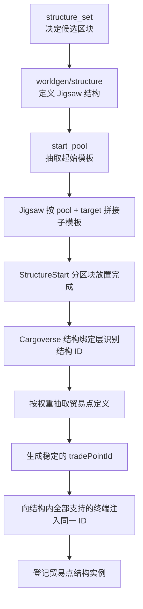

# 贸易点结构生成层与制作规范

## 1. 章节定位

本章描述 Cargoverse 贸易点的结构生成层，覆盖：

- 世界生成结构的数据组成；
- 如何制作并添加一个新的贸易点结构；
- 如何将世界生成结构绑定到贸易点定义；
- Jigsaw 模板、接口和结构池的搭建规范；
- 自然生成后贸易点实例 UUID 与终端的绑定流程；
- 调试、校验和常见故障。

贸易点结构决定“贸易点长什么样、在哪里生成、包含哪些终端”，贸易点定义决定“贸易点如何交易和运行”。两者通过 `trade_point_structure_bindings` 连接，不应把经济配置写入结构模板。

开发阶段建议使用实例侧数据目录覆盖模组内置资源：

```text
<游戏实例>/.minecraft/kubejs/data/cargoverse
```

结构配置确定后，再同步回模组资源或正式整合包。具体本地绝对路径属于开发机配置，不应提交到公共文档。调试期间不要同时修改模组内置数据和外部覆盖数据，否则容易误判实际加载来源。

---

## 2. 总体生成链路



对应职责：

| 层级 | 负责内容 |
|---|---|
| `structure_set` | 候选结构、权重、间距和放置规则 |
| `worldgen/structure` | 结构类型、起始池、拼接深度、起始高度和地形适应 |
| `template_pool` | 每个 Jigsaw 池可选择的模板、权重、Processor 和投影方式 |
| `structure/*.nbt` | 实际方块、方块实体数据和 Jigsaw 接口 |
| biome tag | 允许该结构出现的生物群系 |
| `trade_point_structure_bindings` | 世界结构 ID 与贸易点定义的绑定 |
| 运行时转接层 | 生成 `tradePointId`，绑定终端并保存实例 |

---

## 3. 一个贸易点结构所需的数据

以下示例使用结构 ID：

```text
cargoverse:cloud_farm
```

### 3.1 推荐目录

```text
data/cargoverse/
├─ structure/
│  └─ trade_point/resource/cloud_farm/
│     ├─ roads/
│     │  ├─ road_a1.nbt
│     │  ├─ road_a2.nbt
│     │  ├─ road_b1.nbt
│     │  └─ road_c2.nbt
│     └─ fixed_buildings/
│        ├─ farmhouse.nbt
│        ├─ helipad.nbt
│        ├─ wheat_fields.nbt
│        ├─ acquisition_station.nbt
│        └─ sales_station.nbt
├─ worldgen/
│  ├─ template_pool/
│  │  └─ trade_point/resource/cloud_farm/
│  │     ├─ start.json
│  │     ├─ roads.json
│  │     └─ fixed_buildings.json
│  ├─ structure/
│  │  └─ cloud_farm.json
│  └─ structure_set/
│     └─ cloud_farm.json
├─ tags/worldgen/biome/has_structure/
│  └─ cloud_farm.json
└─ trade_point_structure_bindings/
   └─ cloud_farm.json
```

命名空间之后的文件路径就是资源 ID。例如：

```text
data/cargoverse/structure/trade_point/resource/cloud_farm/roads/road_a1.nbt
```

对应：

```text
cargoverse:trade_point/resource/cloud_farm/roads/road_a1
```

---

## 4. 建立起始结构

### 4.1 起始池

每个贸易点必须有一个起始池：

```text
data/cargoverse/worldgen/template_pool/
trade_point/resource/cloud_farm/start.json
```

示例：

```json
{
  "fallback": "minecraft:empty",
  "elements": [
    {
      "weight": 1,
      "element": {
        "element_type": "minecraft:single_pool_element",
        "location": "cargoverse:trade_point/resource/cloud_farm/fixed_buildings/farmhouse",
        "processors": "minecraft:empty",
        "projection": "rigid"
      }
    }
  ]
}
```

当前 `cloud_farm` 使用 `farmhouse` 作为起点。起始模板必须包含能够继续生成其余骨架的主动 Jigsaw 出口。

如果起始池包含多个模板，会按权重抽取其中一个。对于固定布局，起始池通常只保留一个元素。

### 4.2 世界结构定义

```text
data/cargoverse/worldgen/structure/cloud_farm.json
```

示例：

```json
{
  "type": "minecraft:jigsaw",
  "biomes": "#cargoverse:has_structure/cloud_farm",
  "step": "surface_structures",
  "spawn_overrides": {},
  "terrain_adaptation": "beard_thin",
  "start_pool": "cargoverse:trade_point/resource/cloud_farm/start",
  "size": 6,
  "start_height": {
    "absolute": 0
  },
  "project_start_to_heightmap": "WORLD_SURFACE_WG",
  "max_distance_from_center": 116,
  "use_expansion_hack": false
}
```

主要字段：

- `start_pool`：起始模板池；
- `size`：Jigsaw 最大递归深度，不是模板数量；
- `project_start_to_heightmap`：将起点投影到指定高度图；
- `max_distance_from_center`：所有子 Piece 距离起点中心的最大水平距离；
- `terrain_adaptation`：结构对周围原版地形的整体修整方式。

固定链路的有效深度必须小于等于 `size`。如果接口名称和结构池都正确，但远端模板始终不生成，应检查拼接深度和中心距离。

### 4.3 结构集

```text
data/cargoverse/worldgen/structure_set/cloud_farm.json
```

结构集负责把世界结构加入自然生成。基础格式：

```json
{
  "structures": [
    {
      "structure": "cargoverse:cloud_farm",
      "weight": 1
    }
  ],
  "placement": {
    "type": "minecraft:random_spread",
    "salt": 15487029,
    "spacing": 32,
    "separation": 12
  }
}
```

约束：

- `spacing` 必须大于 `separation`；
- `salt` 应为该结构集使用的稳定整数；
- 修改结构集只影响尚未生成的新区域；
- 正式项目采用何种额外放置规则由对应世界生成项目负责，本章不展开。

### 4.4 生物群系标签

```text
data/cargoverse/tags/worldgen/biome/has_structure/cloud_farm.json
```

示例：

```json
{
  "replace": false,
  "values": [
    "#minecraft:is_overworld"
  ]
}
```

标签资源 ID 必须与世界结构中的 `biomes` 一致：

```text
#cargoverse:has_structure/cloud_farm
```

---

## 5. 结构池

### 5.1 道路池

```text
cargoverse:trade_point/resource/cloud_farm/roads
```

当前池包含：

```text
road_a1
road_a2
road_b1
road_c1
```

示例元素：

```json
{
  "weight": 1,
  "element": {
    "element_type": "minecraft:single_pool_element",
    "location": "cargoverse:trade_point/resource/cloud_farm/roads/road_a1",
    "processors": "minecraft:empty",
    "projection": "terrain_matching"
  }
}
```

同一个池可以容纳固定对应的多个模板。固定链路依靠唯一的 Jigsaw `target` 与子模板 `name` 一一匹配，不要求每个模板创建一个单独池。
![[../road_pool.png]]
### 5.2 固定建筑池

```text
cargoverse:trade_point/resource/cloud_farm/fixed_buildings
```

当前池包含：

```text
farmhouse
helipad
wheat_fields
acquisition_station
sales_station
```

固定建筑入口应具有唯一名称。例如：

```text
cargoverse:cloud_farm/wheat_fields/interfaceA
```

只有 `wheat_fields.nbt` 包含该名称时，即使池中存在多个建筑，指向这个目标名称的接口也只能匹配麦田。
![[../tradepoint_fixed_buildings.png]]
### 5.3 随机建筑池

需要随机建筑时，应单独创建随机池，不要混入固定建筑池。

随机池中的所有候选建筑使用相同入口名称，例如：

```text
cargoverse:cloud_farm/random_small/interfaceA
```

池内通过 `weight` 控制概率。允许该槽位为空时加入：

```json
{
  "weight": 2,
  "element": {
    "element_type": "minecraft:empty_pool_element"
  }
}
```

不同占地规格应使用不同接口和结构池：

```text
random_small
random_medium
random_large
```

Jigsaw 不会自动理解预留空地尺寸。

---

## 6. Jigsaw 接口规范

### 6.1 单向生成规则

假设建筑 A 已经生成，并由它生成道路 B：

```text
建筑 A 出口的 target
    =
道路 B 入口的 name
```

只需要主动一侧指向被动一侧，不需要反向匹配。

建筑 A 主动出口：

```text
目标池 pool：
cargoverse:trade_point/resource/example/roads

名称 name：
cargoverse:example/building_a/to_road_b

目标名称 target：
cargoverse:example/road_b/input

转变为 final_state：
minecraft:air
```

道路 B 被动入口：

```text
目标池 pool：
minecraft:empty

名称 name：
cargoverse:example/road_b/input

目标名称 target：
minecraft:empty

转变为 final_state：
minecraft:air
```

不要让入口再反向生成父模板。反向填写会形成无效分支、自指或重叠候选。

### 6.2 一个接口只承担一种职责

一个普通道路模板至少应区分：

- 输入接口：供父模板匹配；
- 输出接口：主动生成下一模板；
- 建筑槽位接口：主动生成建筑；
- 结束接口：不再继续生成。

推荐命名：

```text
cargoverse:<layout>/<piece>/<role>
```

例如：

```text
cargoverse:cloud_farm/roadA1/interfaceB
cargoverse:cloud_farm/roadB1/interfaceA
cargoverse:cloud_farm/wheat_fields/interfaceA
```

同一固定池内，被目标引用的入口 `name` 必须唯一。重复名称代表这些模板都是合法候选，会产生随机结果。

### 6.3 朝向

两个需要对接的 Jigsaw 正面必须相向：

```text
[父结构][出口 →] [← 入口][子结构]
```

名称正确但朝向不兼容时，模板仍不会生成。

水平接口统一检查：

- `orientation` 的正面方向；
- 接口高度；
- 子模板旋转后是否能对齐；
- `joint` 是否符合预期。

布局需要保持水平旋转关系时使用 `aligned`；允许围绕连接轴滚转时使用 `rollable`。普通水平道路与建筑接口应保持统一，不要在同一组接口中随意混用。

### 6.4 终止接口

不再扩展的接口设置：

```text
pool   = minecraft:empty
target = minecraft:empty
```

如果该 Jigsaw 只用于被父模板连接，连接完成后也不应继续向外生成。

### 6.5 Jigsaw 图必须以树为主

原版 Jigsaw 擅长生成树状关系：

```text
起点
├─ 道路 A
│  └─ 建筑 A
└─ 道路 B
   └─ 建筑 B
```

它不会把一个新接口“连接到已经生成的 Piece”。以下汇合关系不能作为必须成功的逻辑依赖：

```text
道路 A ─┐
        ├→ 同一个道路 C
道路 B ─┘
```

其中一侧可以生成道路 C，另一侧只能在几何位置上对齐；再次生成同一个 Piece 会因为包围盒重叠而被拒绝。固定闭环道路应提前设计好主生成方向，其他接口只做视觉收口。

---

## 7. 模板搭建规范

### 7.1 先确定布局图

制作方块前先记录有向关系：

```text
起始模板
→ 道路 A
├→ 固定建筑 A
└→ 道路 B
   ├→ 固定建筑 B
   └→ 道路 C
```

为每条边明确：

- 谁先生成；
- 父出口的 `target`；
- 子入口的 `name`；
- 父出口使用的池；
- 是否占用一层 Jigsaw 深度。

不要等全部模板保存后再猜测生成方向。
![[../tradepoint_Generation_direction.png]]
### 7.2 保存范围

结构模板的矩形边界会作为 Structure Piece 的包围盒参与碰撞判断，空气区域也在边界内。

规范：

- 保存框尽量贴近实际结构；
- 不要把大片预留建筑空地包进道路 Piece；
- Jigsaw 放在模板边缘；
- 子模板从父模板包围盒外侧开始；
- 大型路网可拆成少量大型骨架 Piece，而不是一个覆盖所有内部空位的矩形；
- 大型建筑可以跨区块生成，但模板边界、中心距离和生成区块数量会随之增加。

若建筑应放在一个巨大路网模板内部，即使那里全是空气，也可能因包围盒相交而被拒绝。
![[../tradepoint_Structure.png]]
### 7.3 道路与建筑的拆分

推荐：

- 道路保存固定路网骨架；
- 建筑保存主体、内部和终端；
- 道路保留建筑入口前的短连接段；
- 建筑 Jigsaw 位于门口或地块边缘；
- 固定布局使用固定目标名称；
- 随机地块使用独立的尺寸池。

道路无需拆成每一个直线和转角。可以将一整段复杂道路保存为一个 Piece，只要不会覆盖需要拼入建筑的空间。
![[../tradepoint_Template_pool1 1.png]]
### 7.4 投影方式

`rigid`：

- 保持模板自身高度；
- 适合建筑、平台、终端站和需要精确高度关系的模板；
- 大型刚性建筑通常必须使用此方式。

`terrain_matching`：

- 根据地形调整 Piece 的垂直放置；
- 适合道路、铺地和允许独立贴地的农田；
- 不会让单个模板内部每个方块分别弯曲贴地；
- 相邻 Piece 高差过大时仍可能出现断层。

当前 `cloud_farm`：

| 模板类别 | projection |
|---|---|
| `farmhouse` 起点 | `rigid` |
| 道路 | `terrain_matching` |
| `wheat_fields` | `terrain_matching` |
| 其他固定建筑 | `rigid` |

### 7.5 Processor

模板保存结构设计，Processor 负责生成时的材料变化。

适合 Processor 的内容：

- 道路主材中的少量裂纹、苔藓和次要材料；
- 木板、石材的随机风化；
- 不影响结构轮廓的装饰噪点；
- 通用占位材料替换。

应直接保存在模板中的内容：

- 道路形状；
- 台阶、路缘和排水沟；
- 建筑地基和入口；
- 明显破洞和大型缺损；
- 影响碰撞与通行的设计。

推荐为道路使用专用语义占位方块，避免 Processor 误替换建筑中正常使用的同类方块。

---

## 8. 绑定贸易点定义

### 8.1 文件位置

每个完整世界结构使用独立绑定文件：

```text
data/<namespace>/trade_point_structure_bindings/<name>.json
```

例如：

```text
data/cargoverse/trade_point_structure_bindings/cloud_farm.json
```

### 8.2 最简绑定

```json
{
  "structures_pool": "cargoverse:cloud_farm"
}
```

此时自动使用：

```text
cargoverse:default
```

注意：字段名虽然是 `structures_pool`，当前实现读取的是完整的世界结构 ID，即：

```text
worldgen/structure/cloud_farm.json
→ cargoverse:cloud_farm
```

它不是 Jigsaw 的 `template_pool` ID，也不是 `structure_set` ID。

### 8.3 多定义加权绑定

```json
{
  "structures_pool": "cargoverse:cloud_farm",
  "trade_point_id": [
    {
      "id": "cargoverse:default",
      "weight": 1
    },
    {
      "id": "cargoverse:cloud_farm_advanced",
      "weight": 5
    }
  ]
}
```

字段：

- `trade_point_id[].id`：`trade_points` 目录中的贸易点定义 ID；
- `trade_point_id[].weight`：正整数权重，运行时钳制到 `1～1000000`。

处理规则：

- 未填写 `trade_point_id`：使用 `cargoverse:default`；
- 数组为空：使用默认定义；
- 候选定义不存在：忽略该候选；
- 所有候选均无效：使用默认定义；
- 多个绑定文件指向同一世界结构：后加载文件覆盖先加载文件，并输出警告；
- 没有绑定文件的世界结构：只生成普通结构，不进入贸易点实例链路。

绑定选择使用世界种子、结构起始区块、首个 Piece 中心和结构 ID 构造的稳定随机源。同一结构实例重载时不会重新随机成另一个定义。

---

## 9. 贸易点实例与终端注入

### 9.1 实例 ID

自然生成结构使用以下内容生成稳定 UUID：

- 世界种子；
- 维度 ID；
- 世界结构 ID；
- 结构起始区块；
- 第一个 Piece 的最小坐标。

它作为该贸易点的：

```text
tradePointId
```

同一个自然生成贸易点中的所有终端共享此 ID；不同贸易点互不影响。

### 9.2 当前支持自动绑定的方块实体

结构放置完成后，转接层扫描本次放置区块与 Structure Piece 的交集，并处理：

- `TradePointTerminalBlockEntity`：贸易点主终端，同时写入定义 ID；
- `CargoSpawnerBlockEntity`：出售货柜终端；
- `ShipIdentifierBlockEntity`：收购/识别类终端；
- `ShopTerminalBlockEntity`：商店终端。

所有终端都直接写入同一个 `tradePointId`，不需要子终端搜索主终端。

主终端不需要在结构模板中保存预制 UUID，也不应将模板保存时的测试 UUID 当成最终实例 ID。自然生成完成后，运行时绑定会覆盖为当前结构实例的稳定 ID。

### 9.3 实例存档

世界存档：

```text
cargoverse_trade_point_structure_instances
```

保存：

- `InstanceId`
- `DefinitionId`
- `StructureId`
- `DimensionId`
- `Origin`
- `MainTerminalPos`

经济状态由贸易点经济存档按同一个 `tradePointId` 管理。

### 9.4 主终端要求

自然生成结构可以完成子终端绑定，即使当前区块尚未放置到主终端所在 Piece；绑定过程会随各区块放置重复执行，并使用同一个稳定 ID。

正式贸易点仍应包含至少一个主终端，用于：

- 显示贸易点状态；
- 管理员查看实例 ID；
- 管理员测试或修改贸易点定义；
- 保存 `MainTerminalPos`。

---

## 10. 添加新贸易点结构的工作流

### 10.1 规划

1. 确定世界结构 ID，例如 `cargoverse:deepcore_mine`；
2. 确定结构类别和目录；
3. 绘制固定的有向 Jigsaw 关系；
4. 区分固定建筑槽位和随机建筑槽位；
5. 估算最大拼接深度和中心距离；
6. 确定起始模板。

### 10.2 制作模板

1. 在测试世界中搭建起始建筑、道路和建筑；
2. 将各 Piece 移动到预期相对位置检查整体布局；
3. 为每条连接边设置父出口与子入口；
4. 保证父 `target` 等于子 `name`；
5. 保证两个 Jigsaw 正面相向；
6. 子入口设为 `minecraft:empty`，避免反向生成；
7. 保存 `.nbt`；
8. 检查保存范围没有多余建筑或邻接 Piece 的 Jigsaw。

结构保存时尤其要检查：父模板一侧的 Jigsaw 不应被误保存进子模板。否则子模板可能出现自指接口，而真正的父模板缺失生成出口。

### 10.3 建立数据文件

依次建立：

1. `structure/*.nbt`；
2. `worldgen/template_pool/.../start.json`；
3. 道路、固定建筑和随机建筑池；
4. `worldgen/structure/<id>.json`；
5. `worldgen/structure_set/<id>.json`；
6. 生物群系标签；
7. `trade_point_structure_bindings/<id>.json`。

### 10.4 绑定定义

确认：

- `structures_pool` 指向世界结构 ID；
- 候选 `trade_point_id` 均存在；
- 模板中的所有终端类型都在自动绑定支持范围内；
- 主终端没有依赖模板内预制 UUID。

### 10.5 调试

修改外部数据包后执行：

```mcfunction
/reload
```

手动放置完整世界结构：

```mcfunction
/place structure cargoverse:cloud_farm
```

查找自然生成结构：

```mcfunction
/locate structure cargoverse:cloud_farm
```

注意：

- 已生成的贸易点不会因 `/reload` 自动重拼；
- 自然生成修改只能在新区块验证；
- 部分世界生成注册内容可能需要重进存档或重启游戏；
- `/place structure` 适合检查模板链路，不等价于验证自然分布密度。

---

## 11. 发布前检查表

### 11.1 数据文件

- [ ] 起始池存在且只引用有效模板；
- [ ] 所有模板池 JSON 可以解析；
- [ ] 所有 `location` 对应实际 `.nbt`；
- [ ] 世界结构的 `start_pool` 正确；
- [ ] `size` 足够覆盖最长链路；
- [ ] `max_distance_from_center` 足够覆盖最远 Piece；
- [ ] 生物群系标签 ID 正确；
- [ ] 结构集引用正确的世界结构 ID；
- [ ] 贸易点结构绑定文件存在。

### 11.2 Jigsaw

- [ ] 每条固定链路只有一个主动生成方向；
- [ ] 父 `target` 与子 `name` 完全一致；
- [ ] 父 `pool` 中确实包含子模板；
- [ ] 子入口没有反向生成父模板；
- [ ] 固定目标名称在对应池内唯一；
- [ ] Jigsaw 正面相向且高度一致；
- [ ] 结束接口使用 `minecraft:empty`；
- [ ] 没有意外自指、循环或必须依赖的汇合边；
- [ ] 子模板没有误保存父模板的 Jigsaw。

### 11.3 几何与地形

- [ ] Piece 保存框贴近实际内容；
- [ ] 父子 Piece 包围盒不重叠；
- [ ] 建筑空位不位于父 Piece 的巨大空气包围盒内部；
- [ ] 建筑使用合适的 `rigid`；
- [ ] 道路或农田只在确实需要时使用 `terrain_matching`；
- [ ] 跨区块大型模板在新区块生成中完成验证；
- [ ] 道路闭环的非父连接只作为视觉收口。

### 11.4 贸易点运行时

- [ ] 结构绑定引用真实存在的贸易点定义；
- [ ] 主终端显示有效 `tradePointId`；
- [ ] 出售、收购和商店终端使用同一个 `tradePointId`；
- [ ] 结构实例存档登记了结构 ID 和定义 ID；
- [ ] 重进存档后终端绑定不发生变化；
- [ ] 多个自然生成贸易点之间的经济状态互不影响。

---

## 12. 常见故障

### 12.1 某个模板及其全部后继都不生成

优先检查：

1. 父模板是否真的存在主动出口；
2. 父出口 `target` 是否为空；
3. 子入口 `name` 是否匹配；
4. 子模板是否在父出口指定的池中；
5. 接口朝向；
6. 拼接深度；
7. Piece 包围盒碰撞。

如果一个建筑依赖某条道路生成，道路缺失时建筑也必然缺失。

### 12.2 名称都正确但仍然不生成

名称只是连接条件之一，还要检查：

- Jigsaw 正面是否相向；
- 模板能否通过旋转对齐；
- 子 Piece 是否与已生成 Piece 相交；
- 是否超过中心距离；
- 是否超过 Jigsaw 深度；
- 目标池中是否实际包含该模板。

### 12.3 生成了错误的固定建筑

对应池中有多个模板使用了相同入口 `name`。固定接口必须使用唯一目标名称；共享名称只应用于需要随机抽取的槽位。

### 12.4 道路能生成但闭环缺一段

原版 Jigsaw 不负责把两个已经存在的 Piece 再连接起来。为闭环指定一条主生成路径，其余连接位置按几何坐标对齐，不要让两侧都尝试生成同一个 Piece。

### 12.5 终端没有共享贸易点 ID

检查：

- 世界结构 ID 是否存在于 `trade_point_structure_bindings`；
- `structures_pool` 是否错误填写成模板池 ID；
- 终端是否属于当前自动绑定支持的方块实体类型；
- 终端是否真的包含在 Structure Piece 的保存范围；
- 日志是否显示绑定文件无效或定义缺失。

### 12.6 `/reload` 后看不到修改

- 已生成结构不会更新；
- 需要在新区块生成新的实例；
- 确认外部 KubeJS 数据覆盖路径正确；
- 确认没有同时修改另一个未被加载的数据副本；
- 必要时重进存档或重启游戏。
