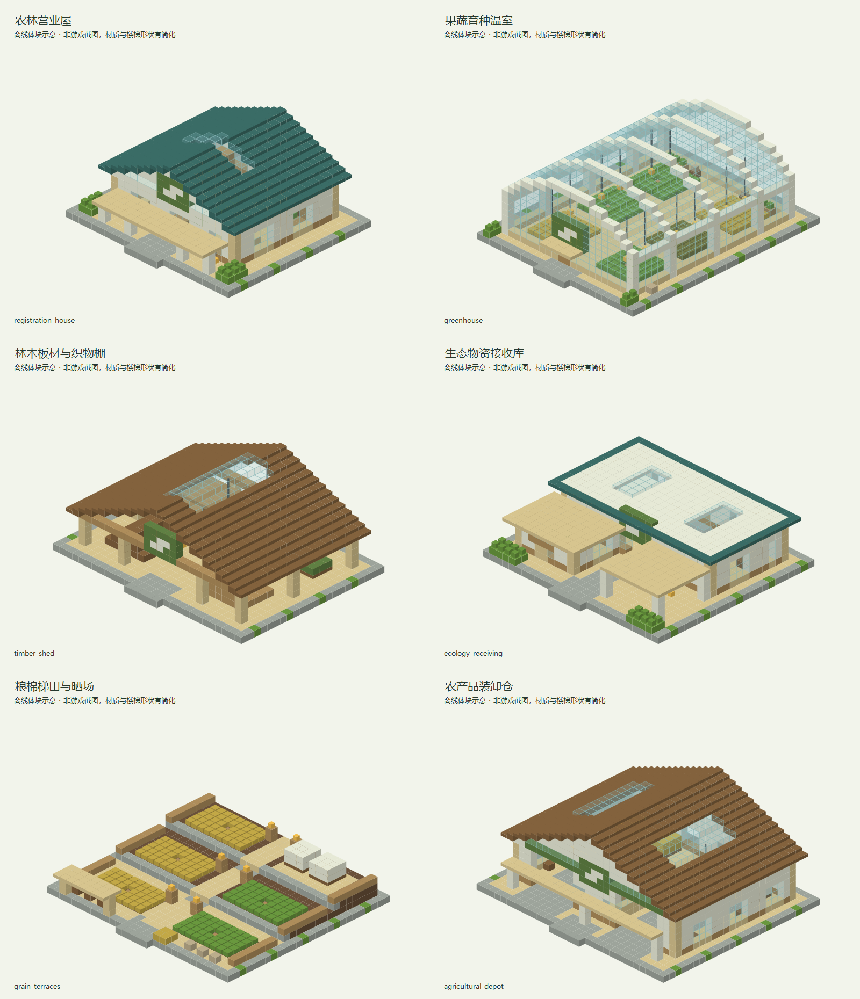

# 梯田农林站

> 已同步内置经济数据包；2026-09-12 首批六个独立建筑 NBT 已交付开发存档，供作者加载调整，未接入模组内置结构及自然生成绑定。可手工绑定信息柜使用，尚不会自然生成。

## 身份与定位

普通农林地表；农业登记入口，谷物、木材及温室作物的供应站。

| 项目 | 内容 |
| --- | --- |
| 设计编号 | V01 |
| 资源 ID | `cargoverse:resource/agriculture/terrace_farm` |
| 目标 JSON | `src/main/resources/data/cargoverse/trade_points/trade_points_definitions/resource/agriculture/terrace_farm.json` |
| schema_version | 1 |
| manufacturer | `cargoverse:vbs` — 绿洲农业联盟 / Verdant BioSystems |
| display_name | 梯田农林站 |
| node_role | `agriculture_site`（语义元数据） |
| tech_level | 3（目录中最高货物科技等级的描述，不是解锁条件） |
| 布局阶段 | 起步生活圈（地图投放建议，不是运行时字段） |
| ticks_per_day | 24000 |
| resource_table | [cargoverse:resource/agriculture/terrace_farm](<../../../06_资源表/resource/agriculture/terrace_farm.md>) |

## 收售概览

出售：袋装麦粒、纤维棉包、温室鲜果、水培叶菜、密封种粮、工业棉布、烘干木板、针叶原木。

收购：钢化玻璃板、温室骨架模块、家禽种群、育成绵羊、授粉蜂群、循环水培舱、水培营养液、复合肥料。

货物标签、逐项初始库存、容量和日变化统一见关联资源表；两侧各自维护库存。

## 建议结构内容

**建筑形象：**浅木、白色温室框架与绿色标识；普通陆地上用低矮梯田表现农业。

| 建筑／分区 | 建议内容 |
| --- | --- |
| 农林营业院 | 主信息柜、注册终端、粮食及木料的装卸泊位组成第一批可营业核心。 |
| 粮棉田与温室 | 小麦、棉包陈列、果蔬温室和育种角展示主要供应品，不要求真实作物产量。 |
| 林木与板材棚 | 原木、烘干木板和织物货架分区，避免把所有货物都表现为粮袋。 |
| 生态物资接收处 | 营养液、肥料、温室骨架、种群箱与水培舱设独立到货陈列。 |

**行走与装卸路线：**田边入口 → 注册营业屋 → 农产品装卸院；温室和林场作为外围分支。

**最小可营业核心：**贸易点信息柜（唯一注册锚点）、仓库信息柜、货柜装载机、货物卸载机、许可证注册终端。装货与卸货泊位各保留一处清楚的操作区；可以共用入口，但不要把两种操作混放到不易识别的位置。基础泊位须满足实际货柜尺寸与净空，不能只用展示货柜代替。必要终端及最低泊位集中在不会因可选支路缺失而失效的营业核心中。

**可选扩展：**可选添加蜂箱花圃、蓄水池或晒场；道路、农田支路可适度贴合地形。

以上陈列、工艺设备与建筑用途为美术和空间建议。除已绑定的业务终端外，不自动新增 NPC、加工、气候、库存或货物产出机制。首版没有绑定商店或货柜制造台，不把展厅、柜台或车间当成已接入这些功能。

## 首批独立建筑模板

按[独立建筑模板建造规范](../../独立建筑模板建造规范.md)制作；仅用 Java 1.21.1 原版方块，无模组业务终端或运行时绑定。下表尺寸依次为 X×Y×Z，普通建筑地基位于相对 Y=0，默认入口朝北（-Z）。

交付目录：

```text
D:\仓库\天空遗民整合包\Skylands-2.0\10_HMCL_Client_Dev\.minecraft\saves\dev_world\generated\cargoverse\structures\trade_points\resource\agriculture\terrace_farm
```

结构 ID 前缀：`cargoverse:trade_points/resource/agriculture/terrace_farm/`，后接下表文件名去掉 `.nbt`。

| 建筑 | 文件 | 尺寸 | 内容 |
| --- | --- | --- | --- |
| 农林营业屋 | `registration_house.nbt` | 25×13×23 | 前廊、营业柜台、档案办公区、信息柜及注册终端预留区 |
| 果蔬育种温室 | `greenhouse.nbt` | 25×13×31 | 白色玻璃框架、六片灌溉种植床、宽走道、育种工作台 |
| 林木板材与织物棚 | `timber_shed.nbt` | 29×13×23 | 开放木棚、原木堆、分层板材架、织物货位、木工作台 |
| 生态物资接收库 | `ecology_receiving.nbt` | 27×8×25 | 到货雨棚、营养液储罐、种粮与肥料陈列、设备预留区 |
| 粮棉梯田与晒场 | `grain_terraces.nbt` | 29×6×27 | 三级梯田、中央台阶、灌溉、农具棚、白色羊毛棉包陈列 |
| 农产品装卸仓 | `agricultural_depot.nbt` | 31×16×27 | 双装卸开口、宽通道、调度隔间、粮棉货位、装卸设备预留区 |

存档交付目录只保留上述六个正式 `.nbt`，不附带使用说明、清单或备份。结构方块中填写上述前缀加文件名（不带 `.nbt`）加载；修改后保持同一结构名称，确认保存原点与尺寸后保存至磁盘。首批文件此前已完成静态检查和离线体块预览检查；后续校验、修改、重新保存与拼接由作者完成。模板含包围盒内空气，加载前需确认放置范围。

### 建筑概念图

以下为首批六个模板的离线体块概念图，材质和部分方块形状经过简化，并非游戏内截图。文档图片统一归档于库内 `assets/images/trade_points/resource/agriculture/terrace_farm/`。首批检查为此前已完成的工作，后续按更新后的规范精简流程，由作者校验并决定修补或重新生成。



| 建筑 | 单体概念图 | 设计与预留 |
| --- | --- | --- |
| 农林营业屋 | [查看外观](../../../../assets/images/trade_points/resource/agriculture/terrace_farm/registration_house_exterior.png) | 浅木白墙与绿色坡屋顶；信息柜预留 `(7,1,9)`～`(9,3,10)`，注册终端预留 `(15,1,9)`～`(17,3,10)`。 |
| 果蔬育种温室 | [查看外观](../../../../assets/images/trade_points/resource/agriculture/terrace_farm/greenhouse_exterior.png) | 白色拱架、六片种植床、中央三格走道和后部育种工作台；以原版作物表现果蔬生产。 |
| 林木板材与织物棚 | [查看外观](../../../../assets/images/trade_points/resource/agriculture/terrace_farm/timber_shed_exterior.png) | 开放大棚内区分原木、板材和织物货位，保留中央运输走道。 |
| 生态物资接收库 | [查看外观](../../../../assets/images/trade_points/resource/agriculture/terrace_farm/ecology_receiving_exterior.png) | 错层平屋顶与到货雨棚；水培设备预留 `(17,1,5)`～`(22,3,8)`，种群箱操作区预留 `(10,1,15)`～`(11,3,19)`。 |
| 粮棉梯田与晒场 | [查看外观](../../../../assets/images/trade_points/resource/agriculture/terrace_farm/grain_terraces_exterior.png) | 三级低矮梯田、中央台阶、农具棚及晒场；白色羊毛表达棉包，不依赖模组棉花作物。 |
| 农产品装卸仓 | [查看外观](../../../../assets/images/trade_points/resource/agriculture/terrace_farm/agricultural_depot_exterior.png) | 双装卸口与中央调度隔间；装货设备预留 `(5,1,7)`～`(11,6,11)`，卸货设备预留 `(19,1,7)`～`(25,6,11)`。 |

表中坐标均相对于模板原点，预留处的实际模组终端和功能设备由作者添加。

## 经济字段

| 字段 | 设计值 |
| --- | --- |
| prosperity.initial_level | 0 |
| prosperity.upgrade_experience | [100, 300, 800, 2000, 5000] |
| activity.initial_activity | 0 |
| activity.expected_daily_trade_value | 6950 |
| activity.max_daily_load | 2 |
| activity.input_trade_weight / output_trade_weight | 1 / 1 |
| activity.response_rate | 0.25 |
| pricing.buy_price_multiplier | 1.08（贸易点收购，玩家收入） |
| pricing.sell_price_multiplier | 0.9（贸易点出售，玩家支出） |
| pricing.dynamic_price.enabled | false |
| 动态价格备用字段 | min_modifier=0.7，max_modifier=1.3，trade_step=0.03，daily_recovery_step=0.05 |

活跃度目标按两侧日周转基础价值合计向上取整至 50 VB；有限货物用一次性初始批次价值的 1/10 计入观测目标。这不是库存变化倍率或 NPC 资金预算。完整计算见[数值校核](<../../供需覆盖与数值校核.md>)。

## 功能与结构

首版绑定 `registration_point`：`min_prosperity_level: 0`，唯一候选 `cargoverse:oasis_agriculture`，权重 1。复用已有注册定义及基础货柜，不在这里新增入门奖励。

首版不绑定物品商店和货柜制造台；现有默认演示模块的商品与配方不能直接代表本节点。后续按各制造商单独设计这些功能。

结构需设置一个贸易点信息柜注册锚点、货柜装载机、货物卸载机、仓库信息柜、对应货柜的装卸泊位与注册终端。所有终端绑定同一实例 UUID。

地图距离和环境危害需要在结构落点时确定；内容投放阶段不提供代码级许可、科技或区域准入限制。

[设计总览](<../../设计总览.md>) · [贸易点目录](<../../README.md>)

## 结构生成设计

| 项目 | 设计值 |
| --- | --- |
| 世界结构 ID | `cargoverse:trade_point/resource/agriculture/terrace_farm` |
| structure_set | `cargoverse:trade_points/land_settlements` |
| 目标区域／形态 | 原版主世界／地表 |
| 结构组成 | 农林营业核心＋梯田／温室支路 |
| 集内权重／首抽占比 | 6 / 14.6341% |
| 过滤前理论密度 | 0.5854 座 / 1024² 方块 |
| 总平面包络目标 | 96 × 96 方块；含泊位与可选建筑 |
| Jigsaw size／max_distance_from_center | 5 / 64 |
| 起始高度 | absolute=0，投影 WORLD_SURFACE_WG |
| terrain_adaptation | beard_thin |
| 群系标签 | #cargoverse:trade_sites/overworld_land |
| 绑定文件 ID | `cargoverse:resource/agriculture/terrace_farm` |
| 绑定候选 | 仅 `cargoverse:resource/agriculture/terrace_farm`，权重 1，概率 100% |
| 模板变体 | 同经济定义的标准／加棚／加装饰三种外观，权重 6 / 3 / 1；仅制作一版时先用 1 |

概率是结构集通过布点判定后的首次选择比例，不能视为任意区块的生成概率。详细间距、排斥、地形限制与模板制作规则见[生成总表](<../../结构生成规则与概率.md>)；供需密度计算见[库存校核](<../../生成密度与库存校核.md>)。
