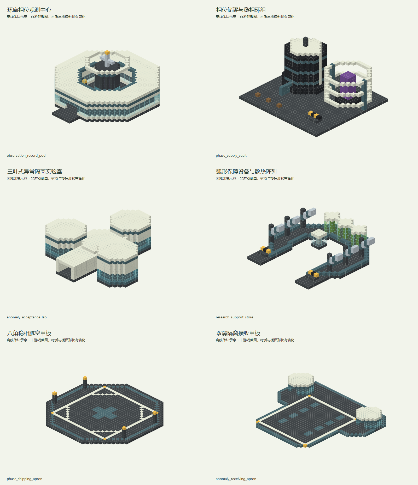

# 虚空相位研究站

> 已同步内置数据包；2026-09-13 已重设计并替换独立建筑 NBT，概念图见下文。拼接与游戏内校验待作者完成，自然生成尚未接入。

## 身份与定位

末地科研前哨；处理特殊样本和异常结构，虚空货物作为 CargoGood 独立交易。

| 项目 | 内容 |
| --- | --- |
| 设计编号 | H03 |
| 资源 ID | `cargoverse:resource/anomaly/phase_station` |
| 目标 JSON | `src/main/resources/data/cargoverse/trade_points/trade_points_definitions/resource/anomaly/phase_station.json` |
| schema_version | 1 |
| manufacturer | `cargoverse:hri` — 地平线研究院 / Horizon Research Institute |
| display_name | 虚空相位研究站 |
| node_role | `anomaly_research`（语义元数据） |
| tech_level | 5（目录中最高货物科技等级的描述，不是解锁条件） |
| 布局阶段 | 远域稀缺航线（地图投放建议，不是运行时字段） |
| ticks_per_day | 24000 |
| resource_table | [cargoverse:resource/anomaly/phase_station](<../../../06_资源表/resource/anomaly/phase_station.md>) |

## 收售概览

出售：稳相末影晶粒、桶装虚空混合物。

收购：再生培养液、末地环境样本、封装数据存储阵列、记忆回声介质、非欧几何构件、时滞晶簇。

货物标签、逐项初始库存、容量和日变化统一见关联资源表；两侧各自维护库存。

## 建议结构内容

**建筑形象：**深色基座、冷白研究舱和低饱和青色装饰；依附原版末地外岛边缘。

| 建筑／分区 | 建议内容 |
| --- | --- |
| 相位物资设备区 | 桶装虚空混合物使用封闭储罐和桶装交接台，稳相末影晶粒使用独立稳相环架，不要求再套仓库房屋。 |
| 异常验收室 | 记忆介质、非欧构件和时滞晶簇各设独立陈列隔间。 |
| 观测与记录舱 | 用仪表阵列、记录终端外观和样本窗口表现研究过程。 |
| 保障设备阵列 | 再生培养液柱、存储阵列、散热片和环境样本接收台开放布置，检修通道保持普通几何形状。 |

**行走与装卸路线：**稳定地表入口 → 可正常使用的营业核心 → 样本验收区；异常观察区留在封闭支路。

**最小可营业核心：**贸易点信息柜（唯一注册锚点）、仓库信息柜、货柜装载机、货物卸载机。装货与卸货泊位各保留一处清楚的操作区；可以共用入口，但不要把两种操作混放到不易识别的位置。基础泊位须满足实际货柜尺寸与净空，不能只用展示货柜代替。必要终端及最低泊位集中在不会因可选支路缺失而失效的营业核心中。

**可选扩展：**可选添加外部探针、错位装饰框架；非欧外观不能影响实际货柜摆放与行走。

以上陈列、工艺设备与建筑用途为美术和空间建议。除已绑定的业务终端外，不自动新增 NPC、加工、气候、库存或货物产出机制。首版没有绑定商店或货柜制造台，不把展厅、柜台或车间当成已接入这些功能。

<!-- generated-resource-templates:start -->
## 已交付独立建筑模板（2026-09-13 重设计版）

已向开发存档交付 **6 个独立 NBT**，使用 Minecraft Java 1.21.1 原版方块。装配与游戏内校验由作者完成；业务设备只留空间，模板没有绑定实例或自然生成。

### 造型与构筑物分工

围绕同心、八角与三叶几何展开的相位设施：环廊观测中心、独立储罐与稳相环、三叶隔离实验室、开放保障设备阵列。储罐与散热装置作为独立构筑物，不附加通用仓库房壳。

本版保留原有六个文件名并替换同名 NBT；部分名称中的 `room`、`store`、`cabin` 是沿用的加载标识，实际外观以本表为准。

存档目录：`dev_world/generated/cargoverse/structures/trade_points/resource/anomaly/phase_station/`。该目录本批仅写入 `.nbt` 文件。

概念图由本批建筑的实际方块布局离线绘制，材质和楼梯形状做了简化，并非游戏截图。

| 文件 | 建筑／构筑物 | 尺寸 X × Y × Z（格） | 高度基准 | 内容 | 图片 |
| --- | --- | --- | --- | --- | --- |
| `observation_record_pod.nbt` | 环廊相位观测中心 | 33 × 18 × 35 | 作业地面 Y=0 | 八角环形营业廊包围玻璃相位井，冷白环盖与中央观测冠形成同心轮廓；柜面沿可正常通行的环廊布置。 | [概念图](../../../../assets/images/trade_points/resource/anomaly/phase_station/observation_record_pod_exterior.png) |
| `phase_supply_vault.nbt` | 相位储罐与稳相环组 | 33 × 18 × 31 | 作业地面 Y=0 | 独立设备构筑物：高位封闭液罐与外露晶粒稳相环并列，管线、阀门外观和前部桶装交接台均开放布置。 | [概念图](../../../../assets/images/trade_points/resource/anomaly/phase_station/phase_supply_vault_exterior.png) |
| `anomaly_acceptance_lab.nbt` | 三叶式异常隔离实验室 | 33 × 11 × 33 | 作业地面 Y=0 | 三个独立八角隔离舱围绕中心分流厅展开，三类异常样本逐舱接收；中央十字走廊连接各舱，顶冠高度各异。 | [概念图](../../../../assets/images/trade_points/resource/anomaly/phase_station/anomaly_acceptance_lab_exterior.png) |
| `research_support_store.nbt` | 弧形保障设备与散热阵列 | 31 × 9 × 33 | 作业地面 Y=0 | 开放式马蹄设备架，两翼为倾斜散热片与数据列柜，后弧为培养液柱；少量检修遮片替代完整房屋屋盖。 | [概念图](../../../../assets/images/trade_points/resource/anomaly/phase_station/research_support_store_exterior.png) |
| `phase_shipping_apron.nbt` | 八角稳相航空甲板 | 39 × 6 × 39 | 作业地面 Y=0 | 八角厚边甲板、同心定位环及四角侧置稳定器；中央25×25格区域完全露天。 | [概念图](../../../../assets/images/trade_points/resource/anomaly/phase_station/phase_shipping_apron_exterior.png) |
| `anomaly_receiving_apron.nbt` | 双翼隔离接收甲板 | 43 × 6 × 37 | 作业地面 Y=0 | 蝶翼外轮廓包围中央23×25格落地区，左右检疫短舱沿后缘展开，双向导引条对应接收与人员路线。 | [概念图](../../../../assets/images/trade_points/resource/anomaly/phase_station/anomaly_receiving_apron_exterior.png) |

结构名称前缀：`cargoverse:trade_points/resource/anomaly/phase_station/`，后接表中的文件名（去掉 `.nbt`）。

### 设备与航空作业预留

下列坐标相对各自模板原点，以 X, Y, Z 表示，边界均包含。常规入口／设备接近方向为北（-Z）；远界箭首出货甲板从南（+Z）后部操作带接近。各模板的作业面高度见表，抛物面天线观测台位于 Y=8；雷达、吊机、储罐和异常壳体属于设备或景观构筑物。露天平台上空保持开放，高于模板高度的净空范围不会自动清除模板之外的方块。

- **环廊相位观测中心**：主信息柜（10, 1, 7 → 12, 3, 9）；仓库信息柜（20, 1, 7 → 22, 3, 9）。
- **相位储罐与稳相环组**：桶装与晶粒交接（14, 1, 5 → 20, 3, 10）。
- **三叶式异常隔离实验室**：中心验收台（14, 1, 14 → 18, 3, 17）。
- **弧形保障设备与散热阵列**：保障物资接收（5, 1, 9 → 7, 3, 11）；环境样本交接（23, 1, 9 → 25, 3, 11）。
- **八角稳相航空甲板**：露天航空净空（7, 1, 7 → 31, 14, 31）；封存物资装载（13, 1, 33 → 25, 3, 36）。
- **双翼隔离接收甲板**：露天航空净空（10, 1, 3 → 32, 14, 27）；隔离样本卸载（14, 1, 30 → 28, 3, 34）。

正式节点的出货、接收平台分为两个独立模板；侧边暂存棚和后部设备操作区避开停机区。观测杆、遗迹、错位环等外围构筑物应由作者放在飞行通道之外。
<!-- generated-resource-templates:end -->

## 经济字段

| 字段 | 设计值 |
| --- | --- |
| prosperity.initial_level | 0 |
| prosperity.upgrade_experience | [100, 300, 800, 2000, 5000] |
| activity.initial_activity | 0 |
| activity.expected_daily_trade_value | 10000 |
| activity.max_daily_load | 2 |
| activity.input_trade_weight / output_trade_weight | 1 / 1 |
| activity.response_rate | 0.25 |
| pricing.buy_price_multiplier | 1.2（贸易点收购，玩家收入） |
| pricing.sell_price_multiplier | 1（贸易点出售，玩家支出） |
| pricing.dynamic_price.enabled | false |
| 动态价格备用字段 | min_modifier=0.7，max_modifier=1.3，trade_step=0.03，daily_recovery_step=0.05 |

活跃度目标按两侧日周转基础价值合计向上取整至 50 VB；有限货物用一次性初始批次价值的 1/10 计入观测目标。这不是库存变化倍率或 NPC 资金预算。完整计算见[数值校核](<../../供需覆盖与数值校核.md>)。

## 功能与结构

首版 `modules: {}`，不额外绑定注册点。

首版不绑定物品商店和货柜制造台；现有默认演示模块的商品与配方不能直接代表本节点。后续按各制造商单独设计这些功能。

结构需设置一个贸易点信息柜注册锚点、货柜装载机、货物卸载机、仓库信息柜、对应货柜的装卸泊位。所有终端绑定同一实例 UUID。

地图距离和环境危害需要在结构落点时确定；内容投放阶段不提供代码级许可、科技或区域准入限制。

[设计总览](<../../设计总览.md>) · [贸易点目录](<../../README.md>)

## 结构生成设计

| 项目 | 设计值 |
| --- | --- |
| 世界结构 ID | `cargoverse:trade_point/resource/anomaly/phase_station` |
| structure_set | `cargoverse:trade_points/end_frontier` |
| 目标区域／形态 | 原版末地外岛／地表 |
| 结构组成 | 末地岛沿相位研究基地 |
| 集内权重／首抽占比 | 3 / 75% |
| 过滤前理论密度 | 0.45 座 / 1024² 方块 |
| 总平面包络目标 | 80 × 80 方块；含泊位与可选建筑 |
| Jigsaw size／max_distance_from_center | 4 / 56 |
| 起始高度 | absolute=0，投影 WORLD_SURFACE_WG |
| terrain_adaptation | beard_thin |
| 群系标签 | #cargoverse:trade_sites/end_outer_islands |
| 绑定文件 ID | `cargoverse:resource/anomaly/phase_station` |
| 绑定候选 | 仅 `cargoverse:resource/anomaly/phase_station`，权重 1，概率 100% |
| 模板变体 | 同经济定义的标准／加棚／加装饰三种外观，权重 6 / 3 / 1；仅制作一版时先用 1 |

概率是结构集通过布点判定后的首次选择比例，不能视为任意区块的生成概率。详细间距、排斥、地形限制与模板制作规则见[生成总表](<../../结构生成规则与概率.md>)；供需密度计算见[库存校核](<../../生成密度与库存校核.md>)。
