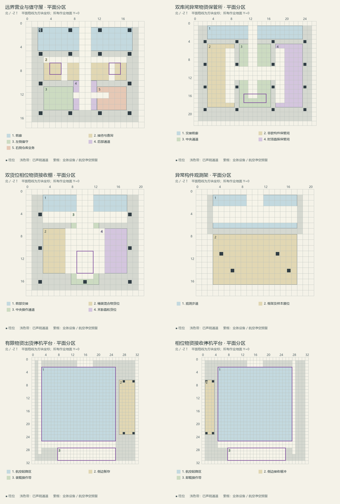
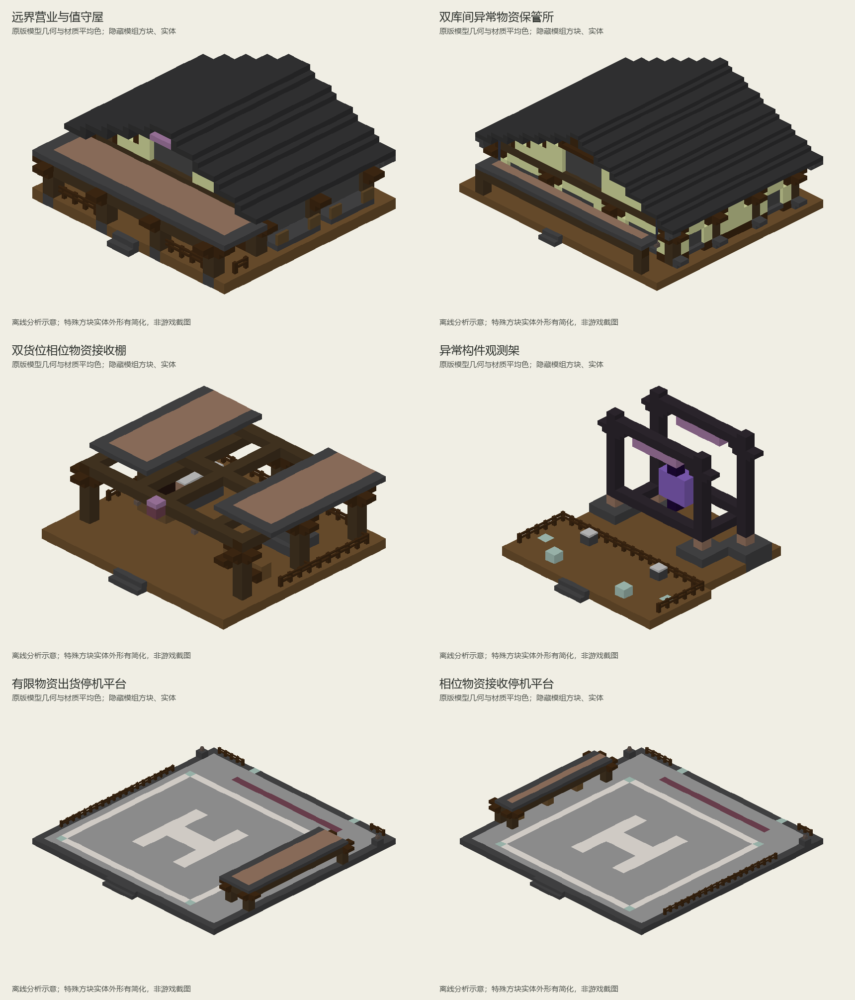

# 远界异常交换站

> 已同步内置经济数据包；独立建筑模板与概念图见下文，模板尚未接入自然生成。

## 身份与定位

远离主航道的异常区；提供有限、不可复制的结构并接收相位研究物资。

| 项目 | 内容 |
| --- | --- |
| 设计编号 | R03 |
| 资源 ID | `cargoverse:resource/anomaly/far_reach_exchange` |
| 目标 JSON | `src/main/resources/data/cargoverse/trade_points/trade_points_definitions/resource/anomaly/far_reach_exchange.json` |
| schema_version | 1 |
| manufacturer | `cargoverse:rex` — 遗民贸易协会 / Remnant Exchange |
| display_name | 远界异常交换站 |
| node_role | `anomaly_exchange`（语义元数据） |
| tech_level | 5（目录中最高货物科技等级的描述，不是解锁条件） |
| 布局阶段 | 远域稀缺航线（地图投放建议，不是运行时字段） |
| ticks_per_day | 24000 |
| resource_table | [cargoverse:resource/anomaly/far_reach_exchange](<../../../06_资源表/resource/anomaly/far_reach_exchange.md>) |

## 收售概览

出售：非欧几何构件、时滞晶簇。

收购：稳相末影晶粒、桶装虚空混合物。

货物标签、逐项初始库存、容量和日变化统一见关联资源表；两侧各自维护库存。

## 建议结构内容

**建筑形象：**深色框架与瓦檐构成稳定的远域营业设施，浅色填充墙及紫色标识区分业务空间；外围独立错位观测架表现异常环境，航空甲板保持平整开放。

| 建筑／分区 | 建议内容 |
| --- | --- |
| 稳定交易甲板 | 用正常水平地面容纳全部实际交易设备，保证空中停靠后的操作路径。 |
| 有限异常物资库 | 非欧构件与时滞晶簇各设一个独立保管舱，表现稀缺外观。 |
| 相位物资接收棚 | 周边柱梁支撑两侧低棚，中央为连续交接通道；虚空混合物与末影晶粒分设左右货位，与有限商品仓分开。 |
| 异常构件观测架 | 前部观测步道与后部封闭展位分开，四个底座支撑错位框架，异常晶体作为静态景观。 |

**行走与装卸路线：**清楚可辨的泊位 → 直达营业核心 → 两侧异常货物柜；视觉错位结构放在不可进入的外围。

**最小可营业核心：**贸易点信息柜（唯一注册锚点）、仓库信息柜、货柜装载机、货物卸载机。装货与卸货泊位各保留一处清楚的操作区；可以共用入口，但不要把两种操作混放到不易识别的位置。基础泊位须满足实际货柜尺寸与净空，不能只用展示货柜代替。必要终端及最低泊位集中在不会因可选支路缺失而失效的营业核心中。

**可选扩展：**可选添加小型观测桅杆和封闭舱门；所有外围模块共享一个实例，不增加稀有库存。

以上陈列、工艺设备与建筑用途为美术和空间建议。除已绑定的业务终端外，不自动新增 NPC、加工、气候、库存或货物产出机制。首版没有绑定商店或货柜制造台，不把展厅、柜台或车间当成已接入这些功能。

<!-- generated-resource-templates:start -->
## 独立建筑模板

六个独立模板按功能划分空间。实际业务区统一为水平地面 Y=0，北侧为入口／接近方向；异常错位外观集中在独立观测架。只使用 Java 1.21.1 原版方块，业务终端保留空间，不附带实体、库存或实例绑定。

存放路径：`<存档目录>/generated/cargoverse/structures/trade_points/resource/anomaly/far_reach_exchange/`。模板文件格式为 `.nbt`，加载名称见下表。

### 平面先行

先安排接待、值守、保管、交接与停靠区域，再根据分区边界和跨度确定柱位，依次搭建柱梁、楼地面、屋顶骨架、墙窗、屋面与楼梯。主体模板保证空间布局和构件连接；细节修饰与室内布置作为后续装修阶段。平面图与模板使用一致的分区和柱位坐标。

| 模板 | 平面分区（本地 X、Z，含边界） | 柱网参考 |
| --- | --- | --- |
| 远界营业与值守屋 | 前廊：X=2…17，Z=1…4；接待与查询：X=3…16，Z=6…9；左侧值守：X=3…7，Z=11…14；后部通道：X=8…11，Z=10…14；右侧仓库业务：X=12…16，Z=11…14 | X=[2, 7, 12, 17]；Z=[5, 10, 15] |
| 双库间异常物资保管所 | 交接前廊：X=3…23，Z=1…3；非欧构件保管间：X=3…8，Z=5…18；中央通道：X=10…16，Z=5…18；时滞晶簇保管间：X=18…23，Z=5…18 | X=[2, 9, 17, 24]；Z=[4, 9, 14, 19] |
| 双货位相位物资接收棚 | 前部交接：X=3…17，Z=1…5；桶装混合物货位：X=3…7，Z=7…14；中央操作通道：X=8…12，Z=4…16；末影晶粒货位：X=13…17，Z=7…14 | X=[2, 10, 18]；Z=[4, 10, 16] |
| 异常构件观测架 | 观测步道：X=3…17，Z=1…6；框架及样本展位：X=3…17，Z=8…16 | X=[4, 6, 14, 16]；Z=[11, 14] |
| 有限物资出货停机平台 | 航空起降区：X=3…25，Z=3…25；侧边暂存：X=27…31，Z=7…23；装载操作带：X=8…25，Z=28…31 | X=见平面柱点；Z=见平面柱点 |
| 相位物资接收停机平台 | 航空起降区：X=5…27，Z=3…25；侧边接收缓冲：X=1…3，Z=7…23；卸载操作带：X=8…25，Z=28…31 | X=见平面柱点；Z=见平面柱点 |

柱网参考列给出定位轴线；实际柱位以平面图黑色柱点为准，通道和大开口内不设置中柱。营业屋采用 5 格柱中心距，保管所中间保留 7 格通道。机具接收棚采用周边支柱与上部横梁，中央人员操作区域保持连贯。

### 外观与单体清单

深色木骨架与瓦檐、浅色末地石砖填充墙、少量紫色识别和旧铜棚面构成远域前哨形象。参考 Farmstead 的梁柱、半砖、倒置楼梯和薄构件做法，按本节点平面重新组合；屋顶不设可使用的夹层。

图片根据 NBT 方块与原版模型几何离线绘制，颜色采用材质平均色，灯光与部分特殊方块外形有简化；非游戏截图。

| 文件 | 建筑／构筑物 | 尺寸 X × Y × Z（格） | 内容 | 图片 |
| --- | --- | --- | --- | --- |
| `stable_trade_cabin.nbt` | 远界营业与值守屋 | 20 × 10 × 18 | 前廊接入接待区，后部左右柜台与值守位，中央通道贯通；柱距5格，木骨架、浅墙与深色瓦檐。 | [平面](../../../../assets/images/trade_points/resource/anomaly/far_reach_exchange/stable_trade_cabin_plan.png) · [外观](../../../../assets/images/trade_points/resource/anomaly/far_reach_exchange/stable_trade_cabin_exterior.png) |
| `finite_anomaly_vaults.nbt` | 双库间异常物资保管所 | 27 × 13 × 23 | 中央7格通道连接左右独立保管间；左侧非欧构件、右侧时滞晶簇，库门朝向中央通道；前廊与后部交接台分开。 | [平面](../../../../assets/images/trade_points/resource/anomaly/far_reach_exchange/finite_anomaly_vaults_plan.png) · [外观](../../../../assets/images/trade_points/resource/anomaly/far_reach_exchange/finite_anomaly_vaults_exterior.png) |
| `phase_receiving_cabin.nbt` | 双货位相位物资接收棚 | 21 × 8 × 19 | 左侧容器位、右侧晶粒位，中间5格交接通道；周边立柱承托横梁及两侧低棚，中央留作露天操作区。 | [平面](../../../../assets/images/trade_points/resource/anomaly/far_reach_exchange/phase_receiving_cabin_plan.png) · [外观](../../../../assets/images/trade_points/resource/anomaly/far_reach_exchange/phase_receiving_cabin_exterior.png) |
| `anomaly_outer_shell.nbt` | 异常构件观测架 | 21 × 15 × 19 | 前部观测步道、后部封闭展位，四个实体底座支撑两道错位框架；异常晶体位于框架内，景观不承担通行。 | [平面](../../../../assets/images/trade_points/resource/anomaly/far_reach_exchange/anomaly_outer_shell_plan.png) · [外观](../../../../assets/images/trade_points/resource/anomaly/far_reach_exchange/anomaly_outer_shell_exterior.png) |
| `finite_goods_shipping_apron.nbt` | 有限物资出货停机平台 | 33 × 5 × 33 | 23×23格露天起降区，右侧低货棚、后部装载操作带；梁式边框、贴地灯与独立人员路线。 | [平面](../../../../assets/images/trade_points/resource/anomaly/far_reach_exchange/finite_goods_shipping_apron_plan.png) · [外观](../../../../assets/images/trade_points/resource/anomaly/far_reach_exchange/finite_goods_shipping_apron_exterior.png) |
| `phase_receiving_apron.nbt` | 相位物资接收停机平台 | 33 × 5 × 33 | 23×23格露天接收区，左侧容器与晶粒缓冲位、后部卸载操作带；与出货平台保持相同标高及接口尺度。 | [平面](../../../../assets/images/trade_points/resource/anomaly/far_reach_exchange/phase_receiving_apron_plan.png) · [外观](../../../../assets/images/trade_points/resource/anomaly/far_reach_exchange/phase_receiving_apron_exterior.png) |

[营业屋内部剖视](../../../../assets/images/trade_points/resource/anomaly/far_reach_exchange/stable_trade_cabin_cutaway.png) · [保管所内部剖视](../../../../assets/images/trade_points/resource/anomaly/far_reach_exchange/finite_anomaly_vaults_cutaway.png)

结构名称前缀：`cargoverse:trade_points/resource/anomaly/far_reach_exchange/`，后接文件名并去掉 `.nbt`。

### 设备与航空作业预留

坐标顺序 X, Y, Z，均相对各自模板原点，边界包含。所有作业地面方块位于 Y=0，人员站立于其上；北侧台阶连接外部场地。两个航空平台各有 23×23 格起降区，侧棚位于该区域之外。高于 NBT 高度的净空是摆放要求，不会自动清理模板之外的方块。

- **远界营业与值守屋**：主信息柜（4, 1, 7 → 5, 3, 8）；仓库信息柜（14, 1, 7 → 15, 3, 8）。
- **双库间异常物资保管所**：保管登记与交接（11, 1, 16 → 15, 3, 17）。
- **双货位相位物资接收棚**：卸货交接工作位（9, 1, 11 → 11, 3, 14）。
- **有限物资出货停机平台**：航空停机与起降净空（3, 1, 3 → 25, 14, 25）；货柜装载机操作区（8, 1, 28 → 25, 4, 31）。
- **相位物资接收停机平台**：航空停机与起降净空（5, 1, 3 → 27, 14, 25）；货物卸载机操作区（8, 1, 28 → 25, 4, 31）。

接收棚承担平台后的分类与人工交接，飞行载具使用独立航空平台。观测架属于外围景观，放在飞行路线之外；后部展位不作为人员穿行通道。模板组合时需处理地面标高、通道连接与场地衔接。

### 放置与检查

放置后检查入口与场地标高、连续通道、门扇开启空间和楼梯上下连接。人员通道至少保留两格通行高度，设备预留范围内避免构件冲突；航空净空还需结合实际载具和周边地形确定。

<!-- generated-resource-templates:end -->

## 经济字段

| 字段 | 设计值 |
| --- | --- |
| prosperity.initial_level | 0 |
| prosperity.upgrade_experience | [100, 300, 800, 2000, 5000] |
| activity.initial_activity | 0 |
| activity.expected_daily_trade_value | 10350 |
| activity.max_daily_load | 2 |
| activity.input_trade_weight / output_trade_weight | 1 / 1 |
| activity.response_rate | 0.25 |
| pricing.buy_price_multiplier | 1.2（贸易点收购，玩家收入） |
| pricing.sell_price_multiplier | 1（贸易点出售，玩家支出） |
| pricing.dynamic_price.enabled | false |
| 动态价格备用字段 | min_modifier=0.7，max_modifier=1.3，trade_step=0.03，daily_recovery_step=0.05 |

活跃度目标按两侧日周转基础价值合计向上取整至 50 VB；有限货物用一次性初始批次价值的 1/10 计入观测目标。这不是库存变化倍率或 NPC 资金预算。完整计算见[数值校核](<../../供需覆盖与数值校核.md>)。

## 功能与结构

首版 `modules: {}`，不额外绑定注册点。

首版不绑定物品商店和货柜制造台；现有默认演示模块的商品与配方不能直接代表本节点。后续按各制造商单独设计这些功能。

结构需设置一个贸易点信息柜注册锚点、货柜装载机、货物卸载机、仓库信息柜、对应货柜的装卸泊位。所有终端绑定同一实例 UUID。

地图距离和环境危害需要在结构落点时确定；内容投放阶段不提供代码级许可、科技或区域准入限制。

[设计总览](<../../设计总览.md>) · [贸易点目录](<../../README.md>)

## 结构生成设计

| 项目 | 设计值 |
| --- | --- |
| 世界结构 ID | `cargoverse:trade_point/resource/anomaly/far_reach_exchange` |
| structure_set | `cargoverse:trade_points/end_frontier` |
| 目标区域／形态 | 原版末地外岛／悬空 |
| 结构组成 | 异常结构外壳与独立交易甲板 |
| 集内权重／首抽占比 | 1 / 25% |
| 过滤前理论密度 | 0.15 座 / 1024² 方块 |
| 总平面包络目标 | 64 × 64 方块；含泊位与可选建筑 |
| Jigsaw size／max_distance_from_center | 3 / 48 |
| 起始高度 | uniform absolute=88..104，不投影高度图 |
| terrain_adaptation | none |
| 群系标签 | #cargoverse:trade_sites/end_outer_islands |
| 绑定文件 ID | `cargoverse:resource/anomaly/far_reach_exchange` |
| 绑定候选 | 仅 `cargoverse:resource/anomaly/far_reach_exchange`，权重 1，概率 100% |
| 模板变体 | 同经济定义的标准／加棚／加装饰三种外观，权重 6 / 3 / 1；仅制作一版时先用 1 |

概率是结构集通过布点判定后的首次选择比例，不能视为任意区块的生成概率。详细间距、排斥、地形限制与模板制作规则见[生成总表](<../../结构生成规则与概率.md>)；供需密度计算见[库存校核](<../../生成密度与库存校核.md>)。
