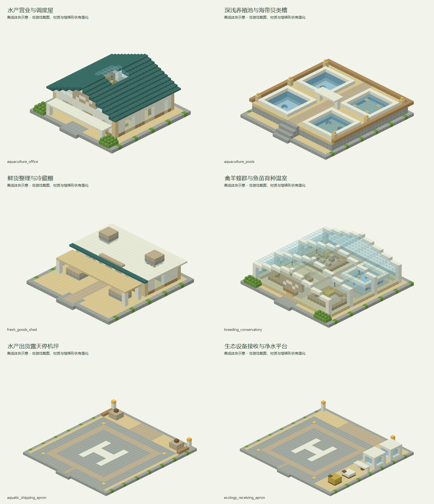

# 云泽水产与育种站

> 已同步内置经济数据包；2026-09-12 首批六个独立建筑 NBT 已交付开发存档，待作者加载验收和调整，未接入内置结构与自然生成绑定。可手工绑定信息柜使用，尚不会自然生成。

## 身份与定位

设有自带养殖池的地表生态园区；提供水产和种群，向生态设施输送活体。

| 项目 | 内容 |
| --- | --- |
| 设计编号 | V02 |
| 资源 ID | `cargoverse:resource/ecology/aquaculture_station` |
| 目标 JSON | `src/main/resources/data/cargoverse/trade_points/trade_points_definitions/resource/ecology/aquaculture_station.json` |
| schema_version | 1 |
| manufacturer | `cargoverse:vbs` — 绿洲农业联盟 / Verdant BioSystems |
| display_name | 云泽水产与育种站 |
| node_role | `ecology_supplier`（语义元数据） |
| tech_level | 3（目录中最高货物科技等级的描述，不是解锁条件） |
| 布局阶段 | 工业与专业航线（地图投放建议，不是运行时字段） |
| ticks_per_day | 24000 |
| resource_table | [cargoverse:resource/ecology/aquaculture_station](<../../../06_资源表/resource/ecology/aquaculture_station.md>) |

## 收售概览

出售：冰鲜河鱼、冰鲜海虾、鲜采食用海带、净化鲜贝、家禽种群、育成绵羊、养殖鱼苗、授粉蜂群。

收购：密封种粮、集装式净水站。

货物标签、逐项初始库存、容量和日变化统一见关联资源表；两侧各自维护库存。

## 建议结构内容

**建筑形象：**蓝绿配色、玻璃水池与浅色温室；池塘由模板自带，不依赖附近河流。

| 建筑／分区 | 建议内容 |
| --- | --- |
| 养殖池群 | 设置深浅不同的鱼池、海带槽和贝类培育槽，采用自带封闭水体。 |
| 鲜货整理棚 | 表现鱼箱、沥水台和遮蔽整理处；航空装货使用邻接的独立露天停机坪，实际交易仍使用资源表。 |
| 育种温室 | 区分禽羊围栏、授粉蜂群和鱼苗育种区，避免种群全部混放。 |
| 生态设备接收台 | 设置独立露天航空卸货坪，种粮与净水设备位靠侧边，保留中央及上方净空。 |

**行走与装卸路线：**营业核心在干燥中央平台，水产装货与种群接收分列两侧；围绕水池设置安全步道。

**最小可营业核心：**贸易点信息柜（唯一注册锚点）、仓库信息柜、货柜装载机、货物卸载机。装货与卸货泊位各保留一处清楚的操作区；可以共用入口，但不要把两种操作混放到不易识别的位置。基础泊位须满足实际货柜尺寸与净空，不能只用展示货柜代替。必要终端及最低泊位集中在不会因可选支路缺失而失效的营业核心中。

**可选扩展：**可选添加观测步道、饲料棚或水塔；不要求实现盐度和水质模拟。

以上陈列、工艺设备与建筑用途为美术和空间建议。除已绑定的业务终端外，不自动新增 NPC、加工、气候、库存或货物产出机制。首版没有绑定商店或货柜制造台，不把展厅、柜台或车间当成已接入这些功能。

## 首批独立建筑模板

本批按[独立建筑模板建造规范](../../独立建筑模板建造规范.md)制作，统一浅木、蓝绿色与白色框架。池塘由模板自带，航空装货和卸货采用两个独立露天平台。仅使用 Java 1.21.1 原版方块，不附带动物实体、模组业务终端或实例绑定。

### 交付与加载

存档交付目录只含六个正式 `.nbt`：

```text
D:\仓库\天空遗民整合包\Skylands-2.0\10_HMCL_Client_Dev\.minecraft\saves\dev_world\generated\cargoverse\structures\trade_points\resource\ecology\aquaculture_station
```

结构方块加载名称的公共前缀为 `cargoverse:trade_points/resource/ecology/aquaculture_station/`，后接下表文件名去掉 `.nbt`。例如：

```text
cargoverse:trade_points/resource/ecology/aquaculture_station/aquaculture_pools
```

| 建筑          | NBT 文件                        | 尺寸 X×Y×Z | 内容                      |
| ----------- | ----------------------------- | -------- | ----------------------- |
| 水产营业与调度屋    | `aquaculture_office.nbt`      | 25×13×25 | 干燥营业核心、接待柜台、办公室及信息柜预留区  |
| 深浅养殖池与海带贝类槽 | `aquaculture_pools.nbt`       | 29×8×31  | 四个封闭自带水池、不同水深、抬高观测步道    |
| 鲜货整理与冷藏棚    | `fresh_goods_shed.nbt`        | 25×9×27  | 冷藏间、鱼箱货架、沥水台及地面转运区      |
| 禽羊蜂群与鱼苗育种温室 | `breeding_conservatory.nbt`   | 29×11×29 | 禽羊围栏、蜂群花圃、鱼苗池和十字步道      |
| 水产出货露天停机坪   | `aquatic_shipping_apron.nbt`  | 33×5×37  | 开放停机区、H 标识、鲜货交接位及装货设备预留 |
| 生态设备接收与净水平台 | `ecology_receiving_apron.nbt` | 39×6×37  | 独立卸货坪、侧边净水储罐与种粮陈列       |

默认北侧（-Z）为步行入口或地面进出方向；原点是西北角地基底层，Y=0 为地基，普通室内或停机平台顶面为 Y=1。养殖池群的主步道顶面为 Y=4，北侧自带台阶。模板含包围盒内空气，请在空地加载。修改后保持同一结构 ID，确认原点与尺寸后保存至磁盘。

### 建筑概念图

以下为离线体块概念图，材质、透明度与部分方块形状经过简化，不是游戏截图。图片使用文档库内标准相对链接，归档于 `assets/images/trade_points/resource/ecology/aquaculture_station/`。



| 建筑 | 单体概念图 | 设计说明 |
| --- | --- | --- |
| 水产营业与调度屋 | [查看外观](../../../../assets/images/trade_points/resource/ecology/aquaculture_station/aquaculture_office_exterior.png) | 深蓝绿坡屋顶、波纹标识与浅色前廊；业务空间保持干燥。 |
| 深浅养殖池与海带贝类槽 | [查看外观](../../../../assets/images/trade_points/resource/ecology/aquaculture_station/aquaculture_pools_exterior.png) | 深鱼池、浅育苗池、海带和贝类陈列槽分开；玻璃池壁与白色压顶表现水产设施。贝类使用原版海泡菜作外观代用。 |
| 鲜货整理与冷藏棚 | [查看外观](../../../../assets/images/trade_points/resource/ecology/aquaculture_station/fresh_goods_shed_exterior.png) | 雨棚只覆盖整理台；前方无遮顶地面转运区可与航空平台衔接。冰块和木桶用于鲜货陈列，不实现冷链机制。 |
| 禽羊蜂群与鱼苗育种温室 | [查看外观](../../../../assets/images/trade_points/resource/ecology/aquaculture_station/breeding_conservatory_exterior.png) | 四区由十字通道分开；禽羊围栏、空蜂箱、花圃及鱼苗水池仅提供空间，动物由作者添加。 |
| 水产出货露天停机坪 | [查看外观](../../../../assets/images/trade_points/resource/ecology/aquaculture_station/aquatic_shipping_apron_exterior.png) | 中央 23×23 格停机区保持开放，嵌地灯和导向线标示停靠区域；交接位放在后方。 |
| 生态设备接收与净水平台 | [查看外观](../../../../assets/images/trade_points/resource/ecology/aquaculture_station/ecology_receiving_apron_exterior.png) | 同样保留 23×23 格中央停机区，净水设施和种粮置于侧边；与出货平台分开使用。 |

### 操作区与后续调整

下列坐标均相对于各模板原点，实际模组设备由作者补入：

| 模板 | 用途 | 相对坐标范围 |
| --- | --- | --- |
| 营业屋 | 主信息柜 | `(6,1,10)`～`(8,3,11)` |
| 营业屋 | 仓库信息柜 | `(16,1,10)`～`(18,3,11)` |
| 鲜货整理棚 | 干燥转运与鱼箱交接 | `(7,1,2)`～`(17,4,6)` |
| 出货停机坪 | 货柜装载机与鲜货交接 | `(12,1,32)`～`(20,5,35)` |
| 接收平台 | 卸载机与净水设备交接 | `(13,1,32)`～`(26,5,35)` |
| 两个航空平台 | 中央停机区 | X、Z 均为 `5～27`，起降方向和上方需保持开阔 |

航空平台没有中央顶棚或横梁；其 NBT 高度只包含已建构件，不会自动清除更高处已有的地形或障碍。平台按本批造型预留，未针对具体飞行载具作尺寸适配验收。站点整体布置、载具净空、池水及生物表现由作者校验，并决定手工修补或重新生成。本批仅执行方块版本／状态和坐标边界等生成必需约束，未执行专项验收或反复渲染校验。

## 经济字段

| 字段 | 设计值 |
| --- | --- |
| prosperity.initial_level | 0 |
| prosperity.upgrade_experience | [100, 300, 800, 2000, 5000] |
| activity.initial_activity | 0 |
| activity.expected_daily_trade_value | 6900 |
| activity.max_daily_load | 2 |
| activity.input_trade_weight / output_trade_weight | 1 / 1 |
| activity.response_rate | 0.25 |
| pricing.buy_price_multiplier | 1.1（贸易点收购，玩家收入） |
| pricing.sell_price_multiplier | 0.9（贸易点出售，玩家支出） |
| pricing.dynamic_price.enabled | false |
| 动态价格备用字段 | min_modifier=0.7，max_modifier=1.3，trade_step=0.03，daily_recovery_step=0.05 |

活跃度目标按两侧日周转基础价值合计向上取整至 50 VB；有限货物用一次性初始批次价值的 1/10 计入观测目标。这不是库存变化倍率或 NPC 资金预算。完整计算见[数值校核](<../../供需覆盖与数值校核.md>)。

## 功能与结构

首版 `modules: {}`，不额外绑定注册点。

首版不绑定物品商店和货柜制造台；现有默认演示模块的商品与配方不能直接代表本节点。后续按各制造商单独设计这些功能。

结构需设置一个贸易点信息柜注册锚点、货柜装载机、货物卸载机、仓库信息柜、对应货柜的装卸泊位。所有终端绑定同一实例 UUID。

地图距离和环境危害需要在结构落点时确定；内容投放阶段不提供代码级许可、科技或区域准入限制。

[设计总览](<../../设计总览.md>) · [贸易点目录](<../../README.md>)

## 结构生成设计

| 项目 | 设计值 |
| --- | --- |
| 世界结构 ID | `cargoverse:trade_point/resource/ecology/aquaculture_station` |
| structure_set | `cargoverse:trade_points/land_settlements` |
| 目标区域／形态 | 原版主世界／地表 |
| 结构组成 | 自带养殖池与育种温室 |
| 集内权重／首抽占比 | 3 / 7.3171% |
| 过滤前理论密度 | 0.2927 座 / 1024² 方块 |
| 总平面包络目标 | 96 × 96 方块；含泊位与可选建筑 |
| Jigsaw size／max_distance_from_center | 5 / 64 |
| 起始高度 | absolute=0，投影 WORLD_SURFACE_WG |
| terrain_adaptation | beard_thin |
| 群系标签 | #cargoverse:trade_sites/overworld_land |
| 绑定文件 ID | `cargoverse:resource/ecology/aquaculture_station` |
| 绑定候选 | 仅 `cargoverse:resource/ecology/aquaculture_station`，权重 1，概率 100% |
| 模板变体 | 同经济定义的标准／加棚／加装饰三种外观，权重 6 / 3 / 1；仅制作一版时先用 1 |

概率是结构集通过布点判定后的首次选择比例，不能视为任意区块的生成概率。详细间距、排斥、地形限制与模板制作规则见[生成总表](<../../结构生成规则与概率.md>)；供需密度计算见[库存校核](<../../生成密度与库存校核.md>)。
