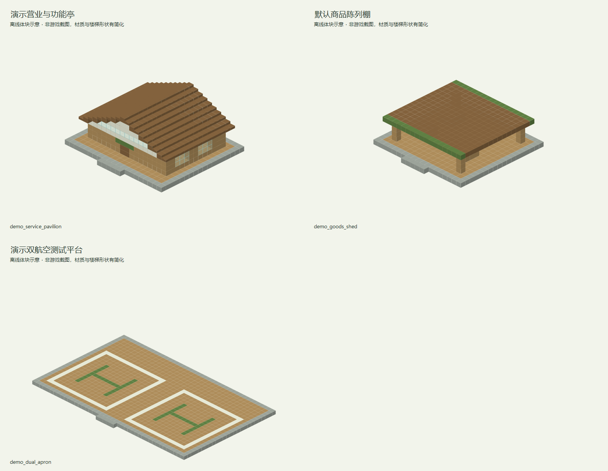

# 默认资源贸易点1

## 定义

| 项目 | 内容 |
| --- | --- |
| 资源 ID | `cargoverse:resource/general/default` |
| JSON 文件 | `src/main/resources/data/cargoverse/trade_points/trade_points_definitions/resource/general/default.json` |
| Schema 版本 | 1 |
| 制造商 | `cargoverse:vbs` |
| 名称 / 节点职责 | 默认资源贸易点1 / `resource_site` |
| 每日 Tick / 科技等级 | 24000 / 2 |

## 繁荣与活跃度

| 初始繁荣 | 升级经验 | 初始活跃度 | 预期日交易价值 | 最大日负载 |
| ---: | --- | ---: | ---: | ---: |
| 2 | 30、80、180、400、800 | 0 | 1000 | 2 |

| 输入权重 | 输出权重 | 响应率 |
| ---: | ---: | ---: |
| 1 | 1 | 0.25 |

## 价格

| 贸易点收购倍率（玩家收入） | 贸易点出售倍率（玩家支出） | 动态价格 | 范围 | 交易步进 | 日恢复步进 |
| ---: | ---: | --- | --- | ---: | ---: |
| 0.8 | 1.2 | False | 0.7～1.3 | 0.03 | 0.05 |

## 资源表

| 资源表 ID | 出售规则 | 收购规则 |
| --- | ---: | ---: |
| [`cargoverse:resource/general/default`](../../../06_资源表/resource/general/default.md) | 3 | 2 |

## 模块

| 模块 | 最低繁荣 | 定义池（权重 × ID） |
| --- | ---: | --- |
| `registration_point` | 0 | 1 × `cargoverse:oasis_agriculture` |
| `item_shop` | 1 | 1 × `cargoverse:resource/general/default_shop` |
| `cargo_manufacturing_platform` | 1 | 1 × `cargoverse:resource/general/default` |

## 建议结构内容

**建筑形象：**沿用云天农庄的现有农舍与道路风格；作为功能演示点，不并入新 24 点的建筑规格。

| 建筑／分区 | 建议内容 |
| --- | --- |
| 演示营业核心 | 保留信息柜、装卸设施与仓库信息，便于检查同一实例的终端绑定。 |
| 默认商品陈列 | 按现有矿石、原木、鲜果和收购物资制作少量对应装饰。 |
| 功能演示角 | 现有注册点、物品商店及制造台保留独立操作空间，用于检查演示模块。 |
| 测试泊位 | 提供容易观察货柜放置和碰撞的净空区域，避免装饰遮挡。 |

**行走与装卸路线：**现有入口 → 信息柜 → 原矿、原木、鲜果交易泊位；保留清晰的调试通道。

**最小可营业核心：**贸易点信息柜（唯一注册锚点）、仓库信息柜、货柜装载机、货物卸载机、许可证注册终端。装货与卸货泊位各保留一处清楚的操作区；可以共用入口，但不要把两种操作混放到不易识别的位置。基础泊位须满足实际货柜尺寸与净空，不能只用展示货柜代替。必要终端及最低泊位集中在不会因可选支路缺失而失效的营业核心中。

**可选扩展：**后续只在需要验证功能时增加小型模块，不要求按新正式节点重建现有结构。

以上陈列、工艺设备与建筑用途为美术和空间建议。除已绑定的业务终端外，不自动新增 NPC、加工、气候、库存或货物产出机制。现有演示模块按原定义工作。

## 设计说明

- 当前测试点出售赤铁矿、针叶原木和温室鲜果，收购复合肥与生物质燃料。
- 出售与收购库存独立按资源表每日补货或消耗，不进行材料转化。

<!-- generated-resource-templates:start -->
## 已交付独立建筑模板（2026-09-12）

已向开发存档交付 **3 个独立 NBT**，使用 Minecraft Java 1.21.1 原版方块。装配与游戏内校验由作者完成；业务设备只留空间，模板没有绑定实例或自然生成。

本批是默认测试点的可选附属模板，保留原有云天农庄结构与功能定义。

存档目录：`dev_world/generated/cargoverse/structures/trade_points/resource/general/default/`。该目录本批仅写入 `.nbt` 文件。

概念图由本批建筑的实际方块布局离线绘制，材质和楼梯形状做了简化，并非游戏截图。

| 文件 | 单体建筑 | 尺寸 X × Z × Y（格） | 内容 | 图片 |
| --- | --- | --- | --- | --- |
| `demo_service_pavilion.nbt` | 演示营业与功能亭 | 21 × 19 × 10 | 功能演示附属模块；木石农舍风格，主信息、仓库、注册、商店及制造台分别预留，保留宽调试通道。 | [概念图](../../../../assets/images/trade_points/resource/general/default/demo_service_pavilion_exterior.png) |
| `demo_goods_shed.nbt` | 默认商品陈列棚 | 19 × 19 × 6 | 少量原矿、原木与鲜果代用陈列；用于默认测试点，不扩展为正式生产节点。 | [概念图](../../../../assets/images/trade_points/resource/general/default/demo_goods_shed_exterior.png) |
| `demo_dual_apron.nbt` | 演示双航空测试平台 | 43 × 27 × 1 | 左右17×17格开放测试泊位，后部装卸接口留空，便于观察货柜和定位，不包含实际功能方块。 | [概念图](../../../../assets/images/trade_points/resource/general/default/demo_dual_apron_exterior.png) |

结构名称前缀：`cargoverse:trade_points/resource/general/default/`，后接表中的文件名（去掉 `.nbt`）。

### 设备与航空作业预留

下列坐标相对各自模板原点，以 X, Y, Z 表示，边界均包含。建筑入口朝北（-Z），地基位于 Y=0。露天平台上空保持开放；表中高于模板高度的净空范围是摆放要求，不会自动清除模板之外的方块。

- **演示营业与功能亭**：主信息柜（4, 1, 6 → 5, 3, 7）；仓库信息柜（15, 1, 6 → 16, 3, 7）；注册终端（4, 1, 11 → 5, 3, 12）；物品商店（14, 1, 11 → 16, 3, 12）；制造台（8, 1, 12 → 11, 3, 14）。
- **演示双航空测试平台**：装卸接口（5, 1, 22 → 15, 5, 25）；装卸接口（27, 1, 22 → 37, 5, 25）。

正式节点的出货、接收平台分为两个独立模板；侧边暂存棚和后部设备操作区避开停机区。观测杆、遗迹、错位环等外围构筑物应由作者放在飞行通道之外。
<!-- generated-resource-templates:end -->
