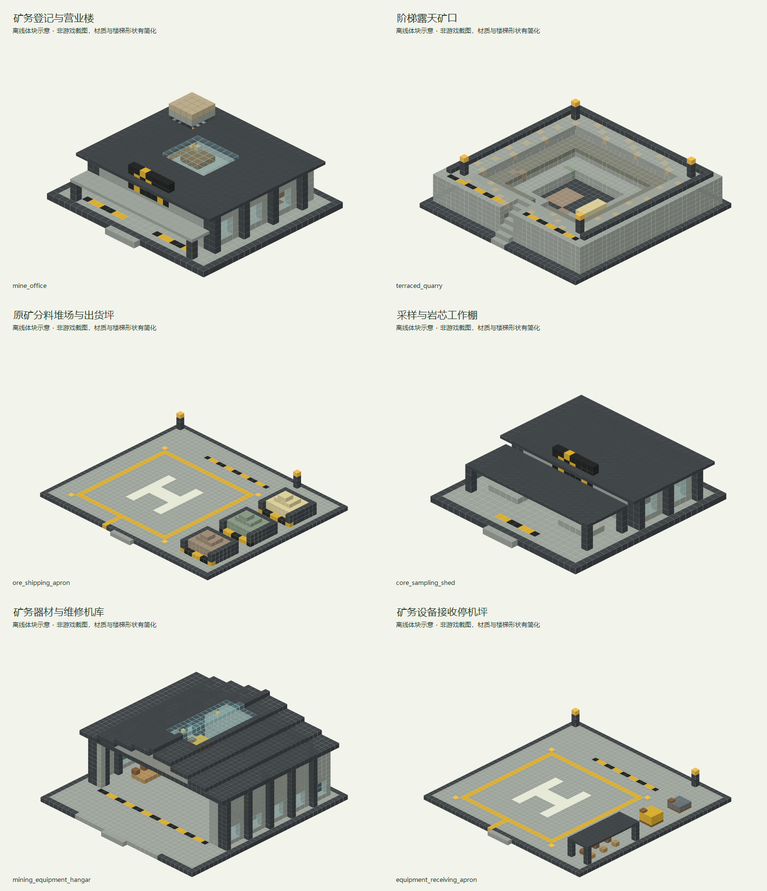

# 深岩露天矿站

> 已同步内置经济数据包；2026-09-12 首批六个独立建筑 NBT 已交付开发存档，待作者加载验收和调整，尚未接入内置结构与自然生成绑定。可手工绑定信息柜使用，尚不会自然生成。

## 身份与定位

普通地表丘陵与安全开采区；矿业登记入口，大宗原矿运输起点。

| 项目 | 内容 |
| --- | --- |
| 设计编号 | D01 |
| 资源 ID | `cargoverse:resource/mining/deepcore_mine` |
| 目标 JSON | `src/main/resources/data/cargoverse/trade_points/trade_points_definitions/resource/mining/deepcore_mine.json` |
| schema_version | 1 |
| manufacturer | `cargoverse:dmc` — 深岩矿业集团 / Deepcore Mining Corporation |
| display_name | 深岩露天矿站 |
| node_role | `mining_site`（语义元数据） |
| tech_level | 2（目录中最高货物科技等级的描述，不是解锁条件） |
| 布局阶段 | 起步生活圈（地图投放建议，不是运行时字段） |
| ticks_per_day | 24000 |
| resource_table | [cargoverse:resource/mining/deepcore_mine](<../../../06_资源表/resource/mining/deepcore_mine.md>) |

## 收售概览

出售：赤铁原矿、含铜原矿、石英原砂、地层岩芯。

收购：耐用工装、矿石破碎机、矿用运输车、矿务手工具。

货物标签、逐项初始库存、容量和日变化统一见关联资源表；两侧各自维护库存。

## 建议结构内容

**建筑形象：**深灰石材、厚重支架与黄黑警示色；地表矿口和粗重堆料最醒目。

| 建筑／分区 | 建议内容 |
| --- | --- |
| 露天矿口 | 制作阶梯状浅矿坑或封闭矿洞入口，不要求定位真实矿脉。 |
| 原矿堆场 | 分隔赤铁、铜矿和石英砂的静态堆垛，邻接露天航空出货平台，留出散料装柜空间。 |
| 采样与岩芯棚 | 放置编号岩芯箱、简易工作台和样本货架。 |
| 矿务器材区 | 以宽入口、高净空机库陈列手工具和矿机轮廓，收购设备及工装使用独立露天航空卸货平台。 |

**行走与装卸路线：**安全道路 → 注册与营业小楼 → 矿石装卸场；矿坑是后方景观，玩家交易无需深入矿井。

**最小可营业核心：**贸易点信息柜（唯一注册锚点）、仓库信息柜、货柜装载机、货物卸载机、许可证注册终端。装货与卸货泊位各保留一处清楚的操作区；可以共用入口，但不要把两种操作混放到不易识别的位置。基础泊位须满足实际货柜尺寸与净空，不能只用展示货柜代替。必要终端及最低泊位集中在不会因可选支路缺失而失效的营业核心中。

**可选扩展：**可选添加输送架、废弃支洞、工人休息棚；矿石景观不驱动资源表产量。

以上陈列、工艺设备与建筑用途为美术和空间建议。除已绑定的业务终端外，不自动新增 NPC、加工、气候、库存或货物产出机制。首版没有绑定商店或货柜制造台，不把展厅、柜台或车间当成已接入这些功能。

## 首批独立建筑模板

本批按[独立建筑模板建造规范](../../独立建筑模板建造规范.md)制作，采用深灰石材、厚重支架和黄黑警示色。航空装货和卸货使用独立露天平台，室内器材区参考大型机库。仅用 Java 1.21.1 原版方块，不放入模组业务终端、载具实体或实例 UUID。

### 文件与加载

交付目录只含六个正式 `.nbt`：

```text
D:\仓库\天空遗民整合包\Skylands-2.0\10_HMCL_Client_Dev\.minecraft\saves\dev_world\generated\cargoverse\structures\trade_points\resource\mining\deepcore_mine
```

结构方块加载名称的公共前缀为 `cargoverse:trade_points/resource/mining/deepcore_mine/`，后接下表文件名去掉 `.nbt`。例如：

```text
cargoverse:trade_points/resource/mining/deepcore_mine/mining_equipment_hangar
```

| 建筑         | NBT 文件                          | 尺寸 X×Y×Z | 内容                       |
| ---------- | ------------------------------- | -------- | ------------------------ |
| 矿务登记与营业楼   | `mine_office.nbt`               | 27×10×25 | 接待柜台、调度办公、工装柜与三类终端预留     |
| 阶梯露天矿口     | `terraced_quarry.nbt`           | 35×11×35 | 自带岩层、三级浅矿坑、北侧进出阶梯及铁铜矿陈列  |
| 原矿分料堆场与出货坪 | `ore_shipping_apron.nbt`        | 43×6×37  | 露天停机区、铁矿／铜矿／原砂分料堆垛、散料装柜区 |
| 采样与岩芯工作棚   | `core_sampling_shed.nbt`        | 25×8×27  | 开放采样台、岩芯分类架、石层陈列和档案柜     |
| 矿务器材与维修机库  | `mining_equipment_hangar.nbt`   | 35×17×37 | 宽门高净空、侧边器材货位、矿机轮廓、中央维修位  |
| 矿务设备接收停机坪  | `equipment_receiving_apron.nbt` | 39×6×39  | 独立卸货坪、后侧交接区、侧边工装工具棚      |

默认北侧（-Z）为入口或地面进出方向；原点在西北角地基底层，Y=0 为基础，普通室内和停机坪顶面为 Y=1。矿坑是包含抬高岩层的完整模块，坑底顶面为 Y=1、主坑沿顶面为 Y=7，作者可选择嵌入地形或衔接坡道。文件含包围盒内空气，在空地加载并确认范围；修改后使用同一结构名称，按调整后的原点和尺寸保存至磁盘。

### 建筑概念图

以下是离线体块概念图，材质、楼梯、围墙等形状有所简化，并非游戏截图。图片位于文档库 `assets/images/trade_points/resource/mining/deepcore_mine/`，使用标准 Markdown 相对链接。



| 建筑 | 概念图 | 设计说明 |
| --- | --- | --- |
| 矿务登记与营业楼 | [查看外观](../../../../assets/images/trade_points/resource/mining/deepcore_mine/mine_office_exterior.png) | 厚重立面、矿业标识、采光顶与干燥营业大厅；交易路线无需深入矿坑。 |
| 阶梯露天矿口 | [查看外观](../../../../assets/images/trade_points/resource/mining/deepcore_mine/terraced_quarry_exterior.png) | 岩层与浅坑由模板自带，铁矿、铜矿及砂岩陈列表现资源来源，不要求地下存在真实矿脉。 |
| 原矿分料堆场与出货坪 | [查看外观](../../../../assets/images/trade_points/resource/mining/deepcore_mine/ore_shipping_apron_exterior.png) | 23×23 格中央停机区，铁铜矿和原砂放在右侧三个隔仓，后侧留散料装柜操作位。 |
| 采样与岩芯工作棚 | [查看外观](../../../../assets/images/trade_points/resource/mining/deepcore_mine/core_sampling_shed_exterior.png) | 采样台在前，分类桶和石层样本在后；工作雨棚用于人员和样本整理。 |
| 矿务器材与维修机库 | [查看外观](../../../../assets/images/trade_points/resource/mining/deepcore_mine/mining_equipment_hangar_exterior.png) | 正面入口 25 格宽、10 格高，侧边布置工具与静态矿机轮廓，中央留连续通行和维修空间，前方配开放场坪。 |
| 矿务设备接收停机坪 | [查看外观](../../../../assets/images/trade_points/resource/mining/deepcore_mine/equipment_receiving_apron_exterior.png) | 独立 23×23 格停机区，上方无遮顶，工具棚与到货陈列靠侧边，后侧预留卸载机位置。 |

### 预留与验收边界

坐标均相对于各自模板原点，功能方块由作者补入：

| 模板 | 用途 | 相对范围 |
| --- | --- | --- |
| 营业楼 | 主信息柜 | `(6,1,9)`～`(8,3,10)` |
| 营业楼 | 许可证注册终端 | `(18,1,9)`～`(20,3,10)` |
| 营业楼 | 仓库信息柜 | `(11,1,18)`～`(12,3,20)` |
| 原矿出货坪 | 散料装柜与装载机 | `(13,1,32)`～`(26,5,35)` |
| 维修机库 | 中央载具通行与维修位 | `(10,1,11)`～`(24,9,31)` |
| 设备接收坪 | 卸载机及矿机到货操作位 | `(12,1,32)`～`(27,6,36)` |

两个露天平台中央停机范围均为 X、Z 的 `5～27` 格，模板不含中央雨棚或横梁。实际起降空间还需结合周边地形与载具外廓调整，NBT 不自动清除模板高度以上的障碍。矿石、砂堆、器材和矿机为静态原版方块陈列，不驱动产量或实现可操作机器。

本批仅执行原版方块版本／状态和坐标边界等生成必需约束，未执行专项验收或反复渲染校验；加载、地形衔接、净空确认及修补由作者完成，作者按问题程度决定手工修补或重新生成。

## 经济字段

| 字段 | 设计值 |
| --- | --- |
| prosperity.initial_level | 0 |
| prosperity.upgrade_experience | [100, 300, 800, 2000, 5000] |
| activity.initial_activity | 0 |
| activity.expected_daily_trade_value | 4050 |
| activity.max_daily_load | 2 |
| activity.input_trade_weight / output_trade_weight | 1 / 1 |
| activity.response_rate | 0.25 |
| pricing.buy_price_multiplier | 1.08（贸易点收购，玩家收入） |
| pricing.sell_price_multiplier | 0.9（贸易点出售，玩家支出） |
| pricing.dynamic_price.enabled | false |
| 动态价格备用字段 | min_modifier=0.7，max_modifier=1.3，trade_step=0.03，daily_recovery_step=0.05 |

活跃度目标按两侧日周转基础价值合计向上取整至 50 VB；有限货物用一次性初始批次价值的 1/10 计入观测目标。这不是库存变化倍率或 NPC 资金预算。完整计算见[数值校核](<../../供需覆盖与数值校核.md>)。

## 功能与结构

首版绑定 `registration_point`：`min_prosperity_level: 0`，唯一候选 `cargoverse:dmc_mining`，权重 1。复用已有注册定义及基础货柜，不在这里新增入门奖励。

首版不绑定物品商店和货柜制造台；现有默认演示模块的商品与配方不能直接代表本节点。后续按各制造商单独设计这些功能。

结构需设置一个贸易点信息柜注册锚点、货柜装载机、货物卸载机、仓库信息柜、对应货柜的装卸泊位与注册终端。所有终端绑定同一实例 UUID。

地图距离和环境危害需要在结构落点时确定；内容投放阶段不提供代码级许可、科技或区域准入限制。

[设计总览](<../../设计总览.md>) · [贸易点目录](<../../README.md>)

## 结构生成设计

| 项目 | 设计值 |
| --- | --- |
| 世界结构 ID | `cargoverse:trade_point/resource/mining/deepcore_mine` |
| structure_set | `cargoverse:trade_points/land_settlements` |
| 目标区域／形态 | 原版主世界／地表 |
| 结构组成 | 矿区营业平台＋露天采样场 |
| 集内权重／首抽占比 | 6 / 14.6341% |
| 过滤前理论密度 | 0.5854 座 / 1024² 方块 |
| 总平面包络目标 | 80 × 80 方块；含泊位与可选建筑 |
| Jigsaw size／max_distance_from_center | 4 / 56 |
| 起始高度 | absolute=0，投影 WORLD_SURFACE_WG |
| terrain_adaptation | beard_thin |
| 群系标签 | #cargoverse:trade_sites/overworld_land |
| 绑定文件 ID | `cargoverse:resource/mining/deepcore_mine` |
| 绑定候选 | 仅 `cargoverse:resource/mining/deepcore_mine`，权重 1，概率 100% |
| 模板变体 | 同经济定义的标准／加棚／加装饰三种外观，权重 6 / 3 / 1；仅制作一版时先用 1 |

概率是结构集通过布点判定后的首次选择比例，不能视为任意区块的生成概率。详细间距、排斥、地形限制与模板制作规则见[生成总表](<../../结构生成规则与概率.md>)；供需密度计算见[库存校核](<../../生成密度与库存校核.md>)。
