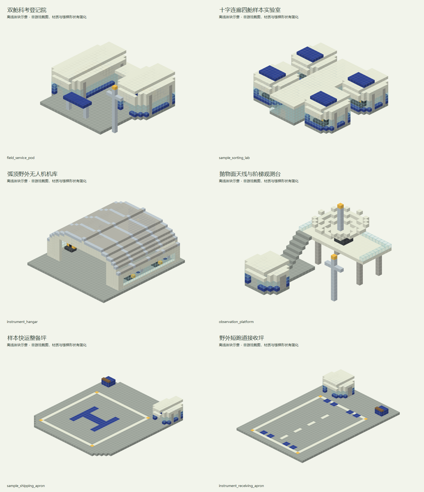

# 地平线野外科考站

> 已同步内置数据包；2026-09-13 已重设计并替换独立建筑 NBT，概念图见下文。拼接与游戏内校验待作者完成，自然生成尚未接入。

## 身份与定位

科考航线入口；研究院登记点，汇集外部考察队的样本与仪器。

| 项目 | 内容 |
| --- | --- |
| 设计编号 | H01 |
| 资源 ID | `cargoverse:resource/research/field_station` |
| 目标 JSON | `src/main/resources/data/cargoverse/trade_points/trade_points_definitions/resource/research/field_station.json` |
| schema_version | 1 |
| manufacturer | `cargoverse:hri` — 地平线研究院 / Horizon Research Institute |
| display_name | 地平线野外科考站 |
| node_role | `research_outpost`（语义元数据） |
| tech_level | 4（目录中最高货物科技等级的描述，不是解锁条件） |
| 布局阶段 | 工业与专业航线（地图投放建议，不是运行时字段） |
| ticks_per_day | 24000 |
| resource_table | [cargoverse:resource/research/field_station](<../../../06_资源表/resource/research/field_station.md>) |

## 收售概览

出售：高空微生物样本、末地环境样本、遗迹材料切片、野外采样器、精密测量仪。

收购：地层岩芯、培养基原液、测绘无人机。

货物标签、逐项初始库存、容量和日变化统一见关联资源表；两侧各自维护库存。

## 建议结构内容

**建筑形象：**白色轻型科考舱、深蓝仪器箱与外置天线；像可扩展的野外驻站设施。

| 建筑／分区 | 建议内容 |
| --- | --- |
| 科考营业舱 | 将注册终端、主信息柜、仓库信息与样本装卸区域集中。 |
| 样本整理室 | 岩芯箱、微生物样本、遗迹材料切片和末地样本分柜展示。 |
| 仪器与无人机棚 | 展示采样器、测量仪、无人机外壳及回收检修架。 |
| 雷达与观测平台 | 独立抛物面天线、气象桅杆和可登临观测台形成设备构筑物，保留外围围栏与上下台阶。 |

**行走与装卸路线：**停泊甲板 → 注册和样本柜面 → 仪器装卸区；观测设施位于外围支路。

**最小可营业核心：**贸易点信息柜（唯一注册锚点）、仓库信息柜、货柜装载机、货物卸载机、许可证注册终端。装货与卸货泊位各保留一处清楚的操作区；可以共用入口，但不要把两种操作混放到不易识别的位置。基础泊位须满足实际货柜尺寸与净空，不能只用展示货柜代替。必要终端及最低泊位集中在不会因可选支路缺失而失效的营业核心中。

**可选扩展：**可选添加科研宿舱、气象杆与外接实验箱；观测设备不产生额外数据商品。

以上陈列、工艺设备与建筑用途为美术和空间建议。除已绑定的业务终端外，不自动新增 NPC、加工、气候、库存或货物产出机制。首版没有绑定商店或货柜制造台，不把展厅、柜台或车间当成已接入这些功能。

<!-- generated-resource-templates:start -->
## 已交付独立建筑模板（2026-09-13 重设计版）

已向开发存档交付 **6 个独立 NBT**，使用 Minecraft Java 1.21.1 原版方块。装配与游戏内校验由作者完成；业务设备只留空间，模板没有绑定实例或自然生成。

### 造型与构筑物分工

野外模块化科研驻站：U形分体营业舱、十字采样舱、筒拱机库与大型抛物面天线。航空设施采用样本整备坪和狭长野外跑道，保持轻型白蓝器材风格。

本版保留原有六个文件名并替换同名 NBT；部分名称中的 `room`、`store`、`cabin` 是沿用的加载标识，实际外观以本表为准。

存档目录：`dev_world/generated/cargoverse/structures/trade_points/resource/research/field_station/`。该目录本批仅写入 `.nbt` 文件。

概念图由本批建筑的实际方块布局离线绘制，材质和楼梯形状做了简化，并非游戏截图。

| 文件                               | 建筑／构筑物      | 尺寸 X × Y × Z（格） | 高度基准     | 内容                                             | 图片                                                                                                                    |
| -------------------------------- | ----------- | --------------- | -------- | ---------------------------------------------- | --------------------------------------------------------------------------------------------------------------------- |
| `field_service_pod.nbt`          | 双舱科考登记院     | 31 × 17 × 29    | 作业地面 Y=0 | 不对称 U 形白色实验舱围合露天登记院，后部玻璃连廊连接长短两翼；侧置通讯桅杆。       | [概念图](../../../../assets/images/trade_points/resource/research/field_station/field_service_pod_exterior.png)          |
| `sample_sorting_lab.nbt`         | 十字连廊四舱样本实验室 | 33 × 10 × 31    | 作业地面 Y=0 | 四个切角采样舱围绕南北玻璃脊廊，岩芯、微生物、遗迹切片、末地样本各占独立舱；屋顶深蓝设备板。 | [概念图](../../../../assets/images/trade_points/resource/research/field_station/sample_sorting_lab_exterior.png)         |
| `instrument_hangar.nbt`          | 弧顶野外无人机机库   | 35 × 15 × 35    | 作业地面 Y=0 | 长向金属肋骨与弧形筒拱屋盖，入口19格宽、9格高；两侧维修架，前端开放整备坪。        | [概念图](../../../../assets/images/trade_points/resource/research/field_station/instrument_hangar_exterior.png)          |
| `observation_platform.nbt`       | 抛物面天线与阶梯观测台 | 25 × 21 × 29    | 作业地面 Y=0 | 低矮气象舱、可登临的阶梯观测台和大型抛物面天线形成高低对比；属于外围科研设施。        | [概念图](../../../../assets/images/trade_points/resource/research/field_station/observation_platform_exterior.png)       |
| `sample_shipping_apron.nbt`      | 样本快运整备坪     | 35 × 7 × 39     | 作业地面 Y=0 | 切角长甲板与单侧样本交接舱，23×25格开放起降区；深蓝 H 标与后部器材操作带。      | [概念图](../../../../assets/images/trade_points/resource/research/field_station/sample_shipping_apron_exterior.png)      |
| `instrument_receiving_apron.nbt` | 野外短跑道接收坪    | 31 × 7 × 45     | 作业地面 Y=0 | 狭长直线跑道与末端仪器棚，21×31格开放进出空间；两侧地灯、轴线和端部条纹标识。      | [概念图](../../../../assets/images/trade_points/resource/research/field_station/instrument_receiving_apron_exterior.png) |

结构名称前缀：`cargoverse:trade_points/resource/research/field_station/`，后接表中的文件名（去掉 `.nbt`）。

### 设备与航空作业预留

下列坐标相对各自模板原点，以 X, Y, Z 表示，边界均包含。常规入口／设备接近方向为北（-Z）；远界箭首出货甲板从南（+Z）后部操作带接近。各模板的作业面高度见表，抛物面天线观测台位于 Y=8；雷达、吊机、储罐和异常壳体属于设备或景观构筑物。露天平台上空保持开放，高于模板高度的净空范围不会自动清除模板之外的方块。

- **双舱科考登记院**：主信息柜（4, 1, 10 → 6, 3, 12）；许可证注册终端（7, 1, 17 → 9, 3, 19）；仓库信息柜（21, 1, 16 → 24, 3, 18）。
- **十字连廊四舱样本实验室**：样本交接台（14, 1, 24 → 18, 3, 27）。
- **弧顶野外无人机机库**：中央检修区（9, 1, 10 → 25, 9, 30）。
- **样本快运整备坪**：露天航空净空（4, 1, 4 → 26, 14, 28）；装载机与交接（10, 1, 32 → 23, 3, 36）。
- **野外短跑道接收坪**：露天航空净空（5, 1, 3 → 25, 14, 33）；仪器卸载与验收（14, 1, 36 → 23, 3, 42）。

正式节点的出货、接收平台分为两个独立模板；侧边暂存棚和后部设备操作区避开停机区。观测杆、遗迹、错位环等外围构筑物应由作者放在飞行通道之外。
<!-- generated-resource-templates:end -->

## 经济字段

| 字段 | 设计值 |
| --- | --- |
| prosperity.initial_level | 0 |
| prosperity.upgrade_experience | [100, 300, 800, 2000, 5000] |
| activity.initial_activity | 0 |
| activity.expected_daily_trade_value | 9600 |
| activity.max_daily_load | 2 |
| activity.input_trade_weight / output_trade_weight | 1 / 1 |
| activity.response_rate | 0.25 |
| pricing.buy_price_multiplier | 1.15（贸易点收购，玩家收入） |
| pricing.sell_price_multiplier | 0.95（贸易点出售，玩家支出） |
| pricing.dynamic_price.enabled | false |
| 动态价格备用字段 | min_modifier=0.7，max_modifier=1.3，trade_step=0.03，daily_recovery_step=0.05 |

活跃度目标按两侧日周转基础价值合计向上取整至 50 VB；有限货物用一次性初始批次价值的 1/10 计入观测目标。这不是库存变化倍率或 NPC 资金预算。完整计算见[数值校核](<../../供需覆盖与数值校核.md>)。

## 功能与结构

首版绑定 `registration_point`：`min_prosperity_level: 0`，唯一候选 `cargoverse:hri_research`，权重 1。复用已有注册定义及基础货柜，不在这里新增入门奖励。

首版不绑定物品商店和货柜制造台；现有默认演示模块的商品与配方不能直接代表本节点。后续按各制造商单独设计这些功能。

结构需设置一个贸易点信息柜注册锚点、货柜装载机、货物卸载机、仓库信息柜、对应货柜的装卸泊位与注册终端。所有终端绑定同一实例 UUID。

地图距离和环境危害需要在结构落点时确定；内容投放阶段不提供代码级许可、科技或区域准入限制。

[设计总览](<../../设计总览.md>) · [贸易点目录](<../../README.md>)

## 结构生成设计

| 项目 | 设计值 |
| --- | --- |
| 世界结构 ID | `cargoverse:trade_point/resource/research/field_station` |
| structure_set | `cargoverse:trade_points/sky_platforms` |
| 目标区域／形态 | 原版主世界／悬空 |
| 结构组成 | 野外科考平台与样本舱 |
| 集内权重／首抽占比 | 3 / 8.1081% |
| 过滤前理论密度 | 0.2595 座 / 1024² 方块 |
| 总平面包络目标 | 64 × 64 方块；含泊位与可选建筑 |
| Jigsaw size／max_distance_from_center | 3 / 48 |
| 起始高度 | uniform absolute=192..208，不投影高度图 |
| terrain_adaptation | none |
| 群系标签 | #cargoverse:trade_sites/overworld_airspace |
| 绑定文件 ID | `cargoverse:resource/research/field_station` |
| 绑定候选 | 仅 `cargoverse:resource/research/field_station`，权重 1，概率 100% |
| 模板变体 | 同经济定义的标准／加棚／加装饰三种外观，权重 6 / 3 / 1；仅制作一版时先用 1 |

概率是结构集通过布点判定后的首次选择比例，不能视为任意区块的生成概率。详细间距、排斥、地形限制与模板制作规则见[生成总表](<../../结构生成规则与概率.md>)；供需密度计算见[库存校核](<../../生成密度与库存校核.md>)。
