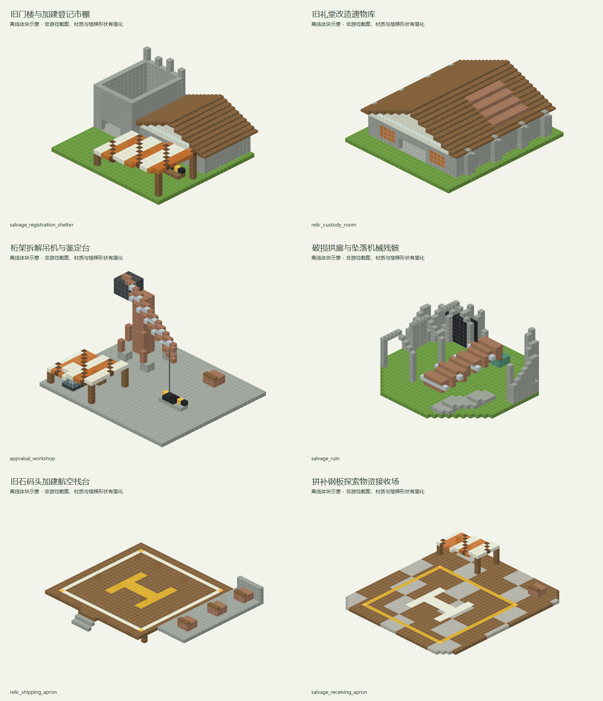

# 遗民打捞交换所

> 已同步内置经济数据包；独立建筑模板与概念图见下文，模板尚未接入自然生成。

## 身份与定位

遗迹区域外围；协会登记点与有限遗物供应地，安全区预留小型接驳泊位。

| 项目 | 内容 |
| --- | --- |
| 设计编号 | R01 |
| 资源 ID | `cargoverse:resource/salvage/remnant_exchange` |
| 目标 JSON | `src/main/resources/data/cargoverse/trade_points/trade_points_definitions/resource/salvage/remnant_exchange.json` |
| schema_version | 1 |
| manufacturer | `cargoverse:rex` — 遗民贸易协会 / Remnant Exchange |
| display_name | 遗民打捞交换所 |
| node_role | `salvage_exchange`（语义元数据） |
| tech_level | 5（目录中最高货物科技等级的描述，不是解锁条件） |
| 布局阶段 | 远域稀缺航线（地图投放建议，不是运行时字段） |
| ticks_per_day | 24000 |
| resource_table | [cargoverse:resource/salvage/remnant_exchange](<../../../06_资源表/resource/salvage/remnant_exchange.md>) |

## 收售概览

出售：旧世合金残片、记忆回声介质、前文明导航核心。

收购：遗迹材料切片、野外采样器。

货物标签、逐项初始库存、容量和日变化统一见关联资源表；两侧各自维护库存。

## 建议结构内容

**建筑形象：**旧石墙、锈色金属补片与后加的营业雨棚；新旧结构边界清楚可见。

| 建筑／分区 | 建议内容 |
| --- | --- |
| 打捞营业棚 | 注册、查询和实际装卸终端位于稳定完整的地面核心。 |
| 遗物保管室 | 旧世合金残片、记忆回声介质及导航核心分架陈列，外观强调有限批次。 |
| 拆解吊机与鉴定台 | 以独立桁架吊机、配重、吊钩及露天拆解台组成作业构筑物，侧边陈列切片、采样器和工具箱。 |
| 自带遗迹残构 | 断墙、旧设备底座和封闭入口组成景观，无需依附另一个自然遗迹。 |

**行走与装卸路线：**安全地表入口 → 协会登记棚 → 遗物装卸区；危险感留给外围遗迹装饰。

**最小可营业核心：**贸易点信息柜（唯一注册锚点）、仓库信息柜、货柜装载机、货物卸载机、许可证注册终端。装货与卸货泊位各保留一处清楚的操作区；可以共用入口，但不要把两种操作混放到不易识别的位置。基础泊位须满足实际货柜尺寸与净空，不能只用展示货柜代替。必要终端及最低泊位集中在不会因可选支路缺失而失效的营业核心中。

**可选扩展：**可选增加回收吊架、残骸堆和探索营棚；装饰遗物不额外发放可交易 CargoGood。

以上陈列、工艺设备与建筑用途为美术和空间建议。除已绑定的业务终端外，不自动新增 NPC、加工、气候、库存或货物产出机制。首版没有绑定商店或货柜制造台，不把展厅、柜台或车间当成已接入这些功能。

<!-- generated-resource-templates:start -->
## 独立建筑模板

包含 **6 个独立 NBT**，使用 Minecraft Java 1.21.1 原版方块。业务设备预留安装空间，模板不附带实例绑定或自然生成配置。

### 造型与构筑物分工

围绕旧构件再利用展开：石门楼加建市棚、旧礼堂遗物库、独立桁架拆解吊机、破拱与机械残骸。航空场以木栈台、旧石码头和拼补钢板表达回收材料施工。

文件名中的 `room`、`store`、`cabin` 用作加载标识，实际建筑形态以模板清单为准。

存放路径：`<存档目录>/generated/cargoverse/structures/trade_points/resource/salvage/remnant_exchange/`。模板文件格式为 `.nbt`。

概念图根据模板的实际方块布局离线绘制，材质和楼梯形状做了简化，并非游戏截图。

| 文件 | 建筑／构筑物 | 尺寸 X × Y × Z（格） | 高度基准 | 内容 | 图片 |
| --- | --- | --- | --- | --- | --- |
| `salvage_registration_shelter.nbt` | 旧门楼与加建登记市棚 | 33 × 15 × 31 | 作业地面 Y=0 | 残存石门楼、偏置木斜屋顶和条纹篷棚围合营业场；旧构件厚重、加建构件轻薄，形成不规则街角。 | [概念图](../../../../assets/images/trade_points/resource/salvage/remnant_exchange/salvage_registration_shelter_exterior.png) |
| `relic_custody_room.nbt` | 旧礼堂改造遗物库 | 31 × 14 × 33 | 作业地面 Y=0 | 高脊旧礼堂的石扶壁、铜皮修补与三座内嵌保管龛；中部为完整长廊，三种遗物各有独立围护。 | [概念图](../../../../assets/images/trade_points/resource/salvage/remnant_exchange/relic_custody_room_exterior.png) |
| `appraisal_workshop.nbt` | 桁架拆解吊机与鉴定台 | 35 × 21 × 31 | 作业地面 Y=0 | 独立大型回收吊机：四腿斜撑塔架、三角桁架悬臂、配重与垂吊钩，下方是露天拆解台；侧边仅设小型鉴定篷。 | [概念图](../../../../assets/images/trade_points/resource/salvage/remnant_exchange/appraisal_workshop_exterior.png) |
| `salvage_ruin.nbt` | 破损拱廊与坠落机械残骸 | 35 × 13 × 33 | 作业地面 Y=0 | 半圆断墙围住斜插铜质机械残骸，旧门洞封闭、拱廊残缺；石瓦砾与锈铜形成可独立布置的遗迹景观。 | [概念图](../../../../assets/images/trade_points/resource/salvage/remnant_exchange/salvage_ruin_exterior.png) |
| `relic_shipping_apron.nbt` | 旧石码头加建航空栈台 | 39 × 7 × 35 | 作业地面 Y=2 | 木梁托起的回收甲板接入单侧旧石码头，25×25格落地区与旁侧石砌交接角形成清晰新旧边界；作业面Y=2。 | [概念图](../../../../assets/images/trade_points/resource/salvage/remnant_exchange/relic_shipping_apron_exterior.png) |
| `salvage_receiving_apron.nbt` | 拼补钢板探索物资接收场 | 37 × 7 × 41 | 作业地面 Y=0 | 不规则边缘的拼补钢木起降场，后部单侧篷布交接棚与散置工具箱；装饰集中在落地区外。 | [概念图](../../../../assets/images/trade_points/resource/salvage/remnant_exchange/salvage_receiving_apron_exterior.png) |

结构名称前缀：`cargoverse:trade_points/resource/salvage/remnant_exchange/`，后接表中的文件名（去掉 `.nbt`）。

### 设备与航空作业预留

下列坐标相对各自模板原点，以 X, Y, Z 表示，边界均包含。常规入口／设备接近方向为北（-Z）；远界箭首出货甲板从南（+Z）后部操作带接近。各模板的作业面高度见表，抛物面天线观测台位于 Y=8；雷达、吊机、储罐和异常壳体属于设备或景观构筑物。露天平台上空保持开放，高于模板高度的净空范围不会自动清除模板之外的方块。

- **旧门楼与加建登记市棚**：主信息柜（15, 1, 6 → 17, 3, 8）；仓库信息柜（23, 1, 6 → 26, 3, 8）；协会注册终端（6, 1, 17 → 9, 3, 20）。
- **桁架拆解吊机与鉴定台**：材料鉴定交接（15, 1, 4 → 21, 3, 12）。
- **旧石码头加建航空栈台**：露天航空净空（4, 3, 5 → 28, 16, 29）；遗物装载操作（30, 3, 13 → 32, 6, 27）。
- **拼补钢板探索物资接收场**：露天航空净空（6, 1, 4 → 30, 14, 28）；探索物资卸货（16, 1, 32 → 26, 3, 38）。

正式节点的出货、接收平台分为两个独立模板；侧边暂存棚和后部设备操作区避开停机区。观测杆、遗迹、错位环等外围构筑物应布置在飞行通道之外。
<!-- generated-resource-templates:end -->

## 经济字段

| 字段 | 设计值 |
| --- | --- |
| prosperity.initial_level | 0 |
| prosperity.upgrade_experience | [100, 300, 800, 2000, 5000] |
| activity.initial_activity | 0 |
| activity.expected_daily_trade_value | 14350 |
| activity.max_daily_load | 2 |
| activity.input_trade_weight / output_trade_weight | 1 / 1 |
| activity.response_rate | 0.25 |
| pricing.buy_price_multiplier | 1.1（贸易点收购，玩家收入） |
| pricing.sell_price_multiplier | 1（贸易点出售，玩家支出） |
| pricing.dynamic_price.enabled | false |
| 动态价格备用字段 | min_modifier=0.7，max_modifier=1.3，trade_step=0.03，daily_recovery_step=0.05 |

活跃度目标按两侧日周转基础价值合计向上取整至 50 VB；有限货物用一次性初始批次价值的 1/10 计入观测目标。这不是库存变化倍率或 NPC 资金预算。完整计算见[数值校核](<../../供需覆盖与数值校核.md>)。

## 功能与结构

首版绑定 `registration_point`：`min_prosperity_level: 0`，唯一候选 `cargoverse:rex_exchange`，权重 1。复用已有注册定义及基础货柜，不在这里新增入门奖励。

首版不绑定物品商店和货柜制造台；现有默认演示模块的商品与配方不能直接代表本节点。后续按各制造商单独设计这些功能。

结构需设置一个贸易点信息柜注册锚点、货柜装载机、货物卸载机、仓库信息柜、对应货柜的装卸泊位与注册终端。所有终端绑定同一实例 UUID。

地图距离和环境危害需要在结构落点时确定；内容投放阶段不提供代码级许可、科技或区域准入限制。

[设计总览](<../../设计总览.md>) · [贸易点目录](<../../README.md>)

## 结构生成设计

| 项目 | 设计值 |
| --- | --- |
| 世界结构 ID | `cargoverse:trade_point/resource/salvage/remnant_exchange` |
| structure_set | `cargoverse:trade_points/remnant_outposts` |
| 目标区域／形态 | 原版主世界／地表 |
| 结构组成 | 自带遗迹残构的安全交换所 |
| 集内权重／首抽占比 | 1 / 100% |
| 过滤前理论密度 | 0.056 座 / 1024² 方块 |
| 总平面包络目标 | 64 × 64 方块；含泊位与可选建筑 |
| Jigsaw size／max_distance_from_center | 3 / 48 |
| 起始高度 | absolute=0，投影 WORLD_SURFACE_WG |
| terrain_adaptation | beard_thin |
| 群系标签 | #cargoverse:trade_sites/overworld_land |
| 绑定文件 ID | `cargoverse:resource/salvage/remnant_exchange` |
| 绑定候选 | 仅 `cargoverse:resource/salvage/remnant_exchange`，权重 1，概率 100% |
| 模板变体 | 同经济定义的标准／加棚／加装饰三种外观，权重 6 / 3 / 1；仅制作一版时先用 1 |

概率是结构集通过布点判定后的首次选择比例，不能视为任意区块的生成概率。详细间距、排斥、地形限制与模板制作规则见[生成总表](<../../结构生成规则与概率.md>)；供需密度计算见[库存校核](<../../生成密度与库存校核.md>)。
