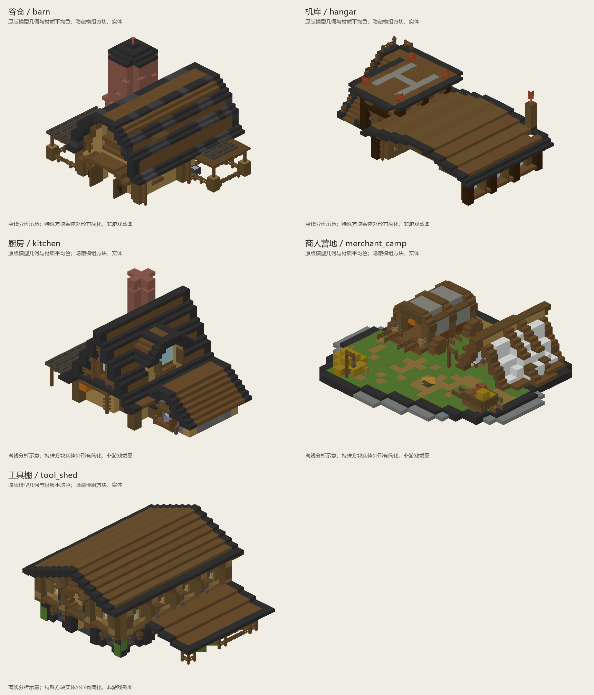
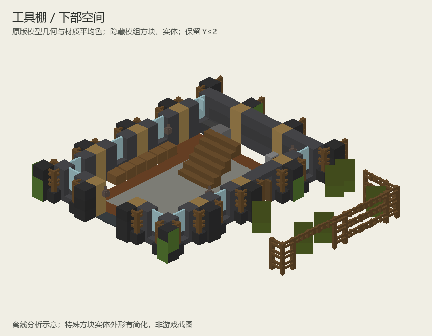
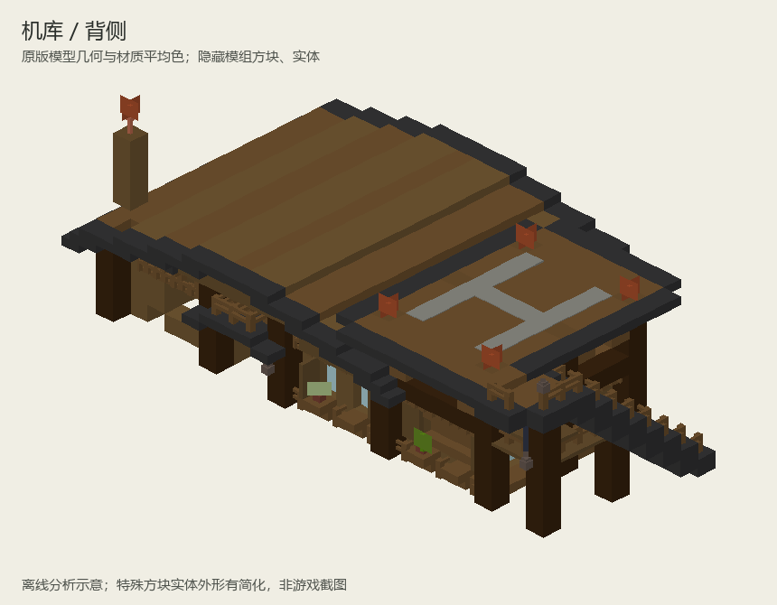

# Farmstead 参考建筑模板分析

> 2026-09-14。读取用户提供的 20 个 NBT，按五类建筑分析；原文件保持原样。本页是参考研究，不代表已经提取组件、转换版本或交付新结构。

## 来源与分析口径

源目录：

```text
C:\Users\OR15\Desktop\天空遗民-1.20.1-Forge-v1.0发行版\.minecraft\versions\云岛旅人-1.20.1-Forge-v1.5\kubejs\data\farmstead\structures
```

- 20 个文件全部读取成功，DataVersion 均为 3465；按文件名分为 `barn`、`hangar`、`kitchen`、`merchant_camp`、`tool_shed` 五组，每组东南西北四份。
- 统计以非空气的已记录方块位置为单位，排除 air、cave_air、void_air、structure_void；不把实体、容器内物品计入方块数。
- 建筑明细使用北向样本。尺寸为 NBT 保存包围盒 **X × Y × Z**，包含屋檐、附棚、装饰或空边，不等同于室内净尺寸。
- 朝向比较对非空气坐标平移归一化，尝试水平旋转；机库额外比较镜像。比较的是位置和方块名称，没有核对旋转后的完整方块状态、方块实体内容与实体。因此“相同”不表示文件逐字节相同。
- 模组方块和实体从分析图中隐藏，重点看原版构件；这不等于已经制作了纯原版替代模板。

## 总览



分析图使用原版客户端方块模型的几何与纹理平均色，保留大部分楼梯、半砖、栅栏和活板门形状；箱子、床、告示牌等特殊渲染外形有简化。未渲染实体、模组装饰、真实光照与完整纹理，不是游戏截图。剖视保留 Y≤2，隐藏的模组家具位置不可直接当作原结构的空闲空间。

| 样本 | 保存尺寸 X×Y×Z | 非空气方块 | 原版方块 | 原版方块种类 | 模组方块比例 | 主要参考价值 |
| --- | --- | ---: | ---: | ---: | ---: | --- |
| `barn_north` 谷仓 | 19×16×17 | 1208 | 1179 | 35 | 2.40% | 高主屋顶、两侧低附棚、砖塔与木梁架 |
| `hangar_north` 机库 | 28×13×17 | 1286 | 1171 | 25 | 8.94% | 长向开敞棚、侧置高位停靠台、外部楼梯 |
| `kitchen_north` 厨房 | 19×15×13 | 983 | 876 | 36 | 10.89% | 紧凑主屋、低附棚、山墙变化、砖砌烟囱 |
| `merchant_camp_north` 商人营地 | 24×8×21 | 906 | 886 | 29 | 2.21% | 帐篷与棚架组成场景，地面路径和中央空场 |
| `tool_shed_north` 工具棚 | 23×12×21 | 1834 | 1750 | 36 | 4.58% | 重复柱跨、上下层、内部楼梯、侧棚与窗墙细节 |

四个房屋／棚类模板中，谷仓和厨房的水平尺寸接近 16 格参考范围；机库采用 28×17 的长条比例，工具棚为中等尺度。商人营地的包围盒容纳多个小构件及空场，不能按同面积的封闭房屋理解。

## 朝向差异

| 类别 | 坐标与方块名称比较结果 | 对后续复用的影响 |
| --- | --- | --- |
| 谷仓 | 四向经旋转归一化后完全对应 | 可选北向研究，朝向导出另做 |
| 商人营地 | 四向的方块布局经旋转后完全对应 | 实体并未纳入相同比较 |
| 机库 | 东向可直接旋转对应北向；南／西向需要镜像加旋转才能完全对应 | 左右布局存在镜像关系，不能只按四向旋转处理 |
| 厨房 | 南向对应北向；东／西向各有 33 个位置差异 | 主要集中在蔬菜箱、冰箱等陈列，另含少量原版方块变动；属于近似版本 |
| 工具棚 | 东／西向各有 4 个位置差异，南向有 7 个 | 差异为藤蔓位置与铃铛等少量装饰 |

`tool_shed_east.nbt` 保存尺寸为 **21×12×28**，但非空气范围为 X=0…20、Y=0…11、Z=0…22，即实体包围盒 **21×12×23**。后方五格是保存空边，不应当作该建筑的必要长度。

## 主体为何具有完成度

### 1. 轮廓有主次，房屋体量并不复杂

谷仓以主屋顶为主体，侧棚降低高度，砖塔承担竖向识别。厨房以主屋、低屋顶附棚和烟囱形成前后及高低层次。工具棚以较宽主屋顶和一侧低棚组织轮廓。机库用低长棚与高位停靠台区分功能。

这些建筑不依赖许多复杂几何体叠加；值得学习的是主次比例、附件位置和连接方式，而非为每个模板增加异形体块。

### 2. 半格及薄构件承担了真实造型

| 北向样本 | 楼梯 | 台阶／半砖 | 活板门 | 栅栏 | 栅栏门 | 墙 | 门 | 玻璃板 | 这些类别占原版方块 |
| --- | ---: | ---: | ---: | ---: | ---: | ---: | ---: | ---: | ---: |
| 谷仓 | 224 | 162 | 63 | 92 | 33 | 22 | 0 | 0 | 50.55% |
| 机库 | 81 | 341 | 54 | 127 | 36 | 0 | 2 | 18 | 56.28% |
| 厨房 | 238 | 64 | 29 | 39 | 28 | 8 | 6 | 20 | 49.32% |
| 商人营地 | 64 | 87 | 78 | 39 | 16 | 0 | 0 | 0 | 32.05% |
| 工具棚 | 122 | 454 | 176 | 120 | 25 | 24 | 2 | 42 | 55.14% |

上述分类是描述性指标，台阶数包含双层台阶，不等于全部都是非完整方块，也不应成为“必须达到 50%”的机械指标。营地包含大量草地，分母不同，不能直接用该比例给建筑评分。

更关键的是方块状态被用来塑形：工具棚 122 个楼梯中有 **92 个倒置楼梯**；机库有 150 个上半砖、141 个下半砖和 50 个双层台阶。谷仓的 40 个营火全部熄灭，集中在 Y=4；厨房另有 33 个熄灭营火集中在 Y=3，用于薄木格构的外观，而非火源。

这说明“细节”大量存在于檐口、梁下、台面、顶棚的形状和连接中。单纯增加箱子、灯或随机换材质无法代替这些处理。

### 3. 柱梁、墙面和附件形成重复节奏

工具棚在 Y=1 的竖向原木柱中，X=3 与 X=13 两侧均出现 Z=6、10、14 的柱位，形成四格柱中心间距。墙面和窗位依附这些重复跨间，端部与门口再单独变化。

原木轴向也明确区分竖柱与横梁。例如机库的原木位置中，201 个 axis=y、175 个 axis=z、57 个 axis=x。主体骨架具有方向性；大量同材质完整方块堆成外壳无法表达相同关系。



剖视可见工具棚的中央空间、内部楼梯、周边工作位置和沿墙窗柱节奏。后续复用应提取“柱脚—柱—梁—窗墙—檐口”的完整跨间，而非只提取一个柱子或一块墙。

### 4. 平台与地面有具体用途，不统一套矩形底板

谷仓模板 Y=0 仅有 117 个非空气方块，机库为 123 个，底层以立柱、围栏或其他构件为主；它们没有把整个保存包围盒铺满。商人营地则把草地、路径和营地边界纳入模板，因为这些就是场景内容。

保存边界未必包含建筑下方的完整地面，不能据此认定缺少支撑。后续引用时需要明确接地层，保留作者拼地形的空间；对独立航空平台才按作业需要制作完整甲板。



机库高位平台已有 H 标记和外部上行楼梯，可参考其平台—棚屋关系及边缘处理。这里仅分析造型，没有测定其可适配的载具尺寸，未来航空模板仍需按实际载具留出净空。

### 5. 材料分工一致，布局因功能而变

这五类模板共享木构、深色瓦边、局部石／砖和少量绿色附着物，但没有共享同一平面。机库是长向开敞棚，谷仓和厨房是高低组合房屋，工具棚有上下层，营地由低矮独立构件围绕空场组成。

材料体系可以复用，完整平面应按功能另行设计。未来工业或科研主题应迁移其比例、厚薄和构件连接方法，不必照搬木瓦配色。

## 模组内容的影响

用户关于原版主体占主导的判断与统计一致：北向样本中原版位置占约 89%～98%。模组内容主要是任务屏幕、箱柜、炊具、货物、机械部件等。

但部分内容也参与局部外观，例如机库有 40 个 `create:white_sail` 和 16 个 `create:fluid_tank`。在本次主体分析中可以隐藏；以后做纯原版版本时，可用原版帆布、储罐造型替代，不应把“隐藏后的缺口”作为目标设计。

机库保存了一架 `immersive_aircraft:bamboo_hopper` 实体，商人营地和工具棚也有实体数据。后续提取建筑组件只取需要的方块与状态；实体、任务信息、容器内容不随建筑样式自动继承。

## 建议优先建立的参考组件

| 优先级 | 来源 | 候选组件 | 应保留的设计关系 |
| --- | --- | --- | --- |
| 1 | 工具棚 | 一跨窗柱墙、柱脚、梁檐、侧棚接头 | 四格柱距及柱墙前后层次，上下层衔接 |
| 1 | 谷仓／厨房 | 主屋顶截面、山墙、屋脊、低附棚连接 | 正倒楼梯、半砖层位、屋檐厚度和主次高差 |
| 2 | 机库 | 开敞棚跨、外部楼梯、高位平台边缘 | 支撑方向、可读的上下路径、平台与棚的关系 |
| 2 | 商人营地 | 小帐篷、棚架、货物角、短围栏 | 小构件尺寸与中央空场，不把每项功能做成房屋 |
| 3 | 厨房／工具棚 | 窗台、台面、灯架、薄木格构 | 附着在骨架上的少量细节及正确方块状态 |

这些是组件候选，并未在本次分析中拆出新的 NBT。组件用于实现已经确定的平面和柱网，可在制作过程中逐步积累；引用时保留可靠的连接关系，再根据目标空间适配。

## 对生成流程的直接启示

2026-09-14 作者补充了实际建造方法：这五类建筑都是先安排平面，再根据平面确定柱间距。NBT 统计反映最终形态，设计顺序以作者说明为准。

同日作者进一步明确交付分工：后续生成负责大体空间布局、柱网框架、墙面屋顶和楼梯，细节装饰与室内设计由作者完成。以下第四步描述作者完整建造流程，不属于默认 NBT 生成范围；参考样本的细部方块统计也不作为交付数量要求。

1. **平面分区。** 大致标明各空间的用途与范围，安排入口、通道、楼梯及设备位置；占地以小型约 16 格、大型约 32 格为参考，按用途调整。
2. **柱网与框架。** 根据平面分区确定柱位和柱距，先搭建柱子、梁及楼层和屋顶骨架。样本中的四格柱距是一种具体解法，后续建筑根据自己的平面确定。
3. **墙体与窗户。** 在框架之间布置墙、门、窗及屋面，使围护与平面中的使用和通行需求一致。
4. **细节修饰。** 最后处理檐口、窗框、灯具、栏杆及装饰；半砖、倒置楼梯和活板门用于落实这些具体构件。

后续生成工具应共用平面、柱位和高度数据，按上述顺序建造。构件提取、方块状态处理及分析图为这一流程提供辅助，不要求先建立完整构件库或逐阶段增加审批。

对照旧生成中间数据，`field_service_pod` 没有使用上述八类细部构件，`stable_trade_cabin` 仅约 0.59%，矿务营业楼约 27.44%。这些数值受材质和基板占比影响，不能作为评分，但与本次观察一致：后期模板主要做到完整方块体块，尚未形成这些参考建筑中的构件层次。

原始统计由工作区工具 `analyze-reference-nbt.py` 输出至 `CargoVerse-Assets/structure-analysis/farmstead/analysis.json`；分析图片全部保存在本文档库的 `assets/images/trade_points/reference/farmstead/`。

## 各样本视图

| 样本 | 外观 | 背侧 | 下部剖视 |
| --- | --- | --- | --- |
| 谷仓 | [外观](../../../assets/images/trade_points/reference/farmstead/barn_exterior.png) | [背侧](../../../assets/images/trade_points/reference/farmstead/barn_rear.png) | [剖视](../../../assets/images/trade_points/reference/farmstead/barn_cutaway.png) |
| 机库 | [外观](../../../assets/images/trade_points/reference/farmstead/hangar_exterior.png) | [背侧](../../../assets/images/trade_points/reference/farmstead/hangar_rear.png) | [剖视](../../../assets/images/trade_points/reference/farmstead/hangar_cutaway.png) |
| 厨房 | [外观](../../../assets/images/trade_points/reference/farmstead/kitchen_exterior.png) | [背侧](../../../assets/images/trade_points/reference/farmstead/kitchen_rear.png) | [剖视](../../../assets/images/trade_points/reference/farmstead/kitchen_cutaway.png) |
| 商人营地 | [外观](../../../assets/images/trade_points/reference/farmstead/merchant_camp_exterior.png) | [背侧](../../../assets/images/trade_points/reference/farmstead/merchant_camp_rear.png) | [剖视](../../../assets/images/trade_points/reference/farmstead/merchant_camp_cutaway.png) |
| 工具棚 | [外观](../../../assets/images/trade_points/reference/farmstead/tool_shed_exterior.png) | [背侧](../../../assets/images/trade_points/reference/farmstead/tool_shed_rear.png) | [剖视](../../../assets/images/trade_points/reference/farmstead/tool_shed_cutaway.png) |

[返回贸易点目录](../README.md)
